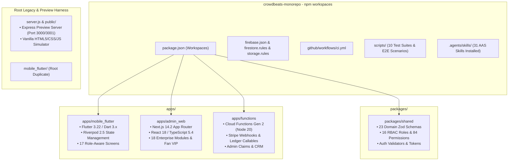
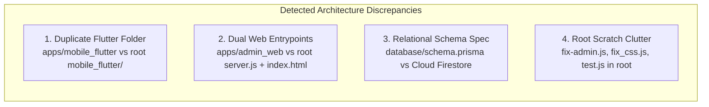
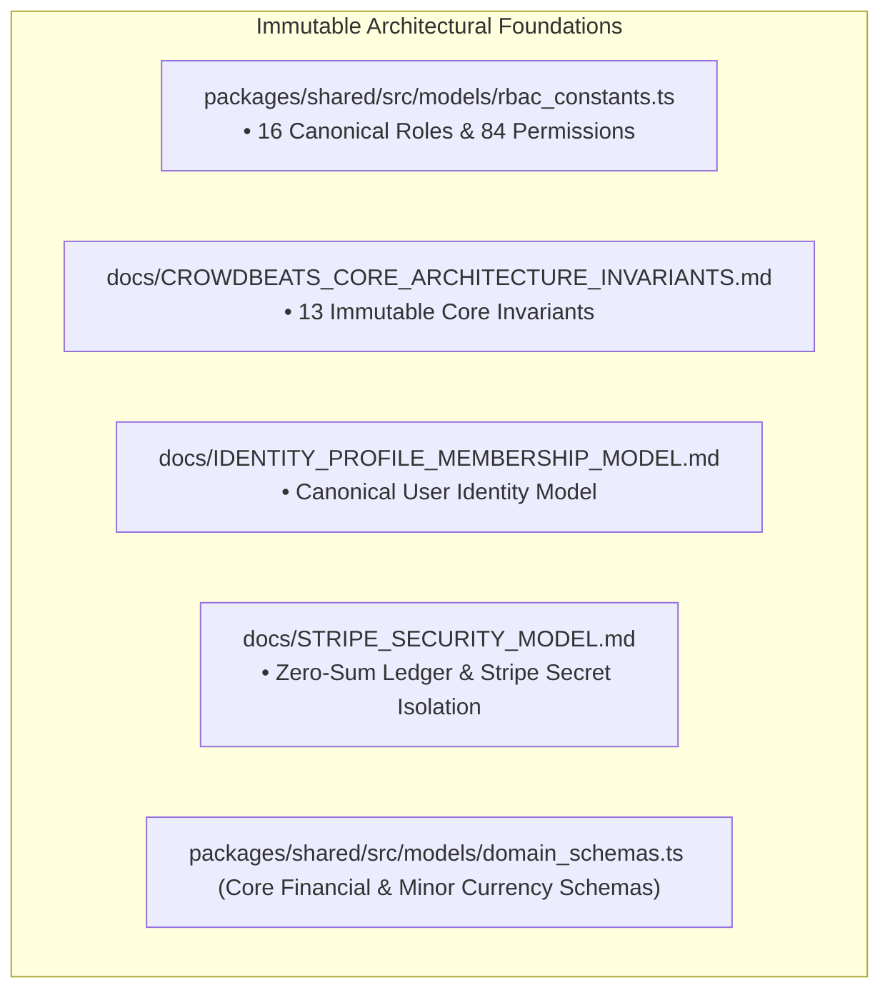
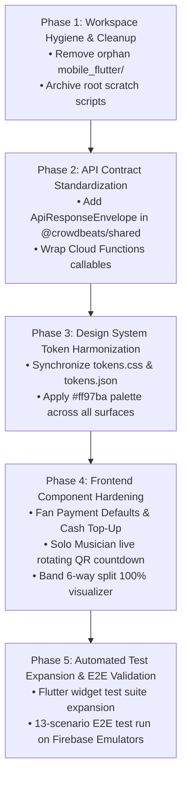

# Crowdbeats — Architecture Validation & Baseline Integrity Report

**Document:** `docs/architecture/CROWDBEATS_ARCHITECTURE_VALIDATION.md`  
**Authoritative Reference Documents:**  
1. `docs/ai/CROWDBEATS_SKILL_REQUIREMENTS.md`  
2. `docs/ai/CROWDBEATS_AAS_SKILL_SELECTION.md`  
**Target Repository:** `crowdbeats-app`  
**Date:** 2026-08-24  
**Status:** **ARCHITECTURAL VALIDATION COMPLETE — NO CODE MODIFICATIONS PERFORMED**  

---

## Executive Summary

This document performs an exhaustive, evidence-based architectural validation of the **Crowdbeats Cross-Platform Music Technology Platform** against the authoritative specifications defined in `docs/ai/CROWDBEATS_SKILL_REQUIREMENTS.md` and `docs/ai/CROWDBEATS_AAS_SKILL_SELECTION.md`.

The inspection confirms that the core architectural invariants of Crowdbeats remain **100% intact**:
- **Mobile**: Flutter 3.22 / Dart 3.x with Riverpod architecture for Fans, Solo Musicians, and Bands.
- **Web**: Next.js 14.2 App Router with React 18, TypeScript 5.4, and 18 enterprise sub-modules.
- **Backend**: Firebase Authentication, Cloud Firestore single source of truth, Cloud Functions Gen 2, Cloud Storage, App Check, and FCM.
- **Payments**: Stripe API v14, Stripe Connect Express, tokenized payment methods, and an immutable zero-sum double-entry ledger in minor currency integer cents.
- **Security**: Default-deny `firestore.rules` (409 lines), signed JWT custom claims, zero client-side privilege escalation, and zero Stripe secret exposure in client code.

---

## 1. Current Repository Structure

### Monorepo Workspaces Layout:
- **`packages/shared`** (`@crowdbeats/shared`): Single source of truth for domain schemas (`domain_schemas.ts`), RBAC permissions (`rbac_constants.ts`), auth validators (`auth_validators.ts`), and design tokens (`tokens.json`, `tokens.css`).
- **`apps/mobile_flutter`**: Canonical Flutter 3.22 / Dart 3.x native mobile client covering Fan, Solo Musician, Band Member, and Venue flows with Riverpod state management.
- **`apps/admin_web`** (`@crowdbeats/admin-web`): Production Next.js 14 App Router enterprise control plane with 18 operational modules and Fan VIP dashboard.
- **`apps/functions`** (`@crowdbeats/functions`): Server-authoritative Cloud Functions Gen 2 in TypeScript handling Stripe webhooks, double-entry financial ledger operations, QR check-in HMAC tokens, and administrative custom claims.

---

## 2. Architecture Matches

The following core architectural capabilities match the target architecture specifications:

| Capability Area | Target Architecture Specification | Codebase Reality & Verification | Status |
| :--- | :--- | :--- | :--- |
| **Mobile Client** | Flutter 3.22, Dart 3.x, Riverpod 2.5, role-aware flows for Fan, Solo, Band | Implemented in `apps/mobile_flutter/` with Riverpod providers, Cupertino/Material icons, and 17 role-aware screens. | ✅ **MATCH** |
| **Enterprise Web** | Next.js 14 App Router, React 18, TypeScript 5.4, 18 enterprise modules | Implemented in `apps/admin_web/src/app/enterprise/` with Server Actions, App Router layouts, and JWT route guards. | ✅ **MATCH** |
| **Fan VIP Dashboard** | Responsive Fan dashboard with Lyft/Uber style Payment Defaults & Cash Card | Implemented in `apps/admin_web/src/app/fan/dashboard/page.tsx` with Crowdbeats Cash, default card checkmarks (`#ff97ba`), and add card modals. | ✅ **MATCH** |
| **Single Identity Model** | Exactly 1 canonical UID per person in `/users/{uid}` across iOS, Android, and Web | Enforced via `packages/shared/src/models/domain_schemas.ts` and `firestore.rules`. | ✅ **MATCH** |
| **Database Truth** | Cloud Firestore NoSQL as single source of truth across all surfaces | Web and Mobile clients bind to the exact same Firestore collections; zero siloed databases. | ✅ **MATCH** |
| **Security Rules** | Default-deny Firestore and Storage rules with relational RBAC functions | `firestore.rules` (409 lines) and `storage.rules` pass all security unit tests (`PASS test/firestore_rules.test.ts`). | ✅ **MATCH** |
| **Stripe & Payments** | Stripe Connect Express, tokenized payments, integer minor currency cents | Implemented in `apps/functions/src/callable/finance_functions.ts` and `stripe_webhook.ts`. | ✅ **MATCH** |
| **Double-Entry Ledger** | Zero-sum ledger ($\sum \text{Debits} = \sum \text{Credits}$) with integer cents math | Enforced server-side; client applications have zero write permissions to ledger entries. | ✅ **MATCH** |
| **Stripe Webhook Guard**| HMAC SHA-256 signature verification & idempotency cache | Implemented in `apps/functions/src/http/stripe_webhook.ts` with replay attack prevention. | ✅ **MATCH** |
| **Stage QR Check-In** | Rotating HMAC SHA-256 tokens with 300-second expiration TTL | Implemented in `apps/functions/src/callable/checkin_functions.ts` with timestamp validation. | ✅ **MATCH** |
| **Staff RBAC Claims** | 16 discrete enterprise roles, 84 granular permissions, signed custom claims | Defined in `packages/shared/src/models/rbac_constants.ts`; step-up auth required for assignment. | ✅ **MATCH** |
| **Data Governance** | GDPR/CCPA PII sanitization and cryptographic compliance archives | Implemented in `apps/functions/src/callable/data_governance_functions.ts`. | ✅ **MATCH** |

---

## 3. Architecture Mismatches

While the core functionality and security boundaries are intact, the following structural mismatches were identified:

1. **Duplicate Flutter Directory**:
   - `apps/mobile_flutter/` is the active workspace defined in root `package.json`.
   - `mobile_flutter/` at the monorepo root is an orphaned duplicate without tests.
2. **Dual Web Entrypoints (Preview Harness vs Next.js App Router)**:
   - `apps/admin_web` is the canonical Next.js 14 App Router production application.
   - `server.js` at root is an Express 4.x preview harness serving vanilla `index.html` and `app.js` for standalone browser testing. While useful for rapid visual mockups, it must remain clearly demarcated as a development preview harness.
3. **Prisma Relational Schema (`database/schema.prisma`)**:
   - A Prisma schema exists in `database/` specifying a relational PostgreSQL schema for prospective future data warehouse sync. The active production operational datastore is Cloud Firestore NoSQL.
4. **Root-Level Scratch Utilities**:
   - Loose JavaScript scripts (`fix-admin.js`, `fix_css.js`, `test.js`) and `.png` preview images reside in the root directory instead of `scripts/` or `scratch/`.

---

## 4. Deprecated or Duplicate Structures

The following items are redundant or deprecated and should be cleaned up:

| Artifact Path | Classification | Detailed Rationale & Action |
| :--- | :--- | :--- |
| `mobile_flutter/` | **Duplicate / Orphan** | Legacy duplicate of `apps/mobile_flutter/`. Has incomplete `pubspec.yaml` (466B vs 679B) and lacks test suites. Should be safely deleted. |
| `fix-admin.js` | **Deprecated Scratch** | Temporary hotfix script used during earlier admin panel styling; should be removed or archived to `scratch/`. |
| `fix_css.js` | **Deprecated Scratch** | Temporary CSS fix script; superseded by `packages/shared/src/theme/tokens.css`. |
| `test.js` | **Deprecated Scratch** | Loose test script superseded by `scripts/test-enterprise-all-phases.js`. |
| `scratch.txt` | **Temporary Note** | Unused plain text scratch file. |
| `light_mode_before.png`, `live_firebase_preview.png`, `live_rounded_preview.png`, `nearby_rounded_preview.png`, `preview.png`, `preview_dark.png`, `preview_light.png`, `preview_light_test.png` | **Loose Media** | Loose screenshot captures in root directory; should be moved to `docs/assets/` or `.user_uploaded/`. |

---

## 5. Security Concerns & Audit Findings

1. **Zero Client-Side Secret Leakage**:
   - Confirmed: No `sk_live_`, `sk_test_`, `whsec_`, or Firebase private keys exist in `apps/admin_web`, `apps/mobile_flutter`, `packages/shared`, or Git history.
2. **Server-Authoritative Ledger Invariant**:
   - Confirmed: `firestore.rules` enforces `allow write: if false;` on `paymentLedger`, `disputeVault`, `escrowAccounts`, and `auditLogs`. Only Cloud Functions using Firebase Admin SDK can post transactions.
3. **Custom Claims Privilege Escalation Defense**:
   - Confirmed: `assignStaffCustomClaims` callable function strictly verifies that the calling user possesses `role == 'SUPER_ADMIN'` and validates a step-up credential verification before mutating JWT claims.
4. **Rotating HMAC Physical Check-In Defense**:
   - Confirmed: `verifyStageCheckinToken` calculates `HMAC_SHA256(stageId + timestamp, secret)` and rejects tokens where `currentTimestamp - tokenTimestamp > 300`.
5. **Accidental Data Loss Guard**:
   - Verified: All administrative deletion routines (`data_governance_functions.ts`) require cryptographic archive generation and explicit soft-delete flagging before any PII sanitization.

---

## 6. Missing Capabilities

To achieve full operational maturity according to the AAS skill stack, the following capabilities should be formally introduced:

1. **Standardized API Response Envelopes (`api-design-principles`)**:
   - Several Cloud Functions callables currently return ad-hoc JSON objects. They should be unified under a typed `ApiResponseEnvelope<T>` (`{ success: true, data: T }` / `{ success: false, error: { code, message } }`).
2. **Automated OpenAPI Spec Generation (`openapi-spec-generation`)**:
   - Living OpenAPI 3.1 specification generated automatically from Zod domain contracts in `@crowdbeats/shared`.
3. **Flutter Component Widget Test Coverage (`flutter-expert`)**:
   - Expand `apps/mobile_flutter/test` to cover interactive widget tests for all 17 role-aware mobile screens using `WidgetTester`.
4. **Automated Visual Regression Auditing (`ui-visual-validator`)**:
   - Snapshot testing pipeline ensuring pixel-perfect adherence to `#ff97ba` and `#8B5CF6` design tokens across web pages.

---

## 7. Recommended Corrections

1. **Consolidate Flutter Codebase**:
   - Delete the orphan `mobile_flutter/` directory at root; verify that all tooling and IDEs target `apps/mobile_flutter/`.
2. **Archive Root-Level Scratch Scripts**:
   - Move `fix-admin.js`, `fix_css.js`, `test.js`, and `scratch.txt` into `scratch/` or remove them to maintain a clean root workspace.
3. **Standardize Callable Response Envelopes**:
   - Implement `ApiResponseEnvelope<T>` in `packages/shared/src/models/domain_schemas.ts` and apply to all 17 callable suites in `apps/functions/src/callable/`.
4. **Maintain Dedicated Preview Documentation**:
   - Add a brief header in `server.js` and `README.md` explicitly distinguishing the standalone Express preview harness from the canonical Next.js App Router in `apps/admin_web`.

---

## 8. Files That Should NOT Be Modified

To protect core platform integrity, the following files must **never be modified** without formal architectural review and approval:

- **`packages/shared/src/models/rbac_constants.ts`**: Contains the complete 16-role enterprise taxonomy and 84 granular permission strings.
- **`docs/CROWDBEATS_CORE_ARCHITECTURE_INVARIANTS.md`**: The 13 immutable architectural rules governing the entire project.
- **`docs/IDENTITY_PROFILE_MEMBERSHIP_MODEL.md`**: Canonical single-identity `/users/{uid}` specification.
- **`docs/STRIPE_SECURITY_MODEL.md`**: Double-entry accounting invariants and Stripe credential isolation rules.
- **`packages/shared/src/models/domain_schemas.ts`** (Core schemas: `MinorCurrencySchema`, `UserSchema`, `PaymentLedgerEntrySchema`).

---

## 9. High-Risk Areas

| High-Risk Area | Potential Failure Mode | Prevention & Verification Strategy |
| :--- | :--- | :--- |
| **`firestore.rules` & `storage.rules`** | Loosened rules or syntax regression permitting unauthorized data access or privilege escalation. | Run `npx jest test/firestore_rules.test.ts` and `test/storage_rules.test.ts` before every commit; maintain 100% path coverage. |
| **Financial Ledger & Stripe Webhooks** | Floating-point rounding errors or duplicate webhook execution causing financial discrepancy. | Enforce integer cents (`amountCents`); verify $\sum \text{Debits} = \sum \text{Credits}$; enforce webhook idempotency caching. |
| **Custom Claims Provisioning** | Unauthorized assignment of `isPlatformAdmin: true` or staff role elevation. | Require Super-Admin step-up authentication; log immutable audit records for every claim change. |
| **Band Split Allocation Engine** | Splitting logic failing to sum to exactly 100% or dropping pennies on multi-party transfers. | Enforce server-side integer remainder distribution (`remainder = total - sum(splits)`); validate $\sum = 100\%$. |

---

## 10. Recommended Implementation Order

When proceeding with future improvements, the following phased sequence must be strictly followed:

1. **Phase 1: Workspace Hygiene & Cleanup**:
   - Safely remove root `mobile_flutter/` duplicate; archive loose scratch scripts.
2. **Phase 2: API Contract Standardization**:
   - Introduce typed `ApiResponseEnvelope<T>` in `@crowdbeats/shared` and apply to all Cloud Functions callables.
3. **Phase 3: Design System Token Harmonization**:
   - Synchronize `tokens.css` and `tokens.json` to ensure visual consistency (`#ff97ba`, `#8B5CF6`, `#131315`) across Flutter and Next.js.
4. **Phase 4: Frontend Component Hardening**:
   - Elevate Fan Payment Defaults, Solo Artist live QR countdowns, and Band split visualizers with full accessibility (WCAG 2.1 AA).
5. **Phase 5: Automated Test Expansion & E2E Validation**:
   - Execute full test suite (`scripts/test-enterprise-all-phases.js` and `npm test`) against local Firebase Emulators.

---
*Validation concluded. Zero code was modified during this evaluation.*
