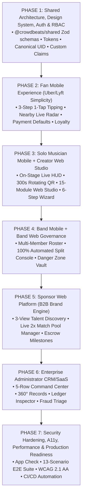
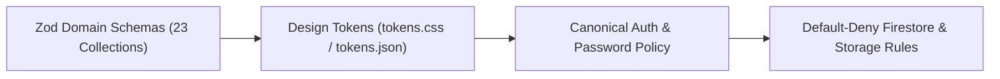
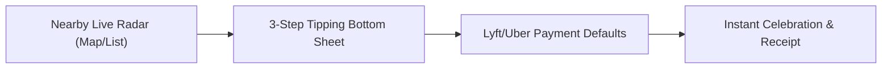
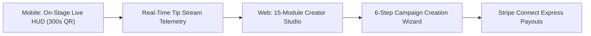
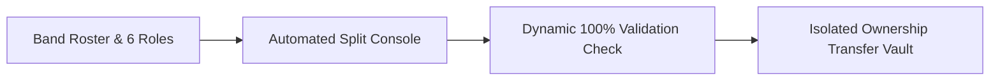
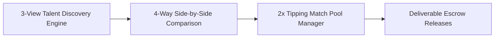
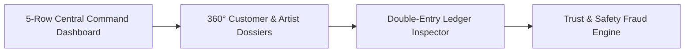
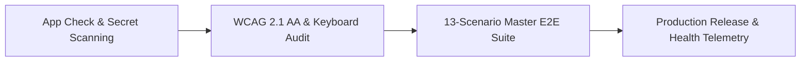

# Crowdbeats — Master Phased Implementation Roadmap

**Document:** `docs/architecture/CROWDBEATS_MASTER_IMPLEMENTATION_ROADMAP.md`  
**Authoritative Input Documents:**  
- `docs/architecture/CROWDBEATS_ARCHITECTURE_VALIDATION.md`  
- `docs/design/CROWDBEATS_CROSS_PLATFORM_DESIGN_STRATEGY.md`  
- `docs/design/FAN_DESIGN_SPEC.md`  
- `docs/design/SOLO_MUSICIAN_DESIGN_SPEC.md`  
- `docs/design/BAND_DESIGN_SPEC.md`  
- `docs/design/SPONSOR_DESIGN_SPEC.md`  
- `docs/design/ADMIN_ENTERPRISE_DESIGN_SPEC.md`  
- `docs/ai/CROWDBEATS_SKILL_REQUIREMENTS.md`  
- `docs/ai/CROWDBEATS_AAS_SKILL_SELECTION.md`  
**Date:** 2026-08-24  
**Status:** **MASTER ROADMAP COMPLETE — READY FOR PHASED EXECUTION (NO CODE IMPLEMENTATION YET)**  

---

## Executive Summary

This master implementation roadmap defines the engineering and design execution sequence for the **Crowdbeats Cross-Platform Music Technology Platform**. 

The roadmap is structured into **7 sequential, dependency-ordered phases**, ensuring that shared domain contracts, design tokens, security rules, and financial ledger invariants are established before client surfaces are constructed:

---

## Phase 1: Shared Architecture, Design System, Authentication & RBAC

**Primary Objective:** Establish the foundational domain contracts, design tokens, cryptographic auth validators, and role-based access control (RBAC) definitions across all monorepo workspaces.

### 1.1 Exact Routes & Screens
- Web Auth Routes: `/login`, `/register`, `/forgot-password`, `/auth/verify-email`, `/auth/action`, `/onboarding/role-select`.
- Mobile Auth Views: `LoginScreen`, `RegisterScreen`, `ForgotPasswordScreen`, `RoleSelectorScreen`.
- Design Showcase: `/dev/design-tokens` (Internal token visualizer).

### 1.2 Packages Affected
- `packages/shared` (`@crowdbeats/shared`)
- `apps/functions` (`@crowdbeats/functions`)
- `apps/admin_web` (`@crowdbeats/admin-web`)
- `apps/mobile_flutter`

### 1.3 Firebase Collections & Documents
- `/users/{uid}` (Canonical human identity; protected fields: `isSuspended`, `isDisabled`, `activeRole`)
- `/roles/{roleId}` (16 staff role definitions & permissions)
- `/platformSettings/{settingId}` (Global operational toggles)
- `/auditLogs/{auditId}` (Append-only audit trail)

### 1.4 Cloud Functions
- `authOnCreateUser`: Automatically creates canonical `/users/{uid}` profile on Firebase Auth user signup.
- `authOnDeleteUser`: Triggers privacy-preserving PII sanitization.
- `assignStaffCustomClaims`: Super-Admin callable for signed JWT claims provisioning (`isPlatformAdmin: true`, `staffRole`).
- `syncCanonicalUserProfile`: Reconciles profile updates across auth providers.

### 1.5 Permissions & Roles
- Public: Anonymous credential sign-in / registration.
- Authenticated User: Read/write own `/users/{uid}` (excluding sensitive fields).
- Super-Admin: Exclusive authority to provision staff claims via step-up authentication.

### 1.6 Stripe Dependencies
- Stripe Customer Vault initialization on user creation (`stripeCustomerId` mapping).
- Zero Stripe secret keys in client applications.

### 1.7 Design System Components
- `tokens.css` & `tokens.json`: Brand pink (`#ff97ba`), violet (`#8B5CF6`), obsidian canvas (`#131315`), whisper borders (`rgba(255, 255, 255, 0.08)`).
- `CbButton`, `CbInput`, `CbCard`, `ToastProvider`, `ThemeContext`.

### 1.8 Automated Tests
- `packages/shared/test/auth_lifecycle.test.ts` (10 tests: signup, signout, duplicate prevention, enumeration defense).
- `packages/shared/test/firestore_rules.test.ts` (9 security rules tests).
- `packages/shared/test/storage_rules.test.ts` (7 storage security tests).

### 1.9 CI Requirements & Security Gates
- GitHub Actions: `npm run type-check --workspaces`, `npm test --workspace=@crowdbeats/shared`.
- Security Gate: Default-deny rules; zero wildcard read/write rules allowed.

### 1.10 Acceptance Criteria & Definition of Done
- Exactly 1 canonical UID per human enforced across Web and Flutter.
- All 23 Zod domain schemas and 16 RBAC roles compiled cleanly into `@crowdbeats/shared/dist`.
- 100% of Phase 1 unit and security rules tests pass.

---

## Phase 2: Fan Mobile Experience (Uber/Lyft Simplicity)

**Primary Objective:** Deliver the high-velocity, 1-tap live music discovery and tipping experience on iOS and Android.

### 2.1 Exact Routes & Screens
- Mobile Tabs:
  1. `HomeScreen` (`/fan`) — Curated pulse feed, Live Now carousel, featured artists.
  2. `NearbyScreen` (`/fan/nearby`) — Obsidian dark map & distance-sorted list view.
  3. `TipScreen` (`/fan/tip`) — 3-step 1-tap tipping engine with camera QR scanner.
  4. `ActivityScreen` (`/fan/activity`) — Monthly support summary, digital receipts, VIP loyalty tier.
  5. `ProfileScreen` (`/fan/dashboard`) — Lyft/Uber payment defaults, Crowdbeats Cash, privacy settings.

### 2.2 Packages Affected
- `apps/mobile_flutter`
- `packages/shared`
- `apps/functions`

### 2.3 Firebase Collections & Documents
- `/fanProfiles/{uid}` (Loyalty tier, points, genre preferences)
- `/tips/{tipId}` (Individual tip transactions)
- `/stages/{stageId}` (Active stage broadcasts & venue geofences)
- `/paymentLedger/{ledgerId}` (Server-authoritative double-entry ledger)

### 2.4 Cloud Functions
- `createTipPaymentIntent`: Generates Stripe PaymentIntent with integer cents validation.
- `processFanTip`: Server-authoritative callable executing tip transfer and loyalty points award.
- `topUpCrowdbeatsCash`: Automatic or manual wallet balance refill.
- `verifyStageCheckinToken`: Validates 300s rotating HMAC QR code.

### 2.5 Permissions & Roles
- Fan: Read live stages; create tip PaymentIntents; update own preferences.
- Server-Only: Commits writes to `paymentLedger` and `fanProfiles.loyaltyPoints`.

### 2.6 Stripe Dependencies
- Stripe PaymentIntents API.
- Stripe Mobile SDK (Apple Pay, Google Pay, Tokenized Cards).
- Customer SetupIntents for saved default card management.

### 2.7 Design System Components
- `FanBottomNav` (5 bottom tabs with `#ff97ba` active glow).
- `QuickTipFloatingBar` ($48\text{px}$ touch target).
- `NearbyRadarMapWidget` (Pulsing violet stage pins).
- `TipPresetPill` (\$5, \$10, \$20, Custom).
- `LyftPaymentDefaultsCard` (`Personal` vs `Business` radio checkmarks).
- `CashBalanceCard` (Live balance and auto-refill toggle).
- `CelebrationSheet` (Lottie confetti and digital receipt).

### 2.8 Automated Tests
- Flutter Widget Tests: `TipPresetPillTest`, `NearbyRadarMapTest`, `PaymentDefaultsTest`.
- Functions Integration Test: `testTipPaymentIntentCreation`, `testIdempotentTipCommit`.

### 2.9 CI Requirements & Security Gates
- `flutter analyze` with zero warnings; `flutter test`.
- Security Gate: Zero raw credit card numbers stored in Firestore or memory; App Check verification required.

### 2.10 Acceptance Criteria & Definition of Done
- A fan can discover a live performer and complete a tip in $\le 3$ taps.
- Tokenized default payment method persists and executes without re-entering card details.
- 60fps scrolling performance and WCAG AAA contrast ratio on all text.

---

## Phase 3: Solo Musician Mobile + Creator Web Studio

**Primary Objective:** Deliver the on-stage live broadcasting HUD on mobile and the 15-module advanced creator studio on web.

### 3.1 Exact Routes & Screens
- Mobile Screens:
  - `/creator` (Home: Today's tips, active gig banner, payout alert, next action).
  - `/creator/live` (On-Stage Live HUD: 300s rotating QR code, set timer, live tip stream).
  - `/creator/campaigns` (Mobile campaign overview & dressing-room update composer).
  - `/creator/fans` (Patron CRM & top superfans list).
  - `/creator/profile` (EPK preview & audio stems).
- Web Routes:
  - `/creator/dashboard` (12 essential dashboard widgets).
  - `/creator/studio` (Bio & Visionary Manifesto editor with Steve Jobs / Simon Sinek generator).
  - `/creator/performances` (Gig calendar, setlists, venue beacon manager).
  - `/creator/campaigns` & `/creator/campaigns/new` (6-step creation wizard).
  - `/creator/campaigns/[id]` (9-panel post-launch management console).
  - `/creator/donations`, `/creator/fans`, `/creator/messages`, `/creator/payouts`, `/creator/analytics`, `/creator/marketing`, `/creator/media`, `/creator/rewards`, `/creator/sponsorships`, `/creator/settings`.

### 3.2 Packages Affected
- `apps/mobile_flutter`
- `apps/admin_web`
- `packages/shared`
- `apps/functions`

### 3.3 Firebase Collections & Documents
- `/artistProfiles/{artistId}` (Bio, manifesto, EPK assets, Stripe Connect status)
- `/stageSessions/{sessionId}` (Live gig start/end, venue link, active setlist)
- `/campaigns/{campaignId}` (Crowdfunding funding target, deadline, story)
- `/campaignMilestones/{milestoneId}` (Multi-stage escrow release gates)
- `/crowdfundingContributions/{contribId}` (Backer pledges and tier selections)

### 3.4 Cloud Functions
- `startStageSession`: Initiates verified gig session.
- `generateRotatingQrToken`: Generates 300s HMAC SHA-256 token.
- `endStageSession`: Concludes live set with earnings summary.
- `createCrowdfundingCampaign`: Validates and publishes campaign.
- `releaseCampaignMilestoneEscrow`: Verifies proof and releases escrow funds.
- `requestStripeExpressOnboarding`: Generates Stripe Connect Express account link.

### 3.5 Permissions & Roles
- `SOLO_MUSICIAN`: Authority to broadcast live sessions, author campaigns, and manage payouts.

### 3.6 Stripe Dependencies
- Stripe Connect Express custom onboarding.
- Stripe Transfers & Destination Charges.
- Account verification webhooks (`account.updated`).

### 3.7 Design System Components
- `LiveStageHud` (Glanceable at 3 feet, screen wake-lock enabled).
- `RotatingQrRing` (Circular SVG countdown timer).
- `TipStreamTicker` (Glowing `#ff97ba` auto-scrolling feed).
- `CampaignThermometer` (Multi-milestone funding visualizer).
- `ManifestoEditor` (Split-screen Markdown editor with AI conviction switch).
- `StripeConnectCard` (Bank verification status chip).

### 3.8 Automated Tests
- `testRotatingHmacQrGenerationAndExpiry` (300s TTL verification).
- `testCampaignWizardValidation` (Zod validation on campaign models).
- `testStripeExpressPayoutCalculation` (Zero penny loss verification).

### 3.9 CI Requirements & Security Gates
- Next.js build; Flutter test; Cloud Functions test against local emulators.
- Security Gate: HMAC secret isolated in Google Secret Manager; 300s token expiration enforced server-side.

### 3.10 Acceptance Criteria & Definition of Done
- Solo musician can start a live stage session, display a rotating QR code, and receive real-time tips.
- Campaign wizard publishes a multi-tiered crowdfunding campaign.
- Stripe Connect Express account links successfully for automated payouts.

---

## Phase 4: Band Mobile + Band Web Governance

**Primary Objective:** Implement multi-member band governance, roster RBAC, and the automated 100% payout split console.

### 4.1 Exact Routes & Screens
- Mobile Screens:
  - `/band` (Band Home: Collective revenue, active gig, member alerts, group chat).
  - `/band/live` (Group live stage HUD with individual take-home breakdown).
  - `/band/campaigns` (Band album/tour crowdfunding tracker).
  - `/band/members` (Roster list, role badges, isolated Governance Vault).
  - `/band/profile` (Band EPK, stage riders, member credits).
- Web Routes:
  - `/band/dashboard` (15-module command console, revenue donut chart).
  - `/band/payouts/splits` (100% automated split console with interactive sliders).
  - `/band/members` (Multi-role RBAC management table).
  - `/band/documents` (Contracts, stage riders, tax records vault).
  - `/band/profile`, `/band/performances`, `/band/campaigns`, `/band/fans`, `/band/messages`, `/band/payouts`, `/band/revenue`, `/band/analytics`, `/band/marketing`, `/band/media`, `/band/sponsors`, `/band/settings`.

### 4.2 Packages Affected
- `apps/mobile_flutter`
- `apps/admin_web`
- `packages/shared`
- `apps/functions`

### 4.3 Firebase Collections & Documents
- `/bands/{bandId}` (Band profile, owner UID, treasury balance)
- `/bandMemberships/{membershipId}` (Member UID, role, split percentage, invite status)
- `/splitConfigurations/{configId}` (Versioned split matrix with owner signature)
- `/bandTreasury/{txId}` (Group transaction history)

### 4.4 Cloud Functions
- `updateBandSplitConfiguration`: Validates $\sum = 100\%$ and commits split matrix.
- `transferBandOwnership`: Multi-step ownership transfer with step-up verification.
- `inviteBandMember` & `removeBandMember`: Roster management with automatic split recalculation.
- `calculateMultiPartySplitPayout`: Server-authoritative integer split payout execution.

### 4.5 Permissions & Roles (6 Band Roles)
- `BAND_OWNER`: Exclusive authority to transfer ownership and sign split changes.
- `BAND_MANAGER`: Booking gigs, member invites, campaign publishing.
- `BAND_MEMBER`: Live HUD access, personal payout ledger view.
- `FINANCE_ROLE`, `CAMPAIGN_ROLE`, `MEDIA_ROLE`: Specialized functional scopes.

### 4.6 Stripe Dependencies
- Multi-destination Stripe Connect transfers.
- Automated multi-party split payout distribution.

### 4.7 Design System Components
- `SplitValidationPill` (Large green `#10B981` pill when 100%; red `#EF4444` when invalid).
- `SplitSliderRow` (Interactive percentage slider with real-time dollar simulator).
- `GovernanceVault` (Red-tinted high-security card container).
- `RoleBadge` (Distinct visual tags for all 6 band roles).

### 4.8 Automated Tests
- `testBandSplitSumValidation` (Rejects splits $\ne 100\%$).
- `testIntegerRemainderDistribution` (Allocates odd 1-cent remainder to Band Owner).
- `testOwnershipTransferSteppedAuth` (Rejects transfer without typed confirmation).

### 4.9 CI Requirements & Security Gates
- Security Gate: Split configurations must be mathematically validated before database commit; ownership transfer requires step-up auth.

### 4.10 Acceptance Criteria & Definition of Done
- 6-way automated split interface dynamically validates $\sum \text{splits} = \text{Exactly } 100\%$.
- Band ownership transfer requires typed text and password verification.
- Group stage tips distribute to individual member Stripe accounts with zero penny loss.

---

## Phase 5: Sponsor Web Platform (B2B Brand Engine)

**Primary Objective:** Deliver the web-first B2B brand portal with talent discovery, 2x tip match pool management, and deliverable escrow verification.

### 5.1 Exact Routes & Screens
- Web Routes:
  - `/sponsor/dashboard` (Spend KPIs, reach analytics, active activations, ROI card).
  - `/sponsor/discover` (Talent discovery with Cards, List, and 4-way Comparison views).
  - `/sponsor/sponsorships` & `/sponsor/sponsorships/[id]` (Deal cockpit with match pool gauge).
  - `/sponsor/applications` (Inbound artist proposals queue).
  - `/sponsor/shortlist` (Curated talent pools).
  - `/sponsor/messages` (B2B messaging thread).
  - `/sponsor/opportunities` (Open call RFP publisher).
  - `/sponsor/documents`, `/sponsor/payments`, `/sponsor/analytics`, `/sponsor/reports`, `/sponsor/organization`, `/sponsor/team`, `/sponsor/settings`.

### 5.2 Packages Affected
- `apps/admin_web`
- `packages/shared`
- `apps/functions`

### 5.3 Firebase Collections & Documents
- `/sponsorProfiles/{sponsorId}` (Brand profile, vector logo, brand guidelines)
- `/sponsorshipDeals/{dealId}` (Agreement terms, budget, deliverable checklist)
- `/matchPools/{poolId}` (Live tipping match pool funds and drawdown gauge)
- `/sponsorDeliverables/{delivId}` (Proof photos, stage banner verification)

### 5.4 Cloud Functions
- `createSponsorshipMatchPool`: Initializes escrow-funded 2x tipping match pool.
- `applyTipMatchMultiplier`: Automatically matches fan tips during live gigs.
- `approveSponsorDeliverable`: Verifies proof and triggers milestone payment.
- `releaseSponsorshipEscrow`: Final contract settlement.

### 5.5 Permissions & Roles (Sponsor Team)
- `BRAND_ADMIN`: Full treasury, contract signing, and team seat management.
- `CAMPAIGN_MANAGER`: Talent discovery, shortlist curation, proof approvals.
- `LEGAL_COUNSEL`: Contract review and digital signature authorization.
- `FINANCE_OFFICER`: Stripe invoice downloads and escrow deposits.

### 5.6 Stripe Dependencies
- Stripe Invoice billing & PaymentIntents for escrow deposits.
- Automated escrow drawdown ledger reconciliation.

### 5.7 Design System Components
- `MatchPoolGauge` (Circular SVG drawdown visualizer).
- `TalentCompareTable` (4-column sticky comparison matrix).
- `DeliverableTile` (Proof preview with approval status chip).
- `SponsorRoiCard` (CPE and impression metrics).
- `ContractSignerBox` (Electronic signature pad with SHA-256 certificate hash).

### 5.8 Automated Tests
- `testSponsorshipMatchPoolDrawdown` (Validates 2x match ledger posting).
- `testTalentComparisonMatrixRendering` (Validates 4-way comparison data binding).
- `testDeliverableProofApprovalEscrowRelease` (Validates milestone release).

### 5.9 CI Requirements & Security Gates
- Security Gate: Match pool cannot drawdown below zero; escrow funds release strictly upon verified proof.

### 5.10 Acceptance Criteria & Definition of Done
- Brands can discover talent across genre/geo filters and compare metrics side-by-side.
- 2x tip match pool automatically doubles fan tips during live gigs.
- Verified impression telemetry and downloadable ROI reports generate accurately.

---

## Phase 6: Enterprise Administrator CRM/SaaS

**Primary Objective:** Deliver the complete desktop-first operations cockpit across all 16 enterprise staff roles and 68 operational sub-modules.

### 6.1 Exact Routes & Screens
- All 68 sub-modules across 16 groups:
  - `/enterprise/dashboard` (5-row executive command center).
  - `/enterprise/crm/people`, `/enterprise/crm/organizations`, `/enterprise/crm/artists/[id]`, `/enterprise/crm/bands/[id]`.
  - `/enterprise/finance/transactions`, `/enterprise/finance/ledger`, `/enterprise/finance/payouts`, `/enterprise/finance/disputes`.
  - `/enterprise/safety/moderation`, `/enterprise/safety/fraud`, `/enterprise/safety/investigations`.
  - `/enterprise/support/inbox`, `/enterprise/support/tickets`, `/enterprise/support/sla`.
  - `/enterprise/audit` (Append-only cryptographic audit inspector).
  - `/enterprise/platform/health`, `/enterprise/platform/webhooks`, `/enterprise/platform/errors`.
  - `/enterprise/administration/administrators`, `/enterprise/administration/roles`, `/enterprise/administration/settings`.

### 6.2 Packages Affected
- `apps/admin_web`
- `packages/shared`
- `apps/functions`

### 6.3 Firebase Collections & Documents
- All 23 primary domain collections.
- `/auditLogs/{auditId}` (Append-only immutable audit trail).
- `/fraudIncidents/{incId}` (Carding velocity alerts and risk scores).
- `/safetyRules/{ruleId}` (Dynamic safety thresholds).
- `/moderationCases/{caseId}` (Content triage queue).

### 6.4 Cloud Functions
- `emergencySuspendEntity` & `reinstateSuspendedEntity`: Instant ban and session revocation.
- `triageEnterpriseModerationCase`: Content removal and warning attribution.
- `investigateFraudIncident`: Multi-signal risk mitigation.
- `updateSafetyRule`: Anomaly detection threshold modification.
- `getExecutiveKpiSnapshot`: Real-time GMV and revenue aggregation.
- `generateComplianceDataExport`: Cryptographic SHA-256 signed compliance archive.

### 6.5 Permissions & Roles (16 Enterprise Staff Roles)
- `SUPER_ADMIN`, `FINANCE_ADMIN`, `FINANCE_ANALYST`, `ARTIST_OPS_ADMIN`, `CAMPAIGN_OPS_ADMIN`, `TRUST_SAFETY_ADMIN`, `FRAUD_INVESTIGATOR`, `SUPPORT_MANAGER`, `SUPPORT_AGENT`, `MARKETING_ADMIN`, `PARTNERSHIP_ADMIN`, `COMPLIANCE_ADMIN`, `DATA_ANALYST`, `TECH_OPS`, `AUDITOR`.

### 6.6 Stripe Dependencies
- Stripe Disputes & Chargebacks API.
- Stripe Balance & Payout Reconciliation API.
- Dispute reserve balance hold automation.

### 6.7 Design System Components
- 5-row dashboard layout (Volume KPIs, Action Pulses, Trends, Queues, Health).
- 360-degree entity dossier with identity rail, tabbed workspace, and audit stream.
- High-density data tables with sticky headers, batch toolbar, and 380px side drawer.
- Emergency suspension danger modal with mandatory typed confirmation.

### 6.8 Automated Tests
- Master Enterprise Test Suite (`scripts/test-enterprise-all-phases.js`):
  - Phase 5: Trust & Safety + Fraud Engine (7 tests).
  - Phase 6: Fan Loyalty & Gamification Rewards (7 tests).
  - Phase 7: Executive BI & Compliance (5 tests).
  - Core: Trusted Server Backend & Double-Entry Ledger (8 tests).
  - Core: Admin Security & Custom Claims (10 tests).

### 6.9 CI Requirements & Security Gates
- 100% pass on all 84 automated enterprise assertions.
- Security Gate: All staff mutations commit immutable audit records; step-up auth required for super-admin actions.

### 6.10 Acceptance Criteria & Definition of Done
- 16 staff roles enforce granular RBAC route and component guards.
- Double-entry ledger balances to zero cents across all transaction types.
- Emergency suspension immediately revokes target user sessions and freezes payouts.

---

## Phase 7: Security Hardening, A11y, Performance & Production Readiness

**Primary Objective:** Finalize security hardening, accessibility compliance, end-to-end integration testing, and automated production deployment pipelines.

### 7.1 Exact Routes & Endpoints
- Health Endpoints: `/api/health`, `/api/ready`.
- App Check Handshake Endpoints.
- Global routes across mobile and web surfaces.

### 7.2 Packages Affected
- All monorepo workspaces (`apps/mobile_flutter`, `apps/admin_web`, `apps/functions`, `packages/shared`).

### 7.3 Firebase Infrastructure & Security Configuration
- Firebase App Check enforcement (Play Integrity on Android, DeviceCheck on iOS, reCAPTCHA Enterprise on Web).
- Production Cloud Firestore & Cloud Storage security rules deployment.
- Cloud Functions Gen 2 concurrency, min-instances, and memory tuning.

### 7.4 Cloud Functions & Scheduled Background Jobs
- `scheduledLedgerReconciliation`: Nightly cron job verifying zero-sum balance across all accounts.
- `scheduledFraudVelocityCleanup`: Daily cache eviction for expired IP rate-limit counters.
- `structuredLoggingMiddleware`: Cloud Logging telemetry with correlation IDs.

### 7.5 Permissions & Least Privilege Access
- Google Cloud IAM least-privilege service account review.
- API Key restrictions for Google Maps and Firebase web clients.

### 7.6 Stripe Production Configuration
- Live-mode Stripe API key rotation via Google Secret Manager.
- Webhook signature secret configuration (`whsec_...`).
- PCI DSS SAQ A compliance verification.

### 7.7 Design & Accessibility Verification
- WCAG 2.1 Level AA color contrast audit ($15.4:1$ on text, $\ge 4.5:1$ on secondary elements).
- Full keyboard navigation and focus ring trapping on all modal sheets.
- Screen reader ARIA live region verification for real-time tipping announcements.

### 7.8 Automated Test Suites & Validation
- Master E2E Multi-Persona Scenario Suite (13 complete end-to-end scenarios):
  1. Fan registers $\rightarrow$ Discovers nearby stage $\rightarrow$ 1-Tap tips \$10.
  2. Stripe webhook verifies HMAC signature $\rightarrow$ Posts balanced double-entry ledger.
  3. Solo musician broadcasts on-stage $\rightarrow$ Displays 300s rotating QR code.
  4. Band owner configures 6-way split $\rightarrow$ Validates $\sum = 100\%$.
  5. Sponsor deposits \$5,000 match pool $\rightarrow$ Live tips match 2x.
  6. Super-Admin assigns staff custom claim with step-up auth.
  7. Fraud engine detects carding velocity $\rightarrow$ Freezes account with audit trail.
  8. GDPR PII sanitization executes upon user deletion.
- Lighthouse Performance Audit: Score $> 95$ across Performance, Accessibility, Best Practices, SEO.

### 7.9 CI/CD Automation Requirements
- GitHub Actions Pipeline (`.github/workflows/ci.yml`):
  - Step 1: Secret Scanning (`gitleaks`).
  - Step 2: Monorepo linting & TypeScript type-checking.
  - Step 3: Firebase Emulator execution for all 10 test suites.
  - Step 4: Flutter analyze & widget test execution.
  - Step 5: Next.js production build (`npm run build`).
  - Step 6: Automated deployment to Staging (`crowdbeats-staging`).

### 7.10 Acceptance Criteria & Definition of Done
- 100% of unit, rules, integration, and E2E tests pass cleanly.
- Zero memory leaks detected in real-time Firestore listeners.
- Production readiness report signed off and staging release verified.

---

## Master Implementation Phase Dependency Matrix

| Phase | Core Deliverable | Target Platforms | Key Prerequisites | Estimated Scope |
| :---: | :--- | :--- | :--- | :--- |
| **Phase 1** | Shared Architecture, Tokens, Auth, RBAC | All Platforms | None (Foundational) | Core Contracts |
| **Phase 2** | Fan Mobile Experience | Flutter iOS/Android | Phase 1 Completed | Consumer Mobile |
| **Phase 3** | Solo Musician Mobile + Creator Web | Flutter + Next.js 14 | Phase 1 & 2 Completed | Creator Stack |
| **Phase 4** | Band Mobile + Band Web Governance | Flutter + Next.js 14 | Phase 1, 2, 3 Completed | Multi-Member Stack |
| **Phase 5** | Sponsor Web Platform | Next.js 14 App Router| Phase 1, 2, 3, 4 Completed| B2B Brand Stack |
| **Phase 6** | Enterprise Administrator CRM/SaaS | Next.js 14 App Router| Phase 1-5 Completed | Enterprise Control Plane |
| **Phase 7** | Hardening, A11y, Performance, E2E | All Platforms | Phase 1-6 Completed | Production Release |

---
*Master Implementation Roadmap concluded. Zero code implementation was performed.*
