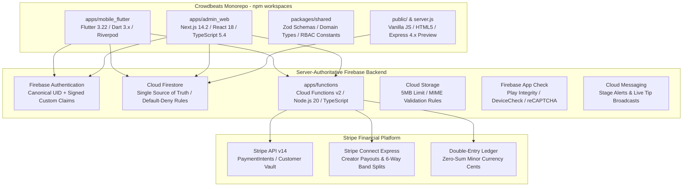
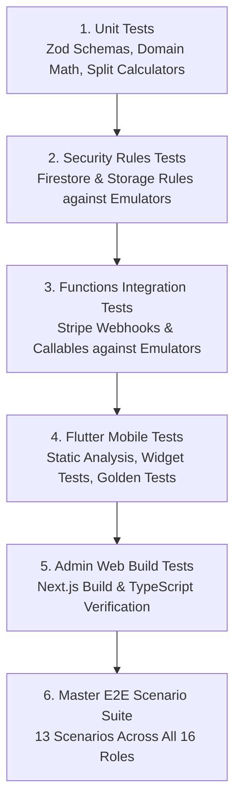
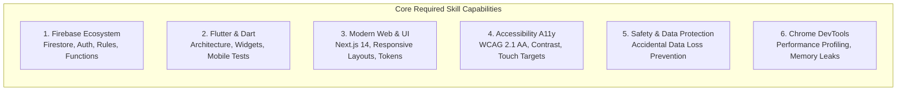

# Crowdbeats — AI Skill Capability Requirements & Architectural Assessment

**Document:** `docs/ai/CROWDBEATS_SKILL_REQUIREMENTS.md`  
**Date:** 2026-08-24  
**Status:** **ASSESSMENT COMPLETE — SPECIFICATION ONLY (NO CODE IMPLEMENTATION)**  
**Target Repository:** `crowdbeats-app`  

---

## Executive Summary

This document presents a comprehensive, evidence-based architectural assessment of the **Crowdbeats Cross-Platform Music Technology Platform** to determine the exact capabilities, skills, and tools required for artificial intelligence pair-programming agents operating on this codebase.

Crowdbeats is a cross-platform live music ecosystem comprising:
1. **Flutter Native Mobile Client** (iOS & Android) for Fans, Solo Musicians, and Band Members.
2. **Responsive Web Client Workspaces** for Solo Artists, Bands, Venues, and Sponsors.
3. **Enterprise SaaS & CRM Control Plane** (Next.js 14 App Router) for 16 internal staff roles across 18 operational modules.
4. **Server-Authoritative Shared Backend** powered by Firebase Authentication, Cloud Firestore, Cloud Functions Gen 2, Cloud Storage, Firebase App Check, and Cloud Messaging (FCM).
5. **Financial & Payout Engine** powered by Stripe, Stripe Connect, tokenized payment methods, and an immutable zero-sum double-entry ledger in minor currency units (cents).

---

## 1. Current Technology Stack Detected

### Detailed Component Inventory
- **Mobile Client (`apps/mobile_flutter/`)**:
  - Flutter SDK `^3.22.0`, Dart SDK `^3.0.0`
  - State Management: Riverpod `^2.5.1` & Provider `^6.1.1`
  - Firebase Plugins: `firebase_core`, `firebase_auth`, `cloud_firestore`, `firebase_storage`, `firebase_messaging`
  - Native Hardware Integration: Camera (QR code scanner), Bluetooth Low Energy (BLE stage beacons), Geolocation (nearby venue radar).
- **Enterprise Web Portal (`apps/admin_web/`)**:
  - Next.js `14.2.35` (App Router, Server Actions, Edge/Node Middleware)
  - TypeScript `5.4.x`, React `18.x`, Vanilla CSS Tokens & Glassmorphic styling.
  - Multi-module CRM, Financial Ledger, Fraud Engine, and Audit Inspector.
- **Shared Domain Contracts (`packages/shared/`)**:
  - TypeScript contracts validated via **Zod `^3.22.4`**.
  - Single source of truth for 23 domain schemas, 16 enterprise roles, 84 discrete permissions, and theme tokens.
- **Backend Services (`apps/functions/`)**:
  - Firebase Cloud Functions Gen 2 (Node.js 20 runtime, TypeScript)
  - Firebase Admin SDK `^12.0.0`
  - Stripe SDK `^14.19.0` with server-side webhook signature verification.
- **Security & Rules Layer**:
  - `firestore.rules` (409 lines): Default-deny security model with relational RBAC functions.
  - `storage.rules`: Strict file size, MIME type, and owner isolation constraints.
- **Automated Validation Suite (`scripts/`)**:
  - 10 automated test suites (84 assertions) covering RBAC, double-entry ledger, Stripe webhooks, and auth lifecycle.

---

## 2. Architecture Findings

1. **13 Immutable Core Invariants**:
   - **Single Identity per Human**: Every individual has exactly one canonical UID in `/users/{uid}` across iOS, Android, and Web (`docs/IDENTITY_PROFILE_MEMBERSHIP_MODEL.md`).
   - **No Siloed Databases**: Web and Mobile query and mutate the exact same Cloud Firestore collections; zero duplicate or platform-specific databases.
   - **Server-Authoritative Ledgers**: Client applications have zero write permissions to balances, ledger entries, or payout distributions.
   - **Stripe Secret Isolation**: Stripe Secret Keys (`sk_...`) and Webhook Secrets (`whsec_...`) reside strictly in Cloud Functions Gen 2 via Google Secret Manager.
   - **Zero Client-Side Privilege Escalation**: Admin privileges are enforced via signed JWT Custom Claims (`isPlatformAdmin: true`), provisioned solely via callable functions requiring Super-Admin step-up authentication.
2. **Multi-Persona Context Switcher**:
   - Authenticated users transition between `FAN`, `SOLO_MUSICIAN`, `BAND_MEMBER`, `VENUE_STAFF`, and `SPONSOR_REP` without logging out or creating secondary accounts.
3. **Double-Entry Financial Accounting**:
   - All transactions balance to zero cents: $\sum \text{Debits} = \sum \text{Credits}$.
   - Integer minor currency units (`amountCents`) prevent floating-point rounding errors.
4. **Physical Stage Verification**:
   - Live stage check-in uses cryptographic rotating HMAC SHA-256 tokens with a 300-second TTL to prevent remote location spoofing.

---

## 3. Product Roles Detected

### 3.1 External Consumer & Creator Personas
| Role | Platform Surface | Primary Responsibilities & UX Workflows |
| :--- | :--- | :--- |
| **`FAN`** | Mobile & Web | Discovers live music via Nearby Radar; 1-tap tips with saved payment methods; earns VIP loyalty tiers (Diamond, Platinum, Gold, Silver); redeems stage perks; follows artists. |
| **`SOLO_MUSICIAN`** | Mobile & Web | Broadcasts live stage sessions; generates 300s rotating HMAC QR tokens; receives real-time tip streams; creates bio/EPK; links Stripe Express payout account. |
| **`BAND_MEMBER` / `BAND_OWNER`** | Mobile & Web | Manages band member roster; configures automated 6-way payout splits (must equal exactly 100%); transfers band ownership; views collective ledger earnings. |
| **`VENUE_STAFF` / `VENUE_MANAGER`** | Web & Mobile | Configures physical stage geofences and BLE beacons; manages event calendar; establishes venue tip-matching floors. |
| **`SPONSOR_REP` / `SPONSOR_ADMIN`** | Web | Funds live tipping match pools (e.g. 2x multiplier); reviews campaign impression analytics and tax receipts. |

### 3.2 Enterprise Administrative & Operations Roles (16 Roles)
| Enterprise Role | Department | Access Scope & Capabilities |
| :--- | :--- | :--- |
| **`EXECUTIVE`** | Leadership | Read-only executive analytics, GMV, take-rate revenue, compliance export downloads. |
| **`SUPER_ADMIN`** | Platform Core | Full platform authority, custom claims provisioning, step-up password authentication, platform settings. |
| **`FINANCE_ADMIN`** | Finance | Payout releases, dispute reserve management, double-entry ledger oversight. |
| **`FINANCE_ANALYST`** | Finance | Transaction monitoring, Stripe fee reconciliation, financial auditing. |
| **`ARTIST_OPS_ADMIN`** | Operations | Musician identity verification (KYC), stage badge approvals, EPK reviews. |
| **`CAMPAIGN_OPS_ADMIN`** | Operations | Crowdfunding project approval, milestone validation, campaign escrow releases. |
| **`TRUST_SAFETY_ADMIN`**| Trust & Safety | User suspensions, content moderation triage, DMCA copyright enforcement. |
| **`FRAUD_INVESTIGATOR`** | Trust & Safety | Multi-signal carding velocity checks, risk scoring, suspicious account freezing. |
| **`SUPPORT_MANAGER`** | Support | Ticket escalations, emergency 24-hour tip reversal authorisations. |
| **`SUPPORT_AGENT`** | Support | Fan and creator inquiry handling, receipt lookup, basic account assistance. |
| **`MARKETING_ADMIN`** | Growth | Featured artist promotions, banner placements, push notification broadcasts. |
| **`PARTNERSHIP_ADMIN`** | Growth | Sponsor onboarding, match pool contract governance. |
| **`COMPLIANCE_ADMIN`** | Legal | Cryptographic compliance data exports, GDPR/CCPA PII deletion orchestration. |
| **`DATA_ANALYST`** | BI & Analytics | Custom analytics queries, cohort retention analysis, platform usage trends. |
| **`TECH_OPS`** | Engineering | Feature flag management, system health monitoring, WAF emergency IP blocking. |
| **`AUDITOR`** | Independent | Read-only append-only immutable audit trail verification. |

---

## 4. Mobile Requirements (Flutter)

1. **Ergonomic Touch-First UX**:
   - Minimum 48x48 dp touch targets for live stage environments.
   - Smooth 60fps scrolling and dark-mode high-contrast visuals.
2. **Native Device Hardware Integration**:
   - Camera access for rapid stage QR scanning.
   - Bluetooth Low Energy (BLE) scanning for stage beacon proximity.
   - Fine and coarse geolocation for live stage radar.
3. **Real-Time Stream Resilience**:
   - Firestore `snapshots()` with local offline cache fallback.
   - Optimistic UI updates for tipping and following actions.
4. **Universal Deep Linking**:
   - `crowdbeats://performer/{id}`, `crowdbeats://tip/{id}`, `crowdbeats://stage/{id}/checkin`.

---

## 5. Web Requirements (Responsive Client Dashboards)

1. **Adaptive Responsive Layouts**:
   - Full 3-column desktop layout ($\ge 1200\text{px}$), 2-column tablet grid ($768\text{px}-1199\text{px}$), and ergonomic mobile drawer ($< 768\text{px}$).
2. **15-Module Solo Musician Workspace**:
   - Dashboard, Profile Studio, Campaigns, Tips, Fans CRM, Analytics, Messages, Events, Media, Payouts, Marketing, Rewards, Settings, Security.
3. **Band Split Governance Console**:
   - Interactive percentage sliders/pills with server-side validation ensuring $\sum \text{splits} = 100\%$.
4. **High-Performance Glassmorphic UI**:
   - Hardware-accelerated CSS backdrop filters, standardized color tokens (`#ff97ba`, `#8B5CF6`, `#131315`), and zero layout shifts.

---

## 6. Enterprise Requirements (Next.js 14 Control Plane)

1. **Role-Based Route & Component Guards**:
   - Server-side Next.js middleware validating signed JWT custom claims before page render.
2. **18 Enterprise Modules**:
   - Admins, Alerts, Analytics, Audit, Campaigns, CRM, Dashboard, Engagement, Finance, Monitor, Permissions, Platform, Roles, Safety, Security, Stages, Tasks, Venues.
3. **Immutable Audit Trail**:
   - Append-only event store capturing `AuditID`, `ActorUID`, `Role`, `Action`, `Resource`, `Timestamp`, and `IPHash`.
4. **Operational Batching**:
   - Bulk payout approvals, batch user notifications, CSV ledger exports.

---

## 7. Firebase Requirements

1. **Firebase Authentication**:
   - Email/Password, Google Sign-In, Apple Sign-In (with private relay).
   - Custom Claims lifecycle management (`isPlatformAdmin`, `staffRole`, `permissions`).
2. **Cloud Firestore**:
   - 23 primary collections, strict default-deny rules, subcollections for audit logs and band memberships.
3. **Cloud Functions Gen 2**:
   - HTTPS callable functions with auth & App Check middleware.
   - Eventarc & HTTP webhook receivers for Stripe.
   - Cron-scheduled background reconciliation jobs.
4. **Firebase App Check**:
   - DeviceCheck (iOS), Play Integrity (Android), reCAPTCHA Enterprise (Web).
5. **Firebase Storage**:
   - Max 5MB file uploads, image format validation (JPEG, PNG, WebP), automatic thumbnail generation.
6. **Firebase Cloud Messaging (FCM)**:
   - Topic-based broadcasts for live stage broadcasts and instant tip alerts.

---

## 8. Payment Requirements (Stripe & Ledger)

1. **Stripe Elements & Mobile SDK**:
   - Tokenized card payments, Google Pay.
2. **Stripe Connect Express**:
   - Automated onboarding for solo musicians and bands; automated split transfers.
3. **Double-Entry Ledger Architecture**:
   - Pure integer minor currency cents (`amountCents`).
   - Zero-sum balance constraint across all transactions.
4. **Webhook Processing**:
   - HMAC SHA-256 signature verification (`stripe.webhooks.constructEvent`).
   - Idempotency store to guarantee at-most-once ledger posting.
5. **Dispute & Refund Lifecycle**:
   - Automatic 100% reserve hold on chargeback notification; 24-hour accidental tip refund window.

---

## 9. Security Requirements

1. **Zero Secret Leakage**:
   - Strict prohibition of `sk_live_`, `sk_test_`, or private keys in client code or Git.
2. **Firestore Security Model**:
   - Granular RBAC helper functions (`isOwner`, `isBandMember`, `isBandManagerOrOwner`, `isVenueStaff`, `hasPermission`).
   - Anti-privilege escalation guards preventing modification of sensitive fields.
3. **Cryptographic Stage Verification**:
   - Rotating HMAC SHA-256 tokens with 300s expiration.
4. **Data Privacy & Governance**:
   - GDPR/CCPA PII sanitization workflows on user deletion.

---

## 10. Testing Requirements

1. **Security Rules Coverage**: 100% of collection paths validated for allowed and denied operations.
2. **Ledger Invariant Tests**: Automated proof that total debits equal total credits for every transaction type.
3. **Zero Production Testing**: All automated test suites must execute strictly against local Firebase Emulators.

---

## 11. Accessibility Requirements (A11y)

1. **WCAG 2.1 Level AA Compliance**:
   - Color contrast ratio $\ge 4.5:1$ for standard text, $\ge 3:1$ for large display text and UI components.
2. **Ergonomic Touch Targets**:
   - Minimum $48 \times 48\text{ dp}$ on Flutter; minimum $44 \times 44\text{ px}$ on Web.
3. **Screen Reader & Keyboard Navigation**:
   - Proper `Semantics` on Flutter widgets; semantic HTML elements (`<button>`, `<nav>`, `<main>`) and `aria-label` tags on Web.
   - Logical tab ordering and visible focus rings.

---

## 12. DevOps Requirements

1. **Monorepo Management**:
   - npm workspaces with shared TypeScript contracts (`@crowdbeats/shared`).
2. **Environment Separation**:
   - Development (Local Emulators), Staging (`crowdbeats-staging`), Production (`crowdbeats-prod`).
3. **CI/CD Automation**:
   - GitHub Actions pipeline enforcing secret scanning, linting, rules emulator execution, Flutter analyze/test, and Next.js production build.
4. **Secret Management**:
   - Google Cloud Secret Manager for Stripe keys and API tokens.

---

## 13. Analytics Requirements

1. **Executive KPI Dashboard**:
   - Real-time GMV, Net Platform Revenue, Active Stages, Tip Velocity.
2. **Operational Telemetry**:
   - Stripe webhook latency, failed payment rates, WAF blocked request counters.
3. **Creator & Fan In-App Analytics**:
   - Top patrons leaderboard, peak tipping songs/hours, fan loyalty tier distribution.
4. **Privacy-Preserving Design**:
   - Aggregate telemetry only; zero raw card data or unhashed PII in analytical logs.

---

## 14. Skill Capability Categories Crowdbeats Actually Needs

Based on our thorough repository inspection, the following **Antigravity AI Skills (AAS Skills)** represent the exact, necessary capabilities for this project:

### 14.1 Firebase Ecosystem & Security Rules
- **Relevant Skills**:
  - `firebase-firestore`: Firestore schema design, indexing, and query optimization.
  - `firebase-basics`: Firebase CLI workflows, emulator configuration, and project initialization.
  - `firebase-auth-basics`: Authentication flows, OAuth providers, and custom claims lifecycle.
  - `firebase-security-rules-auditor`: Comprehensive auditing of `firestore.rules` and `storage.rules` to prevent privilege escalation.
  - `firebase-app-hosting-basics`: Modern Next.js SSR deployment configuration on Firebase App Hosting.

### 14.2 Flutter Mobile & Dart Engineering
- **Relevant Skills**:
  - `flutter-apply-architecture-best-practices`: Layered architecture (UI, Logic, Data/Repositories) and state management.
  - `flutter-build-responsive-layout`: Adaptive layouts across mobile form factors and orientations.
  - `flutter-fix-layout-issues`: Diagnosing and resolving RenderFlex overflows and constraint boundaries.
  - `flutter-add-widget-test`: Component-level widget testing with `WidgetTester`.
  - `dart-run-static-analysis`: Enforcing static analysis standards and linting rules.
  - `flutter-setup-declarative-routing`: Configuring robust declarative routing (`go_router`).

### 14.3 Modern Web, Design Systems & Component Architecture
- **Relevant Skills**:
  - `modern-web-guidance`: Modern web standards (CSS Container Queries, Dialogs, View Transitions, Backdrop Filters, Modern Forms).
  - `react-vite-dashboard` / `shadcn-ui`: Clean component modularity and accessible dashboard primitives.
  - `design-md` / `taste-design`: Semantic design system tokens, typography scales, and UI consistency.

### 14.4 Accessibility (A11y) Auditing
- **Relevant Skills**:
  - `a11y-debugging`: Chrome DevTools MCP accessibility tree auditing, ARIA verification, color contrast checks.
  - `flutter_a11y_agent`: Automated accessibility review of Flutter widgets and semantics.

### 14.5 Accidental Data Loss Prevention
- **Relevant Skills**:
  - `accidental-data-loss-prevention`: Mandatory safety guard requiring explicit verification before any destructive database, storage, or cloud infrastructure operation.

### 14.6 Performance & DevTools Diagnostic Engineering
- **Relevant Skills**:
  - `chrome-devtools`: Real-time DOM inspection, network debugging, and performance profiling.
  - `debug-optimize-lcp`: Core Web Vitals and Largest Contentful Paint optimization.
  - `memory-leak-debugging`: Heap snapshot analysis to detect unclosed Firestore `onSnapshot` listeners.

---

## 15. Skills & Categories Crowdbeats Does NOT Need

To prevent bloat, prompt dilution, and agent confusion, the following skill categories must be strictly excluded:

| Excluded Skill Category | Specific Skill Names | Detailed Technical Rationale for Exclusion |
| :--- | :--- | :--- |
| **BigQuery & Data Warehousing** | `bigquery-sql`, `bigquery-ai-ml`, `bigquery-bigframes`, `bigquery-data-transfer-service`, `bigquery-graph`, `dataform-bigquery`, `dbt-bigquery`, `data-autocleaning`, `federate-lakehouse-catalog`, `discovering-gcp-data-assets` | **Transactional vs Analytical Mismatch**: Crowdbeats runs on Cloud Firestore NoSQL as its single source of truth. It does not use BigQuery data warehouses, dbt transformation models, or Dataform pipelines. Loading these skills risks generating SQL queries incompatible with Firestore. |
| **Distributed Big Data & Spark** | `gcp-spark`, `gcp-composer-troubleshooting`, `gcp-pipeline-orchestration`, `gcp-pipeline-resource-provisioning`, `gcp-managed-airflow-migrations` | **Zero Hadoop/Spark Infrastructure**: The project uses lightweight serverless Cloud Functions Gen 2 in TypeScript, not Apache Spark clusters, Dataproc jobs, or Airflow DAGs. |
| **Dataflow & Beam Streaming** | `gcp-dataflow` | **Native Firestore Real-Time Streams**: Real-time data synchronization is natively handled via Firestore snapshot streams, not Apache Beam / Google Cloud Dataflow pipelines. |
| **Heavy ML & Jupyter Notebooks** | `ml-best-practices`, `notebook-guidance` | **Deterministic Financial Rules**: Crowdbeats relies on deterministic double-entry ledgers, Zod validation schemas, and rule engines. No Jupyter notebooks (`.ipynb`) or predictive model training workflows exist. |
| **Chrome Extensions Development** | `chrome-extensions` | **Irrelevant Platform Target**: Crowdbeats is a Flutter mobile app and responsive web application, not a Manifest V3 browser extension. |
| **Video Rendering Engines** | `remotion` | **No Programmatic Video Generation**: Crowdbeats is a live music interaction and tipping platform, not an automated video generation pipeline. |
| **C/C++ Native Assets & FFI Bindings** | `dart-setup-ffi-assets`, `dart-use-ffigen` | **Standard Flutter Plugins**: Crowdbeats uses standard Flutter plugins (`cloud_firestore`, `camera`, etc.) without custom C/C++ dynamic libraries or native FFI compilation. |
| **Python Dependency Tooling** | `managing-python-dependencies` | **Zero Python in Monorepo**: The codebase is 100% TypeScript/JavaScript (Node.js/Next.js) and Dart (Flutter). There is zero Python code in the repository. |

---

## 16. Risks from Installing Unnecessary Skills

1. **Context Window Degradation & Prompt Dilution**:
   - Loading extraneous tool definitions and documentation consumes valuable context tokens, reducing the agent's reasoning depth on core Firestore and Flutter tasks.
2. **Cross-Technology Hallucination**:
   - Exposure to SQL/BigQuery tools can cause an AI agent to mistakenly generate relational SQL migrations or BigQuery queries instead of Firestore subcollections and security rules.
3. **Execution Latency**:
   - Every unnecessary tool schema increases tool dispatch overhead and slows down agent response times.
4. **Security & Accidental Destructive Commands**:
   - Equipping agents with broad data warehouse or cluster manipulation tools introduces unnecessary risk when working near production cloud environments.

---

## 17. Recommended Next Steps

1. **Formal Review & Sign-Off**:
   - Review and adopt this skill requirements document as the authoritative baseline for AI agent configuration on Crowdbeats.
2. **Curated Skill Activation**:
   - Equip the development environment strictly with the core required skills identified in **Section 14** (Firebase, Flutter, Modern Web, A11y, Safety, DevTools).
3. **Execute Phased Product Development**:
   - With capabilities aligned, proceed with feature development, testing, and hardening in strict accordance with the **13 Immutable Core Architecture Invariants**.

---
*Assessment concluded. Zero code was modified during this evaluation.*
