# Crowdbeats V2 — Admin Control Center Information Architecture

**Document Status:** Approved Architecture  
**Authoritative Visual Reference:** Google Stitch Project `5326179813018056505` ("Vivid Resonance")  
**Target Platform:** Next.js Desktop-First Responsive Staff Control Plane  

---

## 1. Hierarchy Overview

```mermaid
graph TD
    A[Admin Control Center] --> B[1. Core Operations]
    A --> C[2. Financial & Growth]
    A --> D[3. Governance, Safety & Legal]
    A --> E[4. System, Staff & APIs]

    B --> B1[Command Center /admin/command-center]
    B --> B2[CRM & Users /admin/crm]
    B --> B3[Artists & Bands /admin/artists]
    B --> B4[Campaigns & Escrow /admin/campaigns]
    B --> B5[Live Stages & Radar /admin/live]

    C --> C1[Finance & Daily Reconciliation /admin/finance]
    C --> C2[Sponsors & Match Pools /admin/sponsorships]
    C --> C3[Venues & Geofences /admin/venues]
    C --> C4[Growth & Marketing /admin/marketing]
    C --> C5[Community & Fans /admin/community]

    D --> D1[Trust & Safety /admin/trust-safety]
    D --> D2[Compliance & Legal Register /admin/compliance]
    D --> D3[Support & Refunds /admin/support]
    D --> D4[Content Moderation & DMCA /admin/content]
    D --> D5[Enterprise Analytics /admin/analytics]

    E --> E1[Platform & Synthetic Health /admin/platform]
    E --> E2[Staff, Roles & Permissions /admin/administration]
```

---

## 2. Route Group Specifications

| Group | Route | Purpose | Required Role | Audit Event |
| :--- | :--- | :--- | :--- | :--- |
| **Command Center** | `/admin/command-center` | Executive summary of active performers, GMV, health probes, and active safety incidents. | `user:read_any` | `ADMIN_DASHBOARD_VIEWED` |
| **CRM & Users** | `/admin/crm` | Searchable lifecycle records (Account, Persona, Verification) with soft-delete review. | `user:read_any` | `ADMIN_USER_INSPECTED` |
| **Artists & Verification** | `/admin/artists` | Musician and band EPK verification queue, document reviews, and badge issuance. | `user:read_any` | `ADMIN_VERIFICATION_DECIDED` |
| **Campaigns & Escrow** | `/admin/campaigns` | Crowdfunding approval queue, goal progress, payout holds, and milestone fulfillment. | `user:read_any` | `ADMIN_CAMPAIGN_MODERATED` |
| **Live Stages** | `/admin/live` | Real-time GPS and Bluetooth beacon broadcast monitoring across metro areas. | `user:read_any` | `ADMIN_STAGE_INSPECTED` |
| **Finance & Ledger** | `/admin/finance` | Daily automated reconciliation between internal ledger and Stripe PaymentIntents/Payouts. | `finance:view_transactions` | `FINANCIAL_RECONCILIATION_RUN` |
| **Sponsors & Pools** | `/admin/sponsorships` | Corporate match pool budgets, escrow allocations, and sponsorship invoices. | `finance:view_transactions` | `ADMIN_SPONSOR_INSPECTED` |
| **Venues** | `/admin/venues` | Stage geofence boundaries, physical check-in beacons, and venue manager verification. | `user:read_any` | `ADMIN_VENUE_MODIFIED` |
| **Trust & Safety** | `/admin/trust-safety` | Severe incident escalations, blocked accounts, harassment cases, and bans. | `moderation:view_reports` | `ADMIN_SAFETY_ACTIONED` |
| **Compliance Register** | `/admin/compliance` | 28 statutory obligation subject areas, evidence links, and attorney review queue. | `compliance:view_register` | `COMPLIANCE_OBLIGATION_UPDATED` |
| **Support & Refunds** | `/admin/support` | 24-hour fan tip refund inquiries, dual-approval workflow for large refunds (> $100). | `finance:issue_standard_refund` | `ADMIN_REFUND_APPROVED` |
| **Content & DMCA** | `/admin/content` | UGC abuse reports, automated profanity logs, DMCA takedown notices, counter-notices. | `moderation:review_content` | `DMCA_TAKEDOWN_PROCESSED` |
| **Platform & Health** | `/admin/platform` | Synthetic probe health, Firestore latency, Stripe gateway status, API keys. | `security:view_incidents` | `PLATFORM_CONFIG_VIEWED` |
| **Staff & Roles** | `/admin/administration` | Staff invitations, 14-role RBAC assignments, MFA status, and audit log exports. | `admin:view_staff` | `STAFF_ROLE_MODIFIED` |
