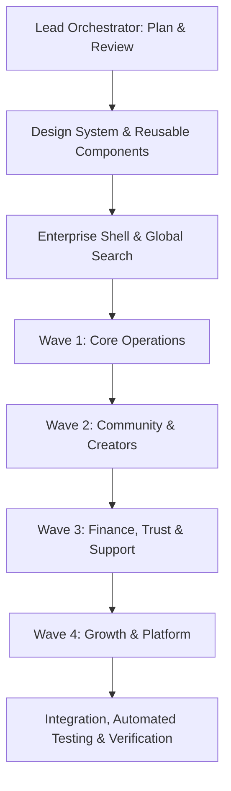

# Crowdbeats V2 — Enterprise Administration Console Master Plan & Screen Design Matrix
**Phase A: Architecture, Metric Registry, Permission Matrix, Screen Specifications & Runbooks**

- **Platform:** Crowdbeats V2 Live Music Platform
- **Lead Architect & Design Director:** Lead Orchestrator
- **Branch:** `feat/admin-operations-overhaul`
- **Design System Anchor:** Google Stitch Project `5326179813018056505` ("Vivid Resonance") + WCAG 2.2 AA Design Tokens

---

## 1. Executive Mission & Working Boundaries

The Crowdbeats V2 Admin Control Plane is an enterprise-grade operational console providing immediate situational awareness across live discovery, creator monetization, payments & financial integrity, trust & safety, and platform resilience.

### Invariant Business & Product Rules
1. **Primary Journey (Fan Discovery):** Geolocation map/list discovery connects fans with live solo musicians and bands. Coarse, time-bucketed audience signals protect fan privacy; private fan locations are never exposed as map pins.
2. **Secondary Journey (QR Entry):** Unique performer QR codes resolve to that specific solo artist or band tipping flow. Reusable creator QR links and short-lived payment session tokens are strictly distinguished to prevent anti-replay abuse.
3. **Guest & Tipping Contract:** Guests can browse freely; tipping requires authenticated sign-in and explicit payment confirmation.
4. **Creator & Fan Roles:** Fans cannot receive payouts or silently switch into creator roles. Band membership, financial authority, and split allocations are distinct permissions.
5. **Fee Structure:** Default Crowdbeats platform fee is 6% plus applicable Stripe processing fees. Fee schedules clearly distinguish fees, payer/bearer, creator net, and payout charges.
6. **Authorization & Separation of Duty:** Admin operations enforce deny-by-default RBAC across 14 platform roles. High-risk operations (> $100 refunds, staff role elevations, compliance payout holds) require two-person sign-off.
7. **Financial Settlement:** UI actions never synthesize settlement; idempotent transactions, provider webhook verification, and automated reconciliation govern all ledger transitions.

---

## 2. Monorepo Inventory & Existing Gaps

| Area | Existing Path | Current State | Required Upgrade |
| :--- | :--- | :--- | :--- |
| **Shell & Nav** | `apps/web/app/(admin)/layout.tsx` | 6 sections, basic sidebar | 5 groups (Overview, Community, Operations, Growth, Platform), 14 canonical sections, global entity search, 256px sidebar, breadcrumbs, responsive drawer. |
| **01 Command Center** | `apps/web/app/(admin)/admin/command-center` | Partial cards & charts | 5 tabs, 8 compact cards (snapshots vs period totals), 7/5 split (Needs Attention queue + Discovery funnel & Service health), regional map/table, payment trend. |
| **02 Users & Accounts** | `apps/web/app/(admin)/admin/users` (aliasing `crm`) | Basic CRM directory | 8 tabs, 4 top cards, directory table with role/region/status, detail drawer (11 tabs), account requests queue, controlled profile editor. |
| **03 Discovery & Live Map**| `apps/web/app/(admin)/admin/discovery` (aliasing `live`) | Radar canvas | 6 tabs, 4 top cards, 2/3 map + 1/3 list synchronized, supply/demand table, search funnel, location error/staleness, QR analytics. |
| **04 Musicians & Bands** | `apps/web/app/(admin)/admin/creators` (aliasing `artists`) | Artists list | 7 tabs, 4 top cards, creator table with live/provider status, onboarding funnel, detail drawer (split history totaling 100%, verification queue). |
| **05 Campaigns** | `apps/web/app/(admin)/admin/campaigns` | Basic table | 8 tabs, 4 top cards, review queue (preview left + checklist right), progress tracking, rewards/obligations calendar. |
| **06 Payments & Finance** | `apps/web/app/(admin)/admin/finance` | Dispersed subpages | 10 tabs, 4 top cards, full-width financial ledger, reconciliation side-by-side (ledger vs Stripe), fee editor with 6% slider and overrides. |
| **07 Trust & Safety** | `apps/web/app/(admin)/admin/trust-safety` | Basic report table | 7 tabs, 4 top cards, 2-pane queue (cases left, evidence right), decision history, appeals separation, policy library. |
| **08 Support** | `apps/web/app/(admin)/admin/support` | Ticket modal | 8 tabs, 4 top cards, 3-pane workspace (queue, conversation, context panel), private notes vs public replies. |
| **09 Sponsors** | `apps/web/app/(admin)/admin/sponsors` (aliasing `sponsorships`)| Placeholder cards | 7 tabs, 4 top cards, sponsorship table, application funnel, deliverable calendar, document viewer. |
| **10 Content & Comms** | `apps/web/app/(admin)/admin/content` | Content list | 8 tabs, 4 top cards, list/calendar toggle, live light/dark preview editor, featured placements, media library. |
| **11 Analytics & Reports** | `apps/web/app/(admin)/admin/analytics` | High-level metrics | 10 tabs, 4 top cards, comparison controls, retention cohort matrix, regional heatmaps, custom report builder. |
| **12 System Health** | `apps/web/app/(admin)/admin/system-health` (aliasing `platform`) | Synthetic probes | 8 tabs, 4 top cards, dependency board, latency/error charts, webhook inspect & retry, log redaction. |
| **13 Security & Audit** | `apps/web/app/(admin)/admin/security` (aliasing `compliance`) | Threat radar | 8 tabs, 4 top cards, immutable audit log table, session revocation, App Check status, incident response. |
| **14 Settings & Access** | `apps/web/app/(admin)/admin/settings` (aliasing `administration`) | Staff invite form | 11 tabs, 4 top cards, secondary settings nav, permission matrix table, feature flags, disaster recovery test logs. |

---

## 3. Team Ownership & Execution Sequence

### Specialist File Ownership
1. **Lead Orchestrator:** Global architecture, integration, final verification (`ADMIN_REDESIGN_MASTER_PLAN_PHASE_A.md`).
2. **Enterprise UX/UI & Design System Specialist:** Reusable components (`apps/web/components/admin/*`), design tokens (`packages/design-tokens/*`).
3. **Frontend Engineer:** 14 page compositions, routes, layouts, and interactive controls (`apps/web/app/(admin)/*`).
4. **Backend & Payments Specialist:** Firestore hooks, queries, reconciliation, fee editor logic (`apps/web/lib/admin/*`, `packages/contracts/*`).
5. **Security, Privacy & QA Specialist:** RBAC permissions, audit logging, Jest test suites, accessibility verification.

---

## 4. Screen-by-Screen Design Matrix (All 14 Sections)

| # | Section Route | Tabs | Top Metric Cards | Primary Widgets / Workspaces | Primary Actions | RBAC Roles |
| :- | :--- | :--- | :--- | :--- | :--- | :--- |
| **01** | `/admin/command-center` | Overview, Needs Attention, Live Activity, Regional Snapshot, Saved Views | 1. Live Solo (Snap) 2. Live Bands (Snap) 3. Active Fans (Snap) 4. Gross Tips ($) 5. Payment Comp % 6. Platform Fee ($) 7. Failed Payouts (Adv) 8. Overdue Cases (Adv) | • Needs Attention Queue (7/5 split) • Service Health & Discovery Funnel • Live Regional Performer Map & Table • GMV Time Series & Pulse Stream | Investigate Alert, Acknowledge Incident, Assign Owner, Quick Filter | All Authorized Staff (Scope-gated) |
| **02** | `/admin/users` | All Users, Fans, Solo Accounts, Band Accounts, Sponsors, Verification, Suspended, Account Requests | 1. New Accounts (24h) 2. Active 7d 3. Incomplete Onboarding 4. Restricted Accounts | • Searchable User Directory • 11-Tab User Detail Drawer • Controlled Profile Edit Modal • Account Requests Queue | Edit Profile, Suspend/Restore, Reset Sessions, View History | Support, Trust & Safety, Super Admin |
| **03** | `/admin/discovery` | Live Map, Check-ins, Search Quality, Regional Coverage, Location Health, QR Entry Analytics | 1. Live Verified Artists 2. Covered Metro Regions 3. Zero-Result Searches 4. Stale Check-ins | • 2/3 Interactive Map + 1/3 List • Supply & Demand Table • Search Drop-off Funnel • QR Conversion vs Replay Matrix | Filter Region, Force End Session, Inspect Search Query | Operations, Support, Super Admin |
| **04** | `/admin/creators` | Solo Musicians, Bands, Onboarding, Verification, Membership, Split Agreements, Creator Success | 1. Payout-Ready Creators 2. Blocked Onboarding 3. Active Bands 4. Unresolved Splits | • Creator Directory & Stage Status • Onboarding Velocity Funnel • Band Split Inspector (100% total) • EPK Verification Queue | Approve Verification, Feature Creator, Resolve Split Dispute | Artist Relations, Compliance, Super Admin |
| **05** | `/admin/campaigns` | Pending Review, Active, Completed, Rejected, Flagged, Rewards, Updates, Reports | 1. Active Campaigns 2. Funds Escrowed ($) 3. Pending Reviews 4. Overdue Rewards | • Campaign Approval Queue • Split Review (Preview left, Decisions right) • Funding Progress Tracker • Reward Fulfillment Calendar | Approve/Reject Campaign, Place Escrow Hold, Review Reward | Operations, Finance, Super Admin |
| **06** | `/admin/finance` | Transactions, Platform Fees, Stripe Costs, Payouts, Refunds, Disputes, Ledger, Reconciliation, Holds, Exports | 1. Gross Tip Volume ($) 2. Net Platform Fees ($) 3. Available Creator Funds 4. Unreconciled Variance | • Full-Width Financial Ledger • Side-by-Side Reconciliation Table • Configurable 6% Fee Slider & Overrides • Dispute Evidence Queue | Run Daily Recon, Issue Refund (Dual signoff if >$100), Apply Fee Override | Finance Admin, Super Admin |
| **07** | `/admin/trust-safety`| Reports, Content Review, Account Abuse, Payment Risk, Location Abuse, Appeals, Policy Library | 1. High-Severity Reports 2. Oldest Case Age 3. Pending Reviews 4. Confirmed Repeat Violations | • 2-Pane Case Workspace • Evidence & Context Inspector • User Strike & Sanction History • Appeals Determination Form | Apply Ban/Strike, Remove UGC, Uphold/Overturn Appeal | Trust & Safety, Moderator, Super Admin |
| **08** | `/admin/support` | Inbox, Payment Help, Payout Help, Account Access, Band Issues, Campaign Issues, Escalations, Help Articles | 1. Open Tickets 2. Overdue SLA Tickets 3. Median First Response 4. Median Resolution Time | • 3-Pane Desk (Queue, Chat, Context) • Visibly Distinct Internal Notes • Linked Payment/User Cards • SLA Countdown Monitor | Assign Ticket, Send Customer Reply, Escalate to Tier 2 | Support Agent, Support Lead, Super Admin |
| **09** | `/admin/sponsors` | Accounts, Applications, Sponsorships, Contracts, Deliverables, Payments, Disputes | 1. Active Sponsors 2. Active Match Pools 3. Unsigned Agreements 4. Overdue Deliverables | • Sponsor Directory & Org Hierarchy • Match Pool Escrow Ledger • Deliverable Verification Checklist • Contract Milestone Viewer | Review Application, Audit Pool Deposit, Approve Deliverable | Partnerships, Finance, Super Admin |
| **10** | `/admin/content` | Landing Content, Featured Creators, Featured Campaigns, Media, Announcements, Templates, Help Content, Scheduled | 1. Scheduled Drops 2. Assets in Review 3. Active Placements 4. Failed Notifications | • CMS List / Calendar Dual View • Side-by-Side Light/Dark Preview Editor • Media Asset Library with Dimensions • Broadcast Audience Estimator | Publish Content, Schedule Drop, Reorder Featured Slots | Growth Manager, Marketing, Super Admin |
| **11** | `/admin/analytics` | Acquisition, Activation, Discovery, Tipping, Creator Success, Retention, Campaigns, Sponsors, Regions, Saved | 1. Activated Fans (30d) 2. Discovery-to-Tip % 3. Retained Artists (90d) 4. Repeat Tippers % | • Period Comparison Funnels • Retention Cohort Matrix • Regional Conversion Geo-table • Custom Report Query Builder | Export Scoped CSV, Save Custom View, Schedule Report | Data Analyst, Executive, Super Admin |
| **12** | `/admin/system-health`| Service Status, Firebase, Maps & Places, Stripe Webhooks, Notifications, Background Jobs, Releases, Usage & Cost | 1. Platform Uptime (99.99%) 2. Synthetic Error Rate 3. p95 Latency (ms) 4. Job Queue Backlog | • Service Dependency Matrix • Synthetic Latency Trend (p50/p95/p99) • Webhook Audit & Idempotent Retry • Redacted Execution Logs | Trigger Health Probe, Re-drive Webhook, Clear Dead-Letter | Developer, DevOps, Super Admin |
| **13** | `/admin/security` | Admin Sign-ins, Sessions, Permission Changes, Sensitive Actions, API Access, App Check, Incidents, Audit Search | 1. Suspicious Logins 2. Elevated Privileges 24h 3. Denied Protected Actions 4. Active Security Incidents | • Unified Audit Event Stream • Active Admin Session Manager • Incident Response Workspace • Token & API Key Rotator | Terminate Session, Declare Incident, Export Forensic Log | Security Admin, Super Admin |
| **14** | `/admin/settings` | General, Admins & Roles, Permission Matrix, Fees & Policies, Notifications, Appearance, Localization, Flags, Integrations, Retention, Recovery | 1. Pending Approvals 2. Overdue Access Audits 3. Last Backup Verification 4. Configuration Alerts | • Secondary Navigation Settings Panels • 14x14 Interactive RBAC Matrix • Canary Feature Flag Toggles • Disaster Recovery Test Logs | Invite Admin, Save Policy Changes, Execute Backup Test | Super Admin, Compliance Admin |

---

## 5. Metric Registry & Precision Definitions

| Metric Identifier | Label | Source & Query Scope | Calculation & Denominator | Refresh Cadence | Adverse Indicator |
| :--- | :--- | :--- | :--- | :--- | :--- |
| `METRIC_LIVE_SOLO` | Live Solo Artists | `liveSessions` (status: active, performerType: solo) | Count of active leases renewed within last 5 minutes | Real-time (15s) | Low (< 5) |
| `METRIC_LIVE_BANDS` | Live Bands | `liveSessions` (status: active, performerType: band) | Count of active leases renewed within last 5 minutes | Real-time (15s) | Low (< 2) |
| `METRIC_ACTIVE_FANS` | Active Fans Nearby | Aggregated geo-buckets (`audienceActivity`) | Count of unique coarse fan pulses within 15 min | Real-time (30s) | Low |
| `METRIC_GROSS_TIPS` | Gross Tip Volume | `tips` (status: succeeded) within selected window | $\sum \text{amountCents} / 100$ | 5 minutes | Negative Trend |
| `METRIC_PAYMENT_COMP`| Payment Completion Rate | `tips` attempts within selected window | $\frac{\text{succeeded tips}}{\text{total initiated payment intents}} \times 100$ | 5 minutes | $< 92\%$ |
| `METRIC_PLATFORM_FEE`| Net Platform Revenue | `tips` (status: succeeded) within selected window | $\sum (\text{platformFeeCents} - \text{refundedFeeCents}) / 100$ | 5 minutes | Negative Trend |
| `METRIC_FAILED_PAYOUTS`| Failed Payouts Needing Action | `payouts` (status: failed \| action_required) | Count of unhandled creator payout exceptions | 1 minute | $> 0$ (CRITICAL RED) |
| `METRIC_OVERDUE_CASES`| Overdue Support & Trust Cases | `supportRequests` + `reports` (status: open, age > SLA) | Count where `now() - createdAt > slaHours` | 1 minute | $> 0$ (AMBER / RED) |

---

## 6. Granular RBAC Permissions & Separation of Duties

### 14 Canonical Roles
1. `FAN` — End user / audience member. Read own profile, tip creators.
2. `SOLO_MUSICIAN` — Independent artist. Manage own stage, view own earnings.
3. `BAND_MEMBER` — Performing musician in a band. Read stage and roster.
4. `BAND_MANAGER` — Operational manager for a band. Edit stage, manage roster.
5. `BAND_OWNER` — Legal owner of a band entity. Manage split configurations, payouts.
6. `SPONSOR_MEMBER` — Brand representative. View match pools.
7. `SPONSOR_MANAGER` — Brand administrator. Manage escrow, create match pools.
8. `SUPPORT_AGENT` — Frontline support. Read users, issue minor refunds (< $100).
9. `MODERATOR` — Trust & safety review. Suspend users, takedown illicit UGC.
10. `FINANCE_ADMIN` — Ledger accountant. Run reconciliation, audit tax & fees.
11. `COMPLIANCE_ADMIN` — Regulatory officer. Handle DSAR, legal holds, sanctions.
12. `SECURITY_ADMIN` — Infosec lead. Revoke sessions, inspect audit logs, rotate keys.
13. `SUPER_ADMIN` — Platform owner. Full authority, dual-signoff on staff grants.
14. `READ_ONLY_AUDITOR` — External/internal auditor. System-wide read-only view.

### Dual-Approval Requirement (Separation of Duty)
The following actions cannot be executed unilaterally by a single administrator:
- **Large Refunds (> $100.00 / 10,000 cents):** Requires approval from `FINANCE_ADMIN` and second signature from `SUPER_ADMIN`.
- **Staff Role Elevation to Admin:** Requires initiation by `SUPER_ADMIN` and verification by secondary `SUPER_ADMIN`.
- **Compliance Payout Hold Release:** Requires `FINANCE_ADMIN` and `COMPLIANCE_ADMIN`.
- **Permanent Account Deletion (GDPR/CCPA):** Requires `COMPLIANCE_ADMIN` and `SUPER_ADMIN`.

---

## 7. Operational Integration Runbooks

### Runbook 1: Stripe Webhook Delivery / Settlement Failure
- **Symptoms:** `METRIC_PAYMENT_COMP` drops below 90%, unreconciled variance increases on `/admin/finance`.
- **Diagnostic Steps:**
  1. Navigate to `/admin/system-health` -> **Stripe Webhooks** tab.
  2. Inspect failed event status, signature error codes, and HTTP return status.
  3. Verify Stripe secret key matches environment configuration (`NEXT_PUBLIC_STRIPE_WEBHOOK_CONFIGURED`).
- **Owner:** Finance Admin & DevOps Engineer.
- **Safe Next Action:** Use the **Idempotent Retry** action on the webhook inspector. Never generate manual ledger credit without checking Stripe Dashboard.

### Runbook 2: Performer Location Staleness / Ghost Stage
- **Symptoms:** Fan reports showing live artist who is not performing; check-in age > 3 hours.
- **Diagnostic Steps:**
  1. Navigate to `/admin/discovery` -> **Live Map** or **Check-ins** tab.
  2. Check `lastHeartbeatAt` and GPS accuracy radius.
- **Owner:** Operations Lead & Customer Support.
- **Safe Next Action:** Click **Force End Session** with reason `"STALE_HEARTBEAT_TIMEOUT"`. The performer's stage transitions to offline immediately.

### Runbook 3: Creator Payout Provider Ineligibility
- **Symptoms:** Payout status shows `"REQUIREMENTS_PAST_DUE"` or `"RESTRICTED"`.
- **Diagnostic Steps:**
  1. Navigate to `/admin/creators` -> Creator Detail -> **Payouts** tab.
  2. Review Stripe Connect requirements array (missing identity document, tax ID, or bank routing).
- **Owner:** Compliance Officer & Support Agent.
- **Safe Next Action:** Click **Send Provider Onboarding Link** to re-prompt the creator via email. Do not attempt manual balance clearance.

### Runbook 4: Security Threat Incident Declaration
- **Symptoms:** Unusual spike in denied admin requests or credential stuff warnings.
- **Diagnostic Steps:**
  1. Navigate to `/admin/security` -> **Admin Sign-ins** and **Audit Search**.
  2. Identify compromised IP range or staff UID.
- **Owner:** Security Administrator.
- **Safe Next Action:** Click **Revoke All Active Sessions** for the target UID; rotate temporary credentials; flag account for MFA re-challenge.
