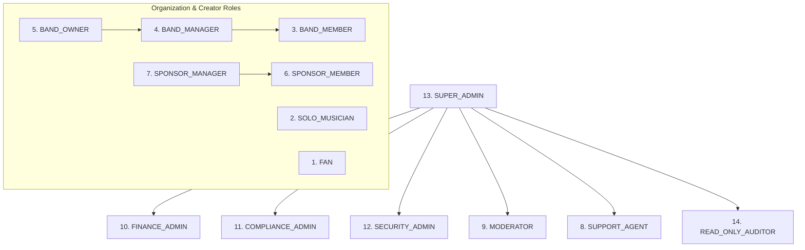

# Crowdbeats V2 — Admin Role & Permissions Matrix (14 Roles)

**Document Status:** Permanent Architecture Specification  
**Code Reference:** `packages/contracts/src/auth/permissions.ts`  

---

## 1. 14 Platform Roles & Hierarchy

---

## 2. Granular Permissions Mapping

| Role | User Mgmt | Musician/EPK | Band Gov | Finance/Refund | Mod/DMCA | Compliance/DSAR | Security/Logs | Staff Admin |
| :--- | :--- | :--- | :--- | :--- | :--- | :--- | :--- | :--- |
| **FAN** | Own | ❌ | ❌ | ❌ | ❌ | ❌ | ❌ | ❌ |
| **SOLO_MUSICIAN** | Own | Full | ❌ | View/Request | ❌ | ❌ | ❌ | ❌ |
| **BAND_MEMBER** | Own | Perform | ❌ | ❌ | ❌ | ❌ | ❌ | ❌ |
| **BAND_MANAGER** | Own | Perform | Roster | ❌ | ❌ | ❌ | ❌ | ❌ |
| **BAND_OWNER** | Own | Full | Full Gov | View/Request | ❌ | ❌ | ❌ | ❌ |
| **SPONSOR_MEMBER** | Own | ❌ | ❌ | ❌ | ❌ | ❌ | ❌ | ❌ |
| **SPONSOR_MANAGER**| Own | ❌ | ❌ | Escrow/Pools | ❌ | ❌ | ❌ | ❌ |
| **SUPPORT_AGENT** | Read Any | ❌ | ❌ | Standard Refund | View Reports | ❌ | View Incidents| ❌ |
| **MODERATOR** | Suspend | ❌ | ❌ | ❌ | Full Takedown| ❌ | ❌ | ❌ |
| **FINANCE_ADMIN** | Read Any | ❌ | ❌ | Large Refund* / Recon | ❌ | ❌ | View Logs | ❌ |
| **COMPLIANCE_ADMIN**| Read Any | ❌ | ❌ | Tax View | ❌ | Full DSAR / Legal Holds | View Logs | ❌ |
| **SECURITY_ADMIN** | Suspend/Reinst| ❌ | ❌ | ❌ | ❌ | ❌ | Full Sec / Sessions | View Staff |
| **SUPER_ADMIN** | Full | Full | Full | Full Dual* | Full | Full | Full | Full |
| **READ_ONLY_AUDITOR**| Read Any | ❌ | ❌ | Read Trans | ❌ | View Reg | View Logs | View Staff |

*\*Note: High-risk operations (large refunds > $100, staff role modifications, compliance payout hold release) strictly require dual-signoff by two distinct administrators.*
