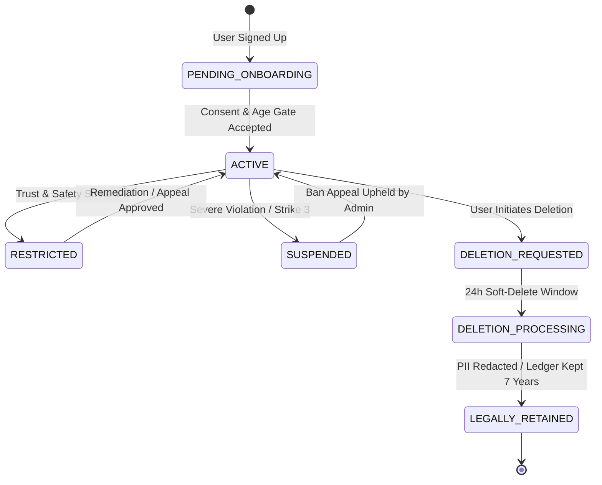
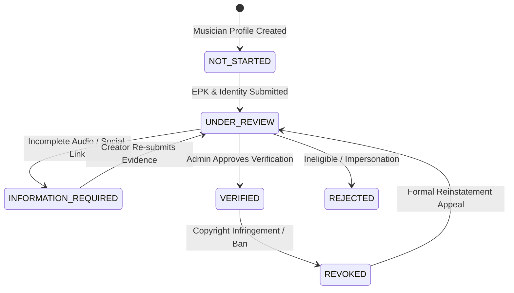
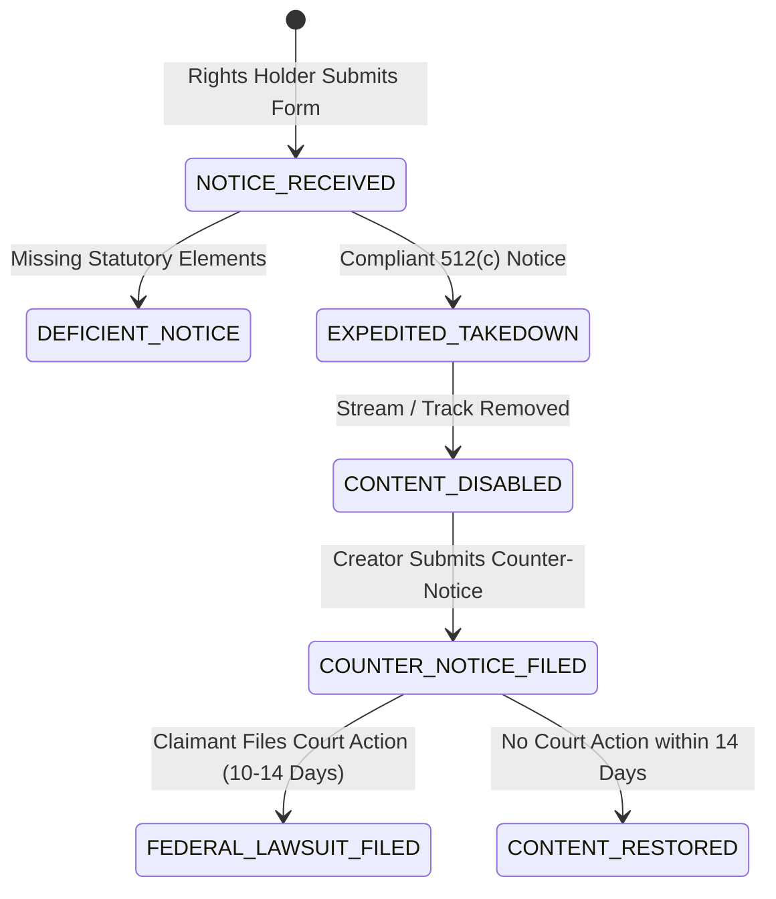

# Crowdbeats V2 — Admin State Machine Catalog

**Document Status:** Permanent Architecture Specification  
**Scope:** Lifecycle State Transitions for Accounts, Personas, Verifications, Campaigns, and DMCA Notices.  

---

## 1. User Account Lifecycle State Machine

---

## 2. Creator & Musician Verification State Machine

---

## 3. DMCA Notice & Takedown State Machine

