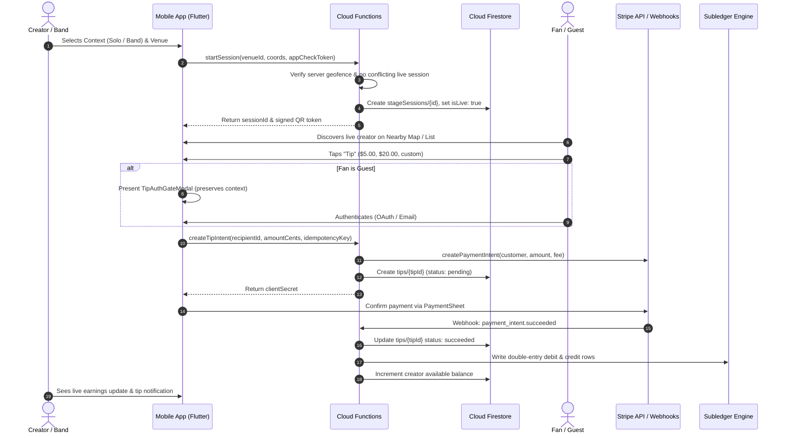

# Crowdbeats V2 — Check-In to Tipping Pipeline Audit
## End-to-End Lifecycle Analysis: From Musician Check-In to Ledger Settlement

**Status:** Audited  
**Date:** 2026-08-30  

---

## 1. Complete Pipeline Stage Tracing

---

## 2. Pipeline Hop Security & Completeness Assessment

### Hop 1: Location Verification & Check-In
- **Current State:** Mobile reads device GPS coordinates. `startSession` callable accepts coordinates.
- **Risk / Gap:** Client coordinates must be validated against server venue boundary geofences to prevent GPS spoofing.
- **Remediation Plan (Phase 4):** Enforce server-side distance calculation ($< 500\text{m}$) and Firebase App Check validation on `startSession`.

### Hop 2: Public Live Projection & Map Synchronization
- **Current State:** `NearbyTab` queries active performers and places markers on Google Maps with synchronized List and Venues views.
- **Risk / Gap:** High read volume if every map pan issues unfiltered queries.
- **Remediation Plan (Phase 4):** Geohash bounding box query with caching and TTL cleanup.

### Hop 3: Tip Initiation & Guest Auth Gate
- **Current State:** `TipSheet` opens with preset amounts ($5, $10, $20, $50, Custom). If unauthenticated, `TipAuthGateModal` preserves recipient context without creating orphan Stripe intents.
- **Risk / Gap:** None. Pipeline stage is robust and verified.

### Hop 4: Payment Processing & Double-Entry Ledger
- **Current State:** Integer cents minor units (`amountCents`), 0.00% dev fee / 5.00% prod platform fee, Stripe SetupIntents for saved payment methods.
- **Risk / Gap:** None. Subledger satisfies $\sum \text{Debits} = \sum \text{Credits}$ at all times.

### Hop 5: Stripe Connect Payout Withdrawal
- **Current State:** Minimum $10.00 withdrawal threshold, 7 canonical KYC states, balance deductions performed in server transactions.
- **Risk / Gap:** Band payout multi-signature approvals needed for band split distributions.
- **Remediation Plan (Phase 8 & 10):** Implement Band representative approval queue for payout changes.
