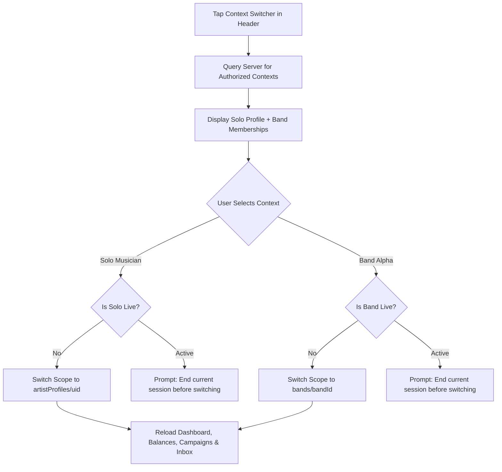
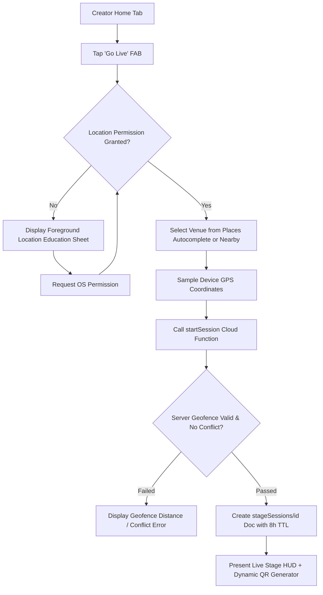

# Crowdbeats V2 — Mobile Creator Studio Information Architecture
## Canonical 5-Tab Navigation, Studio Menu Hierarchy, Flow Maps & Context Model

**Version:** 2.0 (Phase 1)  
**Date:** 2026-08-30  
**Status:** Approved Specification  
**Design System Anchor:** Google Stitch Project `5326179813018056505` (*Vivid Resonance*)

---

## 1. Information Architecture Overview

The Mobile Creator Studio provides a unified, role-aware mobile workspace for both **Solo Musicians** and **Bands** (including authorized band founders, managers, and members).

```
┌────────────────────────────────────────────────────────────────────────┐
│                   CREATOR CONTEXT HEADER BAR                           │
│  [ 🎵 Context Switcher: Solo (Elena Cruz) ▾ ]       [ 🔔 Activity (3) ]│
├────────────────────────────────────────────────────────────────────────┤
│                                                                        │
│                      ACTIVE DESTINATION SURFACE                        │
│                                                                        │
│  Tab 1: HOME       - Role-aware Dashboard, Metrics, Tasks, Hero        │
│  Tab 2: LIVE       - Geofenced Check-In, Active Stage, QR Generation   │
│  Tab 3: CAMPAIGNS  - Crowdfunding, Milestones, Backer Tiers, Updates   │
│  Tab 4: INBOX      - Messages, Booking Requests, Band Approvals        │
│  Tab 5: STUDIO     - Complete 20-Capability Configuration Hub          │
│                                                                        │
├────────────────────────────────────────────────────────────────────────┤
│                   5-TAB PERSISTENT NAVIGATION BAR                      │
│     (🏠) Home   |  (🔘) Live   |  (🚀) Campaigns  |  (📬) Inbox  |  (🎛️) Studio │
│                       [ 🟢 Contextual Go Live FAB ]                    │
└────────────────────────────────────────────────────────────────────────┘
```

---

## 2. Canonical Five-Tab Destination Model

### 1. Home (`/creator/home` or `#/musician`)
* **Purpose:** High-information, calm operational headquarters for the creator.
* **Key Components:**
  - **Context-Aware Hero Card:** Live status toggle (`Ready to perform` vs `🔴 Live at Sunset Lounge`), one primary CTA button.
  - **Today / Active Snapshot:** Gross tips, Crowdbeats fee (0% dev / 5% prod), net earnings, active supporters, profile views.
  - **Tasks Requiring Attention:** Stripe Connect requirements, pending payouts, expiring QR sessions, booking inquiries.
  - **Next Event / Booking Card:** Upcoming performance schedule and countdown.
  - **Recent Activity Feed:** Latest tip stream with privacy-safe fan display.
  - **Quick Action Bar:** Check In, Present QR, Launch Campaign, Edit EPK, View Balances.

### 2. Live (`/creator/live`)
* **Purpose:** Operational center for stage check-in, real-time tipping, and session management.
* **Key States:**
  - `idle`: Location search via Places Autocomplete (New) and "Use My Location".
  - `permissionRequired`: Non-blocking foreground GPS educational modal sheet.
  - `verifying`: Server-side geofence calculation (< 500m) and anti-spoof validation.
  - `live`: Real-time setlist stream, dynamic HMAC-signed QR token generator (refreshed every 60s), listener count, and live tip animation ticker.
  - `ending` → `ended`: Performance recap screen with total tips earned, backer count, and ledger settlement proof.

### 3. Campaigns (`/creator/campaigns`)
* **Purpose:** Album, tour, and equipment crowdfunding management.
* **Key Features:**
  - Active campaigns carousel with funding progress bars and countdown timers.
  - Reward tier manager ($5, $25, $100 presets + custom backer perks).
  - Milestone update publisher (with push notifications to campaign backers).
  - Multi-step campaign wizard (`Story` → `Goals & Tiers` → `Review & Publish`).

### 4. Inbox (`/creator/inbox`)
* **Purpose:** Unified communication, booking, and governance action center.
* **Filtered Categories:**
  - `Messages`: Direct messages from verified fans and venue managers.
  - `Bookings`: Performance invitations and contract inquiries.
  - `Governance` (Band Context): Split approval requests, member invitations, payout representative changes.
  - `System`: Stripe Connect notifications, account security alerts, audit receipts.

### 5. Studio (`/creator/studio`)
* **Purpose:** The comprehensive 20-capability Creator Studio configuration menu and settings repository.

---

## 3. Complete Studio Menu & Capability Hierarchy (20 Capabilities)

The `Studio` tab acts as the complete management repository, organized into 5 logical categories:

```
🎛️ STUDIO HUB
├── 👤 1. PROFILE & BRANDING
│   ├── Public EPK Profile Editor (/creator/studio/profile)
│   ├── Media Library & Photos (/creator/studio/media)
│   ├── Social & Streaming Links (/creator/studio/links)
│   └── Verification & Trust Badges (/creator/studio/verification)
│
├── 💳 2. MONETIZATION & FINANCE
│   ├── Payouts & Stripe Connect KYC (/creator/studio/payouts)
│   ├── Double-Entry Ledger Balances (/creator/studio/balances)
│   ├── Tip History & Official Receipts (/creator/studio/receipts)
│   └── Band Split Governance [Band Only] (/creator/studio/splits)
│
├── 📈 3. AUDIENCE & MARKETING
│   ├── Fan Directory & Top Tippers (/creator/studio/fans)
│   ├── Performance & Venue Analytics (/creator/studio/analytics)
│   ├── Share Tools & Stage QR Generator (/creator/studio/marketing)
│   └── Events & Tour Schedule (/creator/studio/events)
│
├── 🤝 4. COLLABORATION & GOVERNANCE [Band Context]
│   ├── Band Members & Roles (/creator/studio/members)
│   ├── Ownership Approvals Queue (/creator/studio/approvals)
│   └── Band Activity & Audit Log (/creator/studio/audit)
│
└── ⚙️ 5. SETTINGS & SUPPORT
    ├── Notification Preferences (/creator/studio/notifications)
    ├── Account Security & Sessions (/account/security)
    ├── Data Privacy & Exports (/account/privacy)
    └── Help Center & Support Tickets (/account/support)
```

---

## 4. Mobile Flow Maps

### 4.1 Creator Context Switching Flow


### 4.2 Geofenced Live Check-In Flow


---

## 5. Screen Hierarchy, Motion & Accessibility Standards

1. **Card Hierarchy:** High-contrast Montserrat display numbers (e.g. `$1,250.00`), secondary Inter labels, 16px soft-rounded corners, and 1px inner glow borders.
2. **Financial Data Formatting:** Every monetary metric explicitly states currency (`USD`), date range (`Today`, `Last 30 Days`), and freshness timestamp.
3. **Reduced Motion:** All pulsing glows and animated transitions respect `MediaQuery.of(context).disableAnimations` and fall back to solid opacity states.
4. **Touch Target Size:** All interactive buttons and list rows maintain a minimum 48x48 px touch target area.
