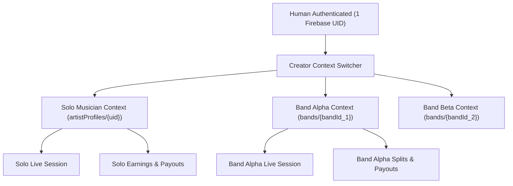

# Crowdbeats V2 — Solo Musician & Band Mobile Creator Studio
## Phase 0: Read-Only Creator Studio Parity & Pipeline Architecture Audit

**Status:** Completed & Evidence-Backed  
**Date:** 2026-08-30  
**Authoritative Stitch Design Project:** `projects/5326179813018056505` (*Enhanced Nearby Live Music Map / Vivid Resonance*)  
**Scope:** Mobile Creator Studio for Solo Musicians and Bands (Flutter iOS/Android).

---

## 1. Executive Summary & Audit Scope

This document provides a comprehensive, read-only architectural audit of the Flutter mobile codebase (`apps/mobile`), the Next.js Creator Studio (`apps/web/app/(creator)`), and the shared Cloud Functions backend (`apps/functions`) for Crowdbeats V2.

The purpose of this audit is to baseline all existing capabilities, detect architectural mismatches against the **Solo Musician & Band Mobile Creator Studio** contract, verify the end-to-end check-in-to-tipping pipeline, inspect the authoritative Google Stitch design system, and establish an evidence-backed roadmap for Phases 1 through 12.

---

## 2. Canonical Creator-Context & Single-UID Identity Model

### 2.1 Single-UID Invariant
Crowdbeats V2 enforces a strict Single-UID identity invariant:
$$\text{Human User} \iff 1 \text{ Firebase Auth UID}$$

A musician never creates multiple login credentials to switch between their solo career and band memberships. Instead:
- **Solo Musician Context:** Governed by `artistProfiles/{uid}`.
- **Band Contexts:** Governed by `bandMemberships/{uid}_{bandId}` linking to `bands/{bandId}`.
- **Context Switching:** Managed dynamically via header context switcher without altering the underlying Firebase Auth session.

### 2.2 Conflicting Live Session Prevention
**Core Business Invariant:** A single human cannot simultaneously be in an active Solo live session and an active Band live session.
- **Server Rule:** When `startSession` callable is invoked, it verifies that no other active live session (`status == 'active'`) exists for that `performerId` or where `creatorUid == auth.uid`.
- **Client Rule:** Context switcher disables switching into another active live performance until the current live stage session is explicitly ended or expired.

---

## 3. Five-Tab Mobile Navigation Contract Audit

The specification requires both Solo and Band mobile shells to use the same canonical five-tab navigation structure:
1. **Home:** Role-aware Creator Dashboard (Live status hero, metrics snapshot, tasks, quick actions).
2. **Live:** Location verification, geofenced check-in, live session manager, dynamic QR token, end session.
3. **Campaigns:** Album & tour crowdfunding, goal progress, backer tiers, milestone updates.
4. **Inbox:** Unified communication hub (messages, booking requests, band approvals, system notices).
5. **Studio:** Full 20-capability Creator Studio configuration menu and settings.

### Current Mobile Implementation State:
- **Solo Shell (`MusicianShell`):** Currently renders `[Home, Live, Campaigns, Fans, Profile]`. Needs refactoring to canonical `[Home, Live, Campaigns, Inbox, Studio]`.
- **Band Shell (`BandShell`):** Currently renders `[Home, Live, Campaigns, Members, Profile]`. Needs refactoring to canonical `[Home, Live, Campaigns, Inbox, Studio]`.
- **Header Context Switcher:** Currently missing a dedicated top bar dropdown that reads authorized memberships from Firestore.

---

## 4. End-to-End Check-In to Tipping Pipeline Audit

The critical business pipeline was traced end-to-end:

| Step | Pipeline Stage | Current Implementation | Status | Findings / Gaps |
| :--- | :--- | :--- | :--- | :--- |
| **1** | **Context Selection** | Client state selection | ⚠️ Partial | Needs server-authorized context validation. |
| **2** | **Location Search** | Places Autocomplete (New) | ✅ Implemented | Uses debounce and session tokens in discovery. Needs check-in wrapper. |
| **3** | **Location Verification** | Foreground GPS verification | ⚠️ Incomplete | Geofence verification logic must run server-side in Cloud Functions. |
| **4** | **Live Session Creation** | `startSession` callable | ✅ Functional | Creates `stageSessions/{sessionId}` and updates `isLive: true`. |
| **5** | **Public Discovery** | `NearbyTab` & Map Markers | ✅ Functional | Live markers appear on map and list views with zero card obstruction. |
| **6** | **Guest / Fan Tipping** | `TipSheet` / `TipAuthGateModal` | ✅ Verified | Guests are gated to sign-in; authenticated fans choose amount & payment method. |
| **7** | **Payment Processing** | `createTipIntent` + Stripe | ✅ Verified | Integer cents, platform fee calculation (0% dev / 5% prod), customer SetupIntents. |
| **8** | **Stripe Webhook** | `stripeWebhook` handler | ✅ Verified | Double-entry subledger posting, creator earnings increment, idempotency. |
| **9** | **Reconciliation** | Daily reconciliation job | ✅ Verified | Reconciles $\sum \text{Debits} = \sum \text{Credits}$, audit logging. |
| **10**| **Creator Payouts** | `requestPayout` callable | ✅ Verified | $10 minimum threshold, Connect KYC checks, server-authoritative balance deduction. |

---

## 5. Authoritative Stitch Design System Inspection

### Project Metadata
- **Project ID:** `projects/5326179813018056505`
- **Project Name:** *Enhanced Nearby Live Music Map*
- **Theme Name:** *Vivid Resonance*
- **Visual Style:** Glassmorphism + High-Contrast Bold (Mixing console aesthetic, pitch black base, neon magenta/purple accents, teal progress gas).

### Core Stitch Design Tokens
- **Base Background:** `#131313` / `#0e0e0e`
- **Surface Card:** `#1c1b1b` (Border: `rgba(255,255,255,0.08)`)
- **Primary Accent:** `#6200ee` / `#cfbdff` (Deep Electric Purple)
- **Secondary Accent:** `#bb86fc` / `#dab9ff` (Electric Magenta)
- **Tertiary Accent:** `#03dac6` / `#17deca` (Teal Gas / Live Progress)
- **Typography:**
  - Headlines & Titles: **Montserrat** (Weights: 600, 700, 800)
  - Body & Functional Metadata: **Inter** (Weights: 400, 500, 600)
- **Elevation:** 20px-40px backdrop-filter blur on floating surfaces, 1px inner glow border.

---

## 6. Decisions Requiring User Approval

The following architectural and product decisions have been identified during Phase 0:
1. **Conflicting Live Sessions:** Confirm that starting a Solo live session automatically suspends/rejects starting a concurrent Band session under the same human UID (and vice versa).
2. **Band Departure / Last Owner Protection:** Confirm that the last owner of a Band cannot depart or delete their profile until band ownership is transferred or all active campaigns and balances are resolved.
3. **Stripe Connect Payout Currency:** Confirm that multi-currency earnings are kept distinct in separate balances rather than converted at arbitrary client exchange rates.
4. **Geofence Check-in Tolerance:** Confirm the maximum allowable check-in distance threshold (e.g. 500 meters / 0.3 miles from venue coordinates).

---

## 7. Recommended Execution Roadmap (Phases 1–12)

- **Phase 1:** Stitch Design System & Mobile Information Architecture (Token layer, typography, component library, flow maps).
- **Phase 2:** Shared Creator Shell, Context Switcher, and Route Security.
- **Phase 3:** Premium Solo and Band Mobile Dashboards (Role-aware cards, metrics snapshots, tasks).
- **Phase 4:** Live Check-In, Location Verification, QR, and Discovery Propagation.
- **Phase 5:** Solo/Band Profiles, Media Library, Sharing, and QR Presentation.
- **Phase 6:** Mobile Solo and Band Campaigns (Crowdfunding wizard, reward tiers, milestone updates).
- **Phase 7:** Inbox, Fans, Requests, and Notifications.
- **Phase 8:** Earnings, Stripe Connect, Payouts, and Band Splits.
- **Phase 9:** Analytics, Events/Bookings, and Marketing Tools.
- **Phase 10:** Band Members, Roles, Ownership, Approvals, and Governance.
- **Phase 11:** Full Quality, Security, Performance, and Accessibility Hardening.
- **Phase 12:** Release Readiness Package (No deployment without separate authorization).
