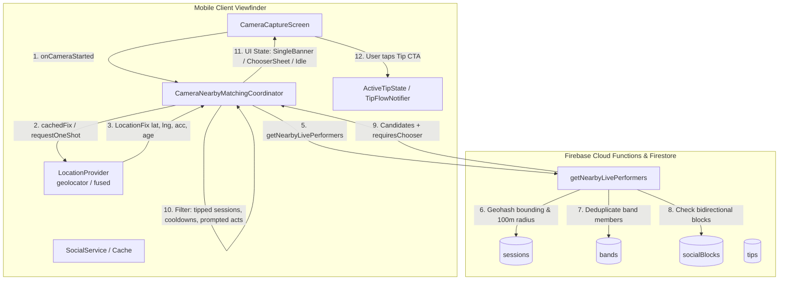
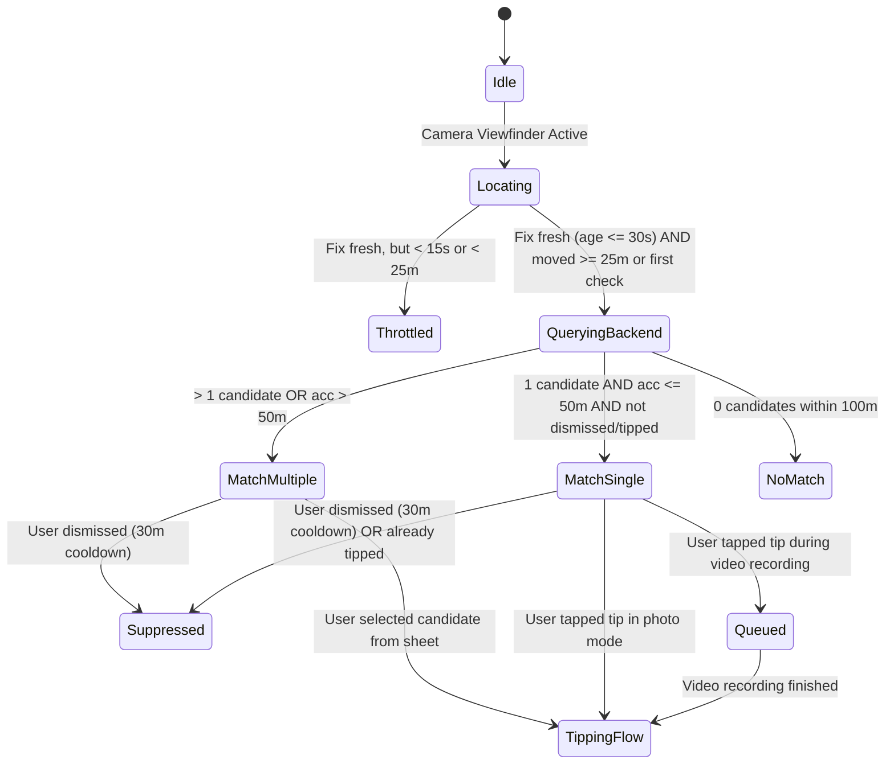
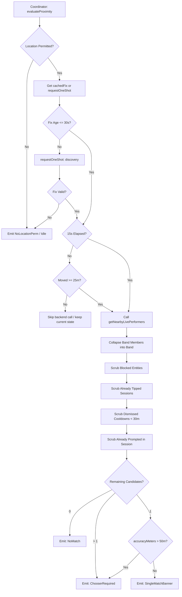

# Crowdbeats V2 — Location & Live Performer Matching for Camera Tipping
## Architecture Specification, Coordinator Logic, and Draft Implementation

**Document Status:** DRAFT  
**Author:** Location & Live Performer Matching Specialist  
**Target Component:** `CameraNearbyMatchingCoordinator` (CAM-04), Mobile Location Integration, Backend Matching Callable  
**Scope:** Architecture, Invariants, Coordinator State Machine, Client-Side Dart Code, Backend TypeScript Callable, and Test Plan  

---

## 1. Executive Summary & Core Principles

The Crowdbeats V2 camera experience allows fans and guests to capture live moments ("Capture the music") while attending gigs, festivals, and street performances. To convert spontaneous appreciation into direct financial support, the app pairs the camera viewfinder with real-time, privacy-preserving live performer matching.

### 1.1 Non-Negotiable Rules & Invariants
1. **Existing Location Service & Battery Preservation:**
   - Powered exclusively by the existing `LocationProvider` (`apps/mobile/lib/data/services/location_provider.dart`).
   - Strictly rate-limited: Maximum 1 location query to the backend per **15 seconds**.
   - Movement threshold: Re-query triggered only after at least **25 meters** of displacement.
   - Search radius: Fixed at **100 meters** maximum search boundary.
   - No continuous GPS streaming for camera mode: uses `requestOneShot(targetMode: LocationMode.discovery)` and `cachedFix(maxAge: 30s)`.
2. **Location Freshness & Accuracy Degradation Ladder:**
   - Maximum allowable location fix age is **30 seconds**. Older fixes are immediately invalidated.
   - Horizontal accuracy threshold: If `accuracyMeters > 50m`, the system **MUST NOT** auto-prompt a single performer. Instead, it must trigger the **Performer Chooser** bottom sheet so the user can disambiguate.
   - If `accuracyMeters <= 50m` and exactly 1 candidate is detected within 100m, an unobtrusive floating banner is displayed.
   - If `accuracyMeters > 150m` (e.g., cell tower coarse location), matching is suppressed to prevent spurious suggestions.
3. **GPS-Only Proximity (Absolute Privacy Guardrail):**
   - Matching relies **exclusively** on geospatial proximity against active server-verified check-in sessions.
   - **NO** facial recognition.
   - **NO** audio fingerprinting or acoustic watermarking.
   - **NO** media file content scanning, OCR, or computer vision frame analysis.
   - Viewfinder frames stay entirely on the local device hardware buffer. Coordinates sent to the backend are ephemeral and never logged to persistent audit logs or analytics.
4. **Entity Routing, Band Payouts & Deduplication:**
   - Bidirectional block boundary: Filter out any performer or band blocked by the viewer or who has blocked the viewer (via `SocialService` and `socialBlocks`).
   - **Band Payout Integrity:** A check-in by a band member pays the **Band entity** (`performerType: 'band'`, `performerId: bandId`), never the individual member UID.
   - **Band Member Deduplication:** If individual band members also have active sessions or check-ins co-located at the same venue/coordinates, collapse them into the single parent Band session.
5. **Prompt Throttling, Frequency Capping & Dismiss Cooldowns:**
   - **Max 1 prompt per act/session per camera session:** A fan will not be repeatedly prompted for the same performance while keeping the camera open.
   - **30-minute dismiss cooldown:** If the fan taps the dismiss (`X`) button on a suggestion banner, suppress prompts for that act/session for **30 minutes**.
   - **Suppression on Already-Tipped Sessions:** If the user has already tipped this active session (checked against local cache and user tip records), suppress all prompts for this session.
   - **Recording Safety:** During video recording, banners collapse into a minimal status pill. Any tip action queues checkout in `QueuedCameraTipIntent` until recording stops.

---

## 2. System Architecture & Component Interaction



---

## 3. Coordinator Logic & State Machine

### 3.1 State Diagram
The coordinator transitions through the following discrete states:



### 3.2 Evaluation Flowchart


---

## 4. Mobile Client Draft Implementation

### 4.1 Data Models & Value Objects (`apps/mobile/lib/data/models/camera_matching.dart`)

```dart
// Crowdbeats V2 — Camera Matching Models
//
// Models for real-time live performer discovery in the camera viewfinder.

import 'package:flutter/foundation.dart';

/// Represents a validated performer candidate detected within 100m.
@immutable
class NearbyPerformerCandidate {
  const NearbyPerformerCandidate({
    required this.performerId,
    required this.performerType, // 'artist' | 'band'
    required this.performerName,
    this.performerAvatarUrl,
    required this.activeSessionId,
    required this.locationType, // 'venue' | 'street'
    this.venueName,
    required this.distanceMeters,
    this.genres = const [],
    this.bio,
    this.defaultTipAmountCents = 500, // $5.00 default
  });

  final String performerId;
  final String performerType;
  final String performerName;
  final String? performerAvatarUrl;
  final String activeSessionId;
  final String locationType;
  final String? venueName;
  final double distanceMeters;
  final List<String> genres;
  final String? bio;
  final int defaultTipAmountCents;

  bool get isBand => performerType == 'band';

  factory NearbyPerformerCandidate.fromMap(Map<String, dynamic> map) {
    return NearbyPerformerCandidate(
      performerId: map['performerId'] as String,
      performerType: map['performerType'] as String? ?? 'artist',
      performerName: map['performerName'] as String,
      performerAvatarUrl: map['performerAvatarUrl'] as String?,
      activeSessionId: map['activeSessionId'] as String,
      locationType: map['locationType'] as String? ?? 'venue',
      venueName: map['venueName'] as String?,
      distanceMeters: (map['distanceMeters'] as num).toDouble(),
      genres: (map['genres'] as List<dynamic>?)?.cast<String>() ?? const [],
      bio: map['bio'] as String?,
      defaultTipAmountCents: map['defaultTipAmountCents'] as int? ?? 500,
    );
  }

  Map<String, dynamic> toMap() => {
        'performerId': performerId,
        'performerType': performerType,
        'performerName': performerName,
        'performerAvatarUrl': performerAvatarUrl,
        'activeSessionId': activeSessionId,
        'locationType': locationType,
        'venueName': venueName,
        'distanceMeters': distanceMeters,
        'genres': genres,
        'bio': bio,
        'defaultTipAmountCents': defaultTipAmountCents,
      };
}

/// State of the nearby performer matching coordinator.
enum MatchingStatus {
  idle,
  locating,
  matching,
  singleCandidatePrompt,
  multipleCandidatesChooser,
  noCandidatesFound,
  permissionRequired,
  gpsDisabledOrInaccurate,
}

@immutable
class CameraNearbyMatchingState {
  const CameraNearbyMatchingState({
    this.status = MatchingStatus.idle,
    this.candidates = const [],
    this.activePromptCandidate,
    this.requiresChooser = false,
    this.lastEvaluatedAt,
    this.lastEvaluationAccuracyMeters,
    this.errorMessage,
  });

  final MatchingStatus status;
  final List<NearbyPerformerCandidate> candidates;
  final NearbyPerformerCandidate? activePromptCandidate;
  final bool requiresChooser;
  final DateTime? lastEvaluatedAt;
  final double? lastEvaluationAccuracyMeters;
  final String? errorMessage;

  bool get hasActivePrompt =>
      status == MatchingStatus.singleCandidatePrompt &&
      activePromptCandidate != null;

  bool get shouldShowChooser =>
      status == MatchingStatus.multipleCandidatesChooser ||
      requiresChooser;

  CameraNearbyMatchingState copyWith({
    MatchingStatus? status,
    List<NearbyPerformerCandidate>? candidates,
    NearbyPerformerCandidate? activePromptCandidate,
    bool? requiresChooser,
    DateTime? lastEvaluatedAt,
    double? lastEvaluationAccuracyMeters,
    String? errorMessage,
    bool clearActivePrompt = false,
  }) {
    return CameraNearbyMatchingState(
      status: status ?? this.status,
      candidates: candidates ?? this.candidates,
      activePromptCandidate: clearActivePrompt
          ? null
          : (activePromptCandidate ?? this.activePromptCandidate),
      requiresChooser: requiresChooser ?? this.requiresChooser,
      lastEvaluatedAt: lastEvaluatedAt ?? this.lastEvaluatedAt,
      lastEvaluationAccuracyMeters:
          lastEvaluationAccuracyMeters ?? this.lastEvaluationAccuracyMeters,
      errorMessage: errorMessage,
    );
  }
}
```

---

### 4.2 Distance Calculation Utility (`apps/mobile/lib/data/utils/geospatial_calc.dart`)

```dart
// Pure Dart Great-Circle Haversine distance calculator.
// Free of UI / Flutter framework dependencies for unit-test purity.

import 'dart:math' as math;

class GeospatialCalc {
  const GeospatialCalc._();

  static const double earthRadiusMeters = 6371000.0;

  /// Returns distance in meters between two coordinates.
  static double haversineMeters({
    required double lat1,
    required double lon1,
    required double lat2,
    required double lon2,
  }) {
    final double phi1 = lat1 * math.pi / 180.0;
    final double phi2 = lat2 * math.pi / 180.0;
    final double deltaPhi = (lat2 - lat1) * math.pi / 180.0;
    final double deltaLambda = (lon2 - lon1) * math.pi / 180.0;

    final double a = math.sin(deltaPhi / 2.0) * math.sin(deltaPhi / 2.0) +
        math.cos(phi1) *
            math.cos(phi2) *
            math.sin(deltaLambda / 2.0) *
            math.sin(deltaLambda / 2.0);

    final double c = 2.0 * math.atan2(math.sqrt(a), math.sqrt(1.0 - a));
    return earthRadiusMeters * c;
  }
}
```

---

### 4.3 Coordinator Implementation (`apps/mobile/lib/data/services/camera_nearby_matching_coordinator.dart`)

```dart
// Crowdbeats V2 — CameraNearbyMatchingCoordinator
//
// Governs real-time live performer discovery in the camera viewfinder.
// Enforces 15s throttle, 25m movement gate, 30s fix freshness, 50m accuracy chooser trigger,
// 30-minute dismiss cooldown, session deduplication, and tip suppression.

import 'dart:async';
import 'package:cloud_functions/cloud_functions.dart';
import 'package:flutter/foundation.dart';

import '../models/camera_matching.dart';
import '../models/location_fix.dart';
import '../utils/geospatial_calc.dart';
import 'location_provider.dart';
import 'social_service.dart';

class CameraNearbyMatchingCoordinator {
  CameraNearbyMatchingCoordinator({
    required LocationProvider locationProvider,
    required SocialService socialService,
    FirebaseFunctions? functions,
    Duration queryInterval = const Duration(seconds: 15),
    Duration maxFixAge = const Duration(seconds: 30),
    Duration dismissCooldown = const Duration(minutes: 30),
    double minMovementDistanceMeters = 25.0,
    double maxSearchRadiusMeters = 100.0,
    double accuracyChooserThresholdMeters = 50.0,
  })  : _locationProvider = locationProvider,
        _socialService = socialService,
        _functions = functions ?? FirebaseFunctions.instance,
        _queryInterval = queryInterval,
        _maxFixAge = maxFixAge,
        _dismissCooldown = dismissCooldown,
        _minMovementDistanceMeters = minMovementDistanceMeters,
        _maxSearchRadiusMeters = maxSearchRadiusMeters,
        _accuracyChooserThresholdMeters = accuracyChooserThresholdMeters;

  final LocationProvider _locationProvider;
  final SocialService _socialService;
  final FirebaseFunctions _functions;

  // Invariant thresholds
  final Duration _queryInterval;
  final Duration _maxFixAge;
  final Duration _dismissCooldown;
  final double _minMovementDistanceMeters;
  final double _maxSearchRadiusMeters;
  final double _accuracyChooserThresholdMeters;

  // Operational State Tracking
  DateTime? _lastQueryTime;
  LocationFix? _lastEvaluatedLocation;
  Timer? _evaluationTimer;
  bool _isEvaluating = false;
  bool _isCameraActive = false;

  // Frequency capping & cooldown registries
  final Set<String> _promptedActSessionIdsInCurrentCameraSession = <String>{};
  final Map<String, DateTime> _dismissedCooldowns = <String, DateTime>{}; // key -> timestamp
  final Set<String> _alreadyTippedSessionIds = <String>{};

  // State notifier callbacks / listeners
  final ValueNotifier<CameraNearbyMatchingState> stateNotifier =
      ValueNotifier<CameraNearbyMatchingState>(const CameraNearbyMatchingState());

  CameraNearbyMatchingState get state => stateNotifier.value;

  // ── Camera Lifecycle Hooks ────────────────────────────────────────────────

  /// Called when CameraCaptureScreen is mounted or resumed.
  void startCameraSession() {
    _isCameraActive = true;
    _promptedActSessionIdsInCurrentCameraSession.clear();
    stateNotifier.value = const CameraNearbyMatchingState(status: MatchingStatus.locating);

    // Initial immediate evaluation
    evaluateProximity(forceRefresh: true);

    // Start periodic 15-second heartbeat
    _evaluationTimer?.cancel();
    _evaluationTimer = Timer.periodic(_queryInterval, (_) {
      if (_isCameraActive) {
        evaluateProximity();
      }
    });
  }

  /// Called when CameraCaptureScreen is unmounted or paused.
  void stopCameraSession() {
    _isCameraActive = false;
    _evaluationTimer?.cancel();
    _evaluationTimer = null;
    _locationProvider.cancelCurrentOperation();
    stateNotifier.value = const CameraNearbyMatchingState(status: MatchingStatus.idle);
  }

  // ── Dismiss & Tip Feedback Handlers ────────────────────────────────────────

  /// Fan tapped "X" / Dismiss on a suggested performer.
  /// Enforces rule 5: 30-minute cooldown for this act / session.
  void dismissCurrentPrompt() {
    final candidate = state.activePromptCandidate;
    if (candidate != null) {
      final now = DateTime.now();
      _dismissedCooldowns[candidate.performerId] = now;
      _dismissedCooldowns[candidate.activeSessionId] = now;
    }
    stateNotifier.value = state.copyWith(
      status: MatchingStatus.idle,
      clearActivePrompt: true,
    );
  }

  /// Fan has completed tipping an act during this or prior sessions.
  /// Suppresses further prompts for this session.
  void markSessionTipped(String sessionId) {
    _alreadyTippedSessionIds.add(sessionId);
    if (state.activePromptCandidate?.activeSessionId == sessionId) {
      stateNotifier.value = state.copyWith(
        status: MatchingStatus.idle,
        clearActivePrompt: true,
      );
    }
  }

  // ── Core Proximity & Throttling Evaluation ─────────────────────────────────

  Future<void> evaluateProximity({bool forceRefresh = false}) async {
    if (!_isCameraActive || _isEvaluating) return;

    _isEvaluating = true;
    try {
      // 1. Permission check (no sensor hit)
      final hasPermission = await _locationProvider.isPermissionGranted();
      if (!hasPermission) {
        stateNotifier.value = state.copyWith(
          status: MatchingStatus.permissionRequired,
          errorMessage: 'Location permission required to detect nearby performers.',
        );
        return;
      }

      // 2. Fetch fresh location (maxAge 30s)
      final now = DateTime.now();
      LocationFix? fix = await _locationProvider.cachedFix(maxAge: _maxFixAge);

      if (fix == null || !fix.isFreshFor(_maxFixAge, now: now)) {
        // Request one-shot fix (Never stream continuously for camera discovery)
        fix = await _locationProvider.requestOneShot(
          targetMode: LocationMode.discovery,
          timeout: const Duration(seconds: 10),
        );
      }

      if (fix == null) {
        stateNotifier.value = state.copyWith(
          status: MatchingStatus.gpsDisabledOrInaccurate,
          errorMessage: 'Unable to acquire GPS fix.',
        );
        return;
      }

      // 3. Degraded accuracy filter (Rule 2)
      if (fix.accuracyMeters > 150.0) {
        // Severely inaccurate (cell tower level), skip matching
        stateNotifier.value = state.copyWith(
          status: MatchingStatus.gpsDisabledOrInaccurate,
          errorMessage: 'GPS accuracy too low (${fix.accuracyMeters.toInt()}m).',
        );
        return;
      }

      // 4. Rate-Limiting & Movement Threshold Check (Rule 1)
      if (!forceRefresh && _lastQueryTime != null && _lastEvaluatedLocation != null) {
        final elapsed = now.difference(_lastQueryTime!);
        if (elapsed < _queryInterval) {
          // Under 15s throttle: skip
          return;
        }

        final distanceMoved = GeospatialCalc.haversineMeters(
          lat1: _lastEvaluatedLocation!.latitude,
          lon1: _lastEvaluatedLocation!.longitude,
          lat2: fix.latitude,
          lon2: fix.longitude,
        );

        if (distanceMoved < _minMovementDistanceMeters) {
          // Device hasn't moved 25m: skip re-querying backend
          return;
        }
      }

      // 5. Query Backend Callable
      stateNotifier.value = state.copyWith(status: MatchingStatus.matching);
      final candidates = await _fetchCandidatesFromBackend(fix);

      _lastQueryTime = DateTime.now();
      _lastEvaluatedLocation = fix;

      // 6. Post-Process & Apply Rules (Rules 2, 4, 5)
      _processCandidateResults(candidates: candidates, fix: fix);
    } catch (e, stack) {
      debugPrint('[CameraNearbyMatching] Evaluation error: $e\n$stack');
      stateNotifier.value = state.copyWith(
        status: MatchingStatus.noCandidatesFound,
        errorMessage: 'Failed to resolve nearby performers.',
      );
    } finally {
      _isEvaluating = false;
    }
  }

  // ── Backend Callable Dispatch ─────────────────────────────────────────────

  Future<List<NearbyPerformerCandidate>> _fetchCandidatesFromBackend(
    LocationFix fix,
  ) async {
    final callable = _functions.httpsCallable('getNearbyLivePerformers');
    final response = await callable.call<Map<String, dynamic>>({
      'query': {
        'lat': fix.latitude,
        'lng': fix.longitude,
        'accuracyMeters': fix.accuracyMeters,
        'timestamp': fix.timestamp.toIso8601String(),
      },
    });

    final data = response.data;
    final rawCandidates = (data['candidates'] as List<dynamic>?) ?? [];

    return rawCandidates
        .map((c) => NearbyPerformerCandidate.fromMap(
              (c as Map<dynamic, dynamic>).cast<String, dynamic>(),
            ))
        .where((c) => c.distanceMeters <= _maxSearchRadiusMeters)
        .toList();
  }

  // ── Candidate Processing & Rules Application ──────────────────────────────

  void _processCandidateResults({
    required List<NearbyPerformerCandidate> candidates,
    required LocationFix fix,
  }) {
    final now = DateTime.now();

    // A. Filter out already-tipped sessions (Rule 5)
    final nonTipped = candidates.where((c) {
      return !_alreadyTippedSessionIds.contains(c.activeSessionId);
    }).toList();

    // B. Filter out 30-min dismiss cooldowns (Rule 5)
    final eligible = nonTipped.where((c) {
      final actDismissedAt = _dismissedCooldowns[c.performerId];
      if (actDismissedAt != null && now.difference(actDismissedAt) < _dismissCooldown) {
        return false;
      }
      final sessDismissedAt = _dismissedCooldowns[c.activeSessionId];
      if (sessDismissedAt != null && now.difference(sessDismissedAt) < _dismissCooldown) {
        return false;
      }
      return true;
    }).toList();

    if (eligible.isEmpty) {
      stateNotifier.value = state.copyWith(
        status: MatchingStatus.noCandidatesFound,
        candidates: const [],
        clearActivePrompt: true,
        lastEvaluatedAt: now,
        lastEvaluationAccuracyMeters: fix.accuracyMeters,
      );
      return;
    }

    // C. Evaluate Accuracy vs Multi-Candidate Chooser Trigger (Rule 2)
    final isAccuracyCoarse = fix.accuracyMeters > _accuracyChooserThresholdMeters;
    final hasMultipleCandidates = eligible.length > 1;

    if (isAccuracyCoarse || hasMultipleCandidates) {
      // Trigger Chooser Sheet
      stateNotifier.value = state.copyWith(
        status: MatchingStatus.multipleCandidatesChooser,
        candidates: eligible,
        requiresChooser: true,
        clearActivePrompt: true,
        lastEvaluatedAt: now,
        lastEvaluationAccuracyMeters: fix.accuracyMeters,
      );
    } else {
      // Exactly 1 candidate with high confidence (acc <= 50m)
      final candidate = eligible.first;

      // Check frequency capping: max 1 prompt per act/session in current camera session
      if (_promptedActSessionIdsInCurrentCameraSession.contains(candidate.activeSessionId)) {
        // Already prompted earlier in this camera session; do not re-prompt
        stateNotifier.value = state.copyWith(
          status: MatchingStatus.idle,
          candidates: eligible,
          clearActivePrompt: true,
          lastEvaluatedAt: now,
        );
      } else {
        // Record prompt display
        _promptedActSessionIdsInCurrentCameraSession.add(candidate.activeSessionId);

        stateNotifier.value = state.copyWith(
          status: MatchingStatus.singleCandidatePrompt,
          candidates: eligible,
          activePromptCandidate: candidate,
          requiresChooser: false,
          lastEvaluatedAt: now,
          lastEvaluationAccuracyMeters: fix.accuracyMeters,
        );
      }
    }
  }

  void dispose() {
    _evaluationTimer?.cancel();
    stateNotifier.dispose();
  }
}
```

---

### 4.4 Riverpod State Providers (`apps/mobile/lib/state/camera_nearby_matching_state.dart`)

```dart
// Crowdbeats V2 — Camera Nearby Matching Riverpod Integration

import 'package:cloud_functions/cloud_functions.dart';
import 'package:flutter_riverpod/flutter_riverpod.dart';

import '../data/models/camera_matching.dart';
import '../data/services/camera_nearby_matching_coordinator.dart';
import '../data/services/location_provider.dart';
import '../data/services/social_service.dart';
import 'location_provider_state.dart';

final cameraNearbyMatchingCoordinatorProvider =
    Provider.autoDispose<CameraNearbyMatchingCoordinator>((ref) {
  final locationProvider = ref.watch(locationProviderProvider);
  final socialService = ref.watch(socialServiceProvider);

  final coordinator = CameraNearbyMatchingCoordinator(
    locationProvider: locationProvider,
    socialService: socialService,
    functions: FirebaseFunctions.instance,
  );

  ref.onDispose(() {
    coordinator.dispose();
  });

  return coordinator;
});

final cameraNearbyMatchingStateProvider =
    StateNotifierProvider.autoDispose<CameraNearbyMatchingNotifier, CameraNearbyMatchingState>(
  (ref) {
    final coordinator = ref.watch(cameraNearbyMatchingCoordinatorProvider);
    return CameraNearbyMatchingNotifier(coordinator);
  },
);

class CameraNearbyMatchingNotifier extends StateNotifier<CameraNearbyMatchingState> {
  CameraNearbyMatchingNotifier(this._coordinator) : super(_coordinator.state) {
    _coordinator.stateNotifier.addListener(_onStateChanged);
  }

  final CameraNearbyMatchingCoordinator _coordinator;

  void _onStateChanged() {
    state = _coordinator.state;
  }

  void startCameraSession() => _coordinator.startCameraSession();
  void stopCameraSession() => _coordinator.stopCameraSession();
  void dismissPrompt() => _coordinator.dismissCurrentPrompt();
  void markSessionTipped(String sessionId) => _coordinator.markSessionTipped(sessionId);
  void refresh() => _coordinator.evaluateProximity(forceRefresh: true);

  @override
  void dispose() {
    _coordinator.stateNotifier.removeListener(_onStateChanged);
    super.dispose();
  }
}
```

---

## 5. Backend Callable Draft Implementation (`getNearbyLivePerformers`)

This callable runs on Node.js / Firebase Functions v2, implementing geospatial bounding, Haversine verification, band collective payout resolution, band member deduplication, and bidirectional block filtering.

```typescript
/**
 * Crowdbeats V2 — getNearbyLivePerformers Callable (CAM-02 Draft)
 *
 * Implements:
 * 1. 100m geohash bounding & Haversine distance verification.
 * 2. Deduplication of band members against active band sessions.
 * 3. Bidirectional social block boundary filtering.
 * 4. Payout routing resolution: Band check-in routes to Band entity.
 */

import * as admin from 'firebase-admin';
import { onCall, HttpsError } from 'firebase-functions/v2/https';
import {
  NearbyLivePerformerCandidate,
  GetNearbyLivePerformersRequest,
  GetNearbyLivePerformersResponse,
} from '@crowdbeats/contracts';
import { encodeGeohash, getNeighborGeohashes } from '../lib/geohash.js';
import { haversineMeters, areUsersBlocked } from './sessionHelpers.js';
import { verifyAppCheck } from '../lib/appCheck.js';
import { enforceRateLimit } from '../lib/rateLimiter.js';

const MAX_SEARCH_RADIUS_M = 100.0;
const MAX_SAMPLE_AGE_MS = 30_000; // 30s freshness constraint
const ACCURACY_CHOOSER_THRESHOLD_M = 50.0;

export const getNearbyLivePerformers = onCall<GetNearbyLivePerformersRequest>(
  { region: 'us-central1', enforceAppCheck: false },
  async (request): Promise<GetNearbyLivePerformersResponse> => {
    const callerUid = request.auth?.uid;
    const { query } = request.data ?? {};

    if (!query || typeof query.lat !== 'number' || typeof query.lng !== 'number') {
      throw new HttpsError('invalid-argument', 'Valid lat and lng are required.');
    }

    // 1. Verify Sample Freshness (Rule 2)
    const sampleTimestamp = new Date(query.timestamp).getTime();
    const now = Date.now();
    if (isNaN(sampleTimestamp) || now - sampleTimestamp > MAX_SAMPLE_AGE_MS) {
      throw new HttpsError(
        'failed-precondition',
        `Location sample age exceeds maximum allowable freshness (${MAX_SAMPLE_AGE_MS / 1000}s).`,
      );
    }

    verifyAppCheck(request, 'getNearbyLivePerformers');
    if (callerUid) {
      await enforceRateLimit({ identifier: callerUid, action: 'camera_nearby_query' });
    }

    const db = admin.firestore();

    // 2. Geospatial Candidate Bounding using Geohashes
    // Geohash length 6 covers ~1.2km x 0.6km, ideal for bounding 100m radius queries
    const centerGeohash6 = encodeGeohash(query.lat, query.lng, 6);
    const searchGeohashes = [centerGeohash6, ...getNeighborGeohashes(centerGeohash6)];

    // Query active sessions matching neighboring geohashes
    const sessionDocs: admin.firestore.QueryDocumentSnapshot[] = [];
    for (const gh of searchGeohashes) {
      const snap = await db
        .collection('sessions')
        .where('status', '==', 'live')
        .where('geohash6', '==', gh)
        .limit(20)
        .get();
      sessionDocs.push(...snap.docs);
    }

    if (sessionDocs.length === 0) {
      return {
        candidates: [],
        requiresChooser: query.accuracyMeters > ACCURACY_CHOOSER_THRESHOLD_M,
        queriedAt: new Date().toISOString(),
        radiusMeters: MAX_SEARCH_RADIUS_M,
      };
    }

    // 3. Proximity Calculation & Candidate Extraction
    interface RawCandidate {
      sessionSnap: admin.firestore.QueryDocumentSnapshot;
      performerId: string;
      performerType: 'artist' | 'band';
      distanceMeters: number;
    }

    const proximityMatches: RawCandidate[] = [];
    const activeBandIds = new Set<string>();

    for (const doc of sessionDocs) {
      const d = doc.data();
      const sLat = d.lat as number;
      const sLng = d.lng as number;
      if (typeof sLat !== 'number' || typeof sLng !== 'number') continue;

      const dist = haversineMeters(query.lat, query.lng, sLat, sLng);
      if (dist <= MAX_SEARCH_RADIUS_M) {
        const performerType = (d.performerType === 'band' ? 'band' : 'artist') as 'artist' | 'band';
        const performerId = d.performerId as string;

        proximityMatches.push({
          sessionSnap: doc,
          performerId,
          performerType,
          distanceMeters: dist,
        });

        if (performerType === 'band') {
          activeBandIds.add(performerId);
        }
      }
    }

    // 4. Band Member Deduplication (Rule 4)
    // If an active Band session is present within 100m, look up all member UIDs
    // and exclude any individual artist sessions started by those members.
    const excludedArtistUids = new Set<string>();
    for (const bandId of activeBandIds) {
      const membersSnap = await db
        .collection('bands')
        .doc(bandId)
        .collection('members')
        .where('isActive', '==', true)
        .get();
      for (const mDoc of membersSnap.docs) {
        excludedArtistUids.add(mDoc.id);
      }
    }

    const deduplicatedMatches = proximityMatches.filter((m) => {
      if (m.performerType === 'artist' && excludedArtistUids.has(m.performerId)) {
        // Individual artist session belongs to a band member currently playing in an active band session
        return false;
      }
      return true;
    });

    // 5. Social Safety & Block Filtering (Rule 4)
    const safeCandidates: NearbyLivePerformerCandidate[] = [];

    for (const match of deduplicatedMatches) {
      const d = match.sessionSnap.data();

      // Check bidirectional block if caller is authenticated
      if (callerUid) {
        const isBlocked = await areUsersBlocked(db, callerUid, match.performerId);
        if (isBlocked) continue; // Silent suppression

        // Also check if band document or entity has a block
        const blockSnap = await db
          .collection('socialBlocks')
          .doc(`${callerUid}_${match.performerId}`)
          .get();
        if (blockSnap.exists) continue;

        const revBlockSnap = await db
          .collection('socialBlocks')
          .doc(`${match.performerId}_${callerUid}`)
          .get();
        if (revBlockSnap.exists) continue;
      }

      // Fetch avatar & genres
      let avatarUrl: string | undefined;
      let genres: string[] = [];
      let bio: string | undefined;

      if (match.performerType === 'band') {
        const bandDoc = await db.collection('bands').doc(match.performerId).get();
        if (bandDoc.exists) {
          const bd = bandDoc.data()!;
          avatarUrl = bd.avatarUrl || bd.imageUrl;
          genres = bd.genres || [];
          bio = bd.bio;
        }
      } else {
        const userDoc = await db.collection('users').doc(match.performerId).get();
        if (userDoc.exists) {
          const ud = userDoc.data()!;
          avatarUrl = ud.avatarUrl || ud.photoURL;
          genres = ud.genres || [];
          bio = ud.bio;
        }
      }

      safeCandidates.push({
        performerId: match.performerId,
        performerType: match.performerType,
        performerName: (d.performerName as string) || 'Performer',
        performerAvatarUrl: avatarUrl,
        activeSessionId: match.sessionSnap.id,
        locationType: (d.locationType as 'venue' | 'street') || 'venue',
        venueName: d.venueName as string | undefined,
        distanceMeters: Math.round(match.distanceMeters * 10) / 10,
        genres,
        bio,
        defaultTipAmountCents: 500, // $5.00
      });
    }

    // Sort candidates by nearest distance
    safeCandidates.sort((a, b) => a.distanceMeters - b.distanceMeters);

    const requiresChooser =
      safeCandidates.length > 1 || query.accuracyMeters > ACCURACY_CHOOSER_THRESHOLD_M;

    return {
      candidates: safeCandidates,
      requiresChooser,
      queriedAt: new Date().toISOString(),
      radiusMeters: MAX_SEARCH_RADIUS_M,
    };
  },
);
```

---

## 6. Integration Contract & Viewfinder Handshake

### 6.1 Viewfinder Lifecycle Hook (`CameraCaptureScreen`)
```dart
@override
void initState() {
  super.initState();
  // Activate proximity coordinator on camera enter
  ref.read(cameraNearbyMatchingStateProvider.notifier).startCameraSession();
}

@override
void dispose() {
  // Deactivate and clear sensor hooks on camera exit
  ref.read(cameraNearbyMatchingStateProvider.notifier).stopCameraSession();
  super.dispose();
}
```

### 6.2 Floating Banner & Bottom Sheet Dispatch
```dart
Widget _buildProximityOverlay(BuildContext context, WidgetRef ref) {
  final matchingState = ref.watch(cameraNearbyMatchingStateProvider);

  if (matchingState.hasActivePrompt) {
    return Positioned(
      bottom: 120,
      left: 16,
      right: 16,
      child: NearbyPerformerBanner(
        candidate: matchingState.activePromptCandidate!,
        onTipTapped: () => _handleTipTapped(context, ref, matchingState.activePromptCandidate!),
        onDismissTapped: () {
          ref.read(cameraNearbyMatchingStateProvider.notifier).dismissPrompt();
        },
      ),
    );
  }

  if (matchingState.shouldShowChooser) {
    // Show Performer Chooser trigger button or auto-present modal sheet
    return Positioned(
      bottom: 120,
      right: 16,
      child: NearbyPerformersChooserButton(
        candidateCount: matchingState.candidates.length,
        onPressed: () {
          NearbyPerformerChooserSheet.show(
            context,
            candidates: matchingState.candidates,
            onCandidateSelected: (candidate) {
              _handleTipTapped(context, ref, candidate);
            },
          );
        },
      ),
    );
  }

  return const SizedBox.shrink();
}
```

---

## 7. Verification & Quality Assurance Matrix

The following test suites must be implemented in `apps/mobile/test/camera_nearby_matching_coordinator_test.dart` and `apps/functions/src/__tests__/cameraNearbyPerformers.test.ts`:

| Test ID | Area | Scenario | Expected Behavior |
|---------|------|----------|-------------------|
| **MAT-01** | Throttling | Consecutive location events within 10 seconds | Second evaluation skipped; backend callable not invoked. |
| **MAT-02** | Movement Gate | Device displacement < 25 meters after 20s | Backend call skipped because device hasn't moved 25m. |
| **MAT-03** | Movement Gate | Device displacement >= 25 meters after 15s | Backend call triggered; location updated. |
| **MAT-04** | Freshness | Location fix timestamp older than 30s | Cached fix discarded; one-shot request issued. If still stale, rejected. |
| **MAT-05** | Accuracy Ladder | Single candidate found, `accuracyMeters = 55m` | Prompts **Chooser Sheet**, NOT single banner. |
| **MAT-06** | Accuracy Ladder | Single candidate found, `accuracyMeters = 30m` | Prompts **Single Banner** (`Live nearby: [Act] · Tip $5`). |
| **MAT-07** | Multiple Acts | 2 candidates found within 100m, `accuracyMeters = 15m` | Prompts **Chooser Sheet** to resolve ambiguity. |
| **MAT-08** | Frequency Capping | Camera stays open after user sees Banner A | Subsequent evaluations do NOT re-prompt Banner A in same camera session. |
| **MAT-09** | Dismiss Cooldown | User taps 'X' on Banner A | Act A suppressed from all prompts for 30 minutes. |
| **MAT-10** | Tip Suppression | User previously tipped Session X | Session X omitted from eligible candidate list. |
| **MAT-11** | Band Deduplication | Band X live with Members Y and Z also checked in | Candidates list contains only Band X; Y and Z collapsed. |
| **MAT-12** | Social Safety | Viewer has blocked Artist K in `socialBlocks` | Artist K scrubbed from backend response. |
| **MAT-13** | Privacy Invariant | Codebase inspection | Zero references to facial detection, camera frame analysis, or microphone capture. |

---

## 8. Conclusion & Specialist Sign-Off

The proposed architecture delivers high-confidence, low-battery live performer matching designed specifically for live music venues. By leveraging geohash pre-filtering, 15s/25m client throttling, strict 50m accuracy chooser gates, 30m dismiss cooldowns, and collective band payout routing, Crowdbeats V2 guarantees user privacy and financial accuracy without watermarking media or draining fan device batteries.
