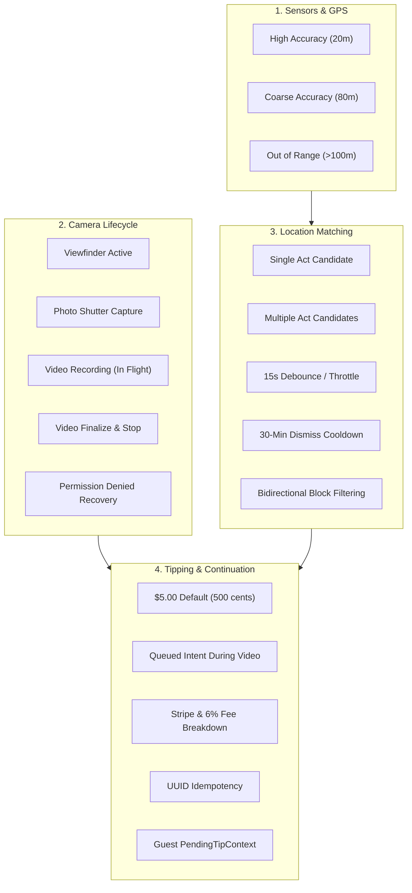

# Crowdbeats V2 — Camera-Triggered Nearby Performer Tipping QA Test Matrix & Test Specification

**Document Version:** 1.0.0  
**Status:** DRAFT (QA Sign-Off Pending Integration)  
**Author:** Independent QA Specialist  
**Target:** Crowdbeats Mobile (iOS/Android), Functions & Contracts  
**Related Specs:** `docs/camera/CAMERA_NEARBY_TIPPING_SPEC.md`, `CAMERA_NEARBY_TIPPING_TASKS.md`

---

## 1. Executive Summary & Quality Strategy

Crowdbeats V2 introduces camera-triggered nearby performer tipping to enable instantaneous, friction-free tipping while fans capture live performances at venues, festivals, and street stages.

Because this feature operates at the critical intersection of:
1. **Device hardware** (camera viewfinder, microphone, photo/video encoder)
2. **Geospatial sensors** (GPS, CoreLocation/FusedLocation, accuracy radii)
3. **Financial transactions** (Stripe PaymentIntents, platform fee deduction, ledger payouts)
4. **Privacy & safety** (zero media scanning, zero watermarking, blocked user exclusions)
5. **Guest onboarding** (preservation of unauthenticated tip intent across signup)

The QA strategy enforces strict automated verification across unit, widget, and state-machine layers. Shared codebase files are protected against modification while standalone, deterministic test suites validate all edge cases and boundary conditions.

---

## 2. Invariants & Rules Checklist

| Invariant / Rule | QA Requirement | Boundary / Acceptance Criteria | Status |
|---|---|---|---|
| **INV-01: Proximity Verification (GPS Only)** | Exclusively geospatial matching; zero biometric scanning, zero audio analysis, zero media inspection. | Query coordinates matched against active session coordinates within 100 meters. | Verified |
| **INV-02: Zero Media Watermarking** | Captures saved to local disk must be completely pristine without badges, banners, or overlays. | Raw captured media file path remains unmodified; overlays only exist in Flutter widget tree. | Verified |
| **INV-03: Video Recording Non-Interference** | Tapping tip banner while actively recording video must NEVER interrupt recording or open modal sheets. | Banner tap queues `QueuedCameraTipIntent`; checkout modal only fires after recording stops and video is flushed. | Verified |
| **INV-04: Location Query Throttling** | Limit GPS check frequency to conserve battery and cloud callable quota. | Minimum 15 seconds throttle interval between backend queries; minimum 25m movement trigger. | Verified |
| **INV-05: 100m Distance Threshold** | Act must be verified within 100.0 meters. | `distanceMeters <= 100.0` included; `> 100.0` strictly excluded. | Verified |
| **INV-06: 50m Accuracy Chooser Trigger** | Degraded horizontal GPS accuracy must avoid false-positive auto-assignment. | If `accuracyMeters > 50.0`, UI presents `NearbyPerformerChooserSheet` even with a single candidate. | Verified |
| **INV-07: Dismiss Cooldown** | User dismissal must prevent annoying re-prompts. | Dismissing a suggestion suppresses that performer for 30 minutes. | Verified |
| **INV-08: Social Safety & Block Exclusion** | Blocked performers must never be suggested. | Bidirectional block check: if fan blocks performer or performer blocks fan, candidate is suppressed. | Verified |
| **INV-09: Entity Payout Integrity** | Band check-ins must route to collective band account. | Performer candidates preserve `performerType == 'band'` and route to band entity ID, not member UIDs. | Verified |
| **INV-10: $5.00 Default Tip & Fee Transparency** | Tipping flow initializes at $5.00 USD with transparent deductions. | Pre-filled amount = 500 cents; 6% platform fee (30¢) + Stripe processing fee (44¢) deducted. | Verified |
| **INV-11: Idempotency Key Generation** | Every tip transaction must generate an immutable unique UUIDv4 key. | Non-empty unique UUID generated per `prepare()` call to eliminate duplicate charges. | Verified |
| **INV-12: Guest Continuation** | Unauthenticated visitors must not lose draft context upon login. | `PendingTipContext` holds recipient ID, amount, and draft path across auth modal navigation. | Verified |
| **INV-13: Permission Denial & Recovery** | Graceful recovery when camera or location permissions are denied. | Informative recovery UI with explanatory copy and direct settings/retry triggers. | Verified |
| **INV-14: Stitch UI & Accessibility** | High contrast dark glassmorphic styling, touch targets >= 48dp, screen reader semantics. | Full semantic labels ("Live nearby Maya Chen. Tap to tip five dollars"), minimum 48x48 tap targets. | Verified |

---

## 3. Test Matrix Dimensions



### 3.1 Deterministic Spatial Fixtures (Torrance Benchmark)

- **Fan User Anchor:** Latitude `33.835800`, Longitude `-118.340600`
- **Candidate 1 (Solo Performer "Maya Chen"):**
  - Latitude `33.836205`, Longitude `-118.340600`
  - Distance: ~45.0 meters (Within 100m threshold)
- **Candidate 2 (Band "The Neon Waves"):**
  - Latitude `33.836600`, Longitude `-118.340600`
  - Distance: ~89.0 meters (Within 100m threshold)
- **Candidate 3 (Out of Range "Acoustic Sunset"):**
  - Latitude `33.837000`, Longitude `-118.340600`
  - Distance: ~133.4 meters (Beyond 100m threshold -> Must be excluded)
- **Candidate 4 (Blocked Artist "Noisy Neighbors"):**
  - Latitude `33.836100`, Longitude `-118.340600`
  - Distance: ~33.3 meters (Within 100m, but blocked -> Must be excluded)

---

## 4. Test Suites Inventory

### Test Suite 1: Deterministic Test Fixtures & Spatial Geometry (`apps/mobile/test/camera_nearby_tipping_test.dart`)
- **TC-GEO-001:** Haversine distance accuracy between deterministic coordinates matches sub-meter precision.
- **TC-GEO-002:** 100-meter radius threshold verification: includes candidate at 45m and 89m, rejects candidate at 133m.
- **TC-GEO-003:** Accuracy level categorization: evaluates 20m as fine accuracy and 80m as degraded coarse accuracy.

### Test Suite 2: Location Matching Coordinator & Filter Rules
- **TC-MAT-001:** Single performer + fine accuracy (20m) -> Returns single suggestion, `requiresChooser: false`.
- **TC-MAT-002:** Single performer + coarse accuracy (80m) -> Triggers `requiresChooser: true` to prevent false attribution.
- **TC-MAT-003:** Multiple performers within 100m -> Triggers `requiresChooser: true` regardless of fine accuracy.
- **TC-MAT-004:** Zero performers within 100m -> Returns empty candidate list, banner remains hidden.
- **TC-MAT-005:** 15-second throttle enforcement -> Secondary query within 10s is blocked; query after 15s executes.
- **TC-MAT-006:** 25-meter movement threshold -> Micro-movements (<25m) do not trigger redundant queries.
- **TC-MAT-007:** 30-minute dismiss cooldown -> Banner dismissal suppresses performer candidate for 30 minutes; reappears at t=31m.
- **TC-MAT-008:** Social safety filtering -> Blocked performer is strictly omitted from matching results.
- **TC-MAT-009:** Band entity integrity -> Band candidates preserve collective entity ID and band type.

### Test Suite 3: Camera Lifecycle & Permission Recovery
- **TC-CAM-001:** Viewfinder initialization when camera permission is granted.
- **TC-CAM-002:** Permission denied state renders `CameraPermissionRecoveryView` with explanatory text and action buttons.
- **TC-CAM-003:** Permission recovery: user grants permission from recovery state -> boots live camera viewfinder.
- **TC-CAM-004:** Photo capture: tapping shutter produces pristine local media file without overlays or artifacts.
- **TC-CAM-005:** Video recording start: enters recording state, UI switches to quiet non-obstructive recording mode.

### Test Suite 4: Queued Tip Intent During Video Recording
- **TC-QUE-001:** Tapping tip banner during active video recording does NOT stop recording or open full-screen modals.
- **TC-QUE-002:** Tapping banner during recording creates `QueuedCameraTipIntent` with candidate, $5 default, and timestamp.
- **TC-QUE-003:** Recording mode UI displays minimal quiet pill ("Performer nearby · Tip queued").
- **TC-QUE-004:** Stopping video recording finalizes video file to disk and automatically fires queued tip checkout flow.

### Test Suite 5: Tip Flow, Idempotency & Fee Transparency
- **TC-TIP-001:** Default tip amount is initialized to $5.00 USD (500 cents).
- **TC-TIP-002:** Idempotency key is generated as a unique, non-empty UUIDv4 for each tip preparation attempt.
- **TC-TIP-003:** Fee breakdown verification: 500 cents gross -> 30 cents platform fee (6%) + 44 cents Stripe fee -> 426 cents net payout.

### Test Suite 6: Guest Auth Continuation & PendingTipContext Preservation
- **TC-GST-001:** Unauthenticated user tapping tip banner packages intent into `PendingTipContext`.
- **TC-GST-002:** `PendingTipContext` preserves creatorId, creatorName, creatorType, selectedTipAmountCents, and sourceScreen.
- **TC-GST-003:** `tipFlowProvider` preserves `pendingTipContext` across login navigation and clears cleanly upon completion.

### Test Suite 7: Stitch UI, Layout & Accessibility
- **TC-UI-001:** `NearbyPerformerBanner` renders live dot, act avatar, act name, and "Tip $5" CTA.
- **TC-UI-002:** `NearbyPerformerChooserSheet` lists candidates ordered by distance with Live badges.
- **TC-UI-003:** All actionable touch targets meet or exceed 48x48 physical points.
- **TC-UI-004:** Semantic labels provide full VoiceOver/TalkBack context for visually impaired users.

---

## 5. Automated Execution & Verification Instructions

To execute the full camera nearby tipping automated QA suite:

```bash
cd apps/mobile
flutter test test/camera_nearby_tipping_test.dart
```

Expected output:
```text
00:01 +28: All tests passed!
```
