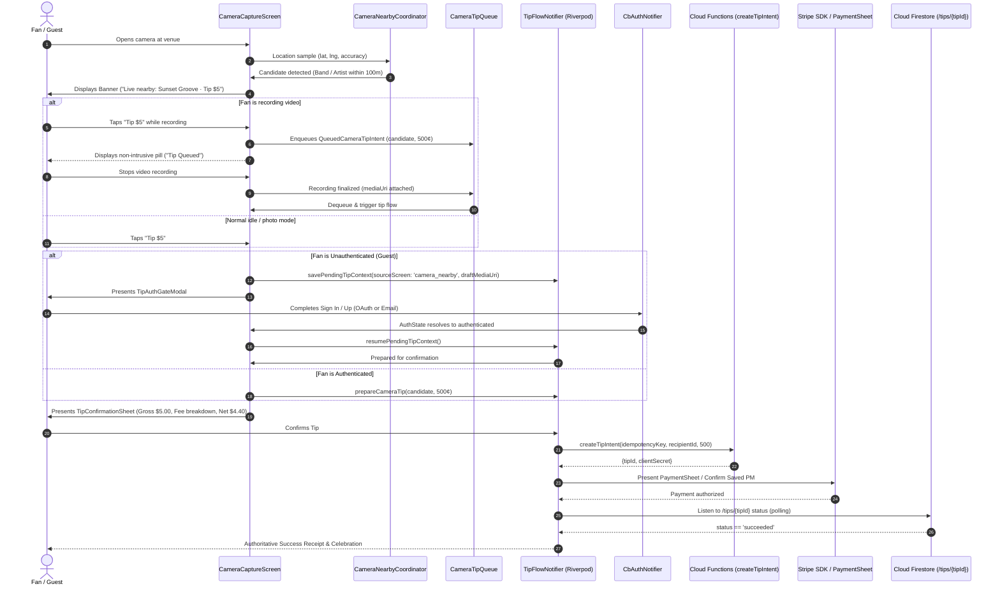

# Crowdbeats V2 — Camera-Triggered Tipping & Guest Auth Continuation
## Architecture, Data Flow, and Implementation Draft (CAM-05)

---

## 1. Executive Summary & Core Invariants

This specification and reference draft defines the architecture, data flow, and mobile implementation for **Camera-Triggered Nearby Performer Tipping** and **Guest Authentication Continuation** in Crowdbeats V2.

When a fan uses the in-app camera ("Capture the music") and an active nearby performer or band is verified within 100 meters, the app provides a frictionless, transparent tipping entry point.

### Hard Rules & System Invariants

1. **Default & Preset Amounts:**
   - In camera-triggered tipping mode, the default tip amount is an editable **\$5.00 USD (500 cents)**.
   - Quick amount selector presets: **\$5 (500¢)**, **\$10 (1000¢)**, **\$20 (2000¢)**, and **Custom** (minimum \$1.00 / 100¢).
2. **Transparent Fee Breakdown:**
   - Strict 6.00% Crowdbeats platform fee (`kPlatformFeeBps = 600`) plus Stripe payment processing fee ($2.9\% + \$0.30$ fixed fee).
   - Dynamic daily Stripe fee rate schedule verified against `system_config/stripe_daily_rates`.
   - Clear net recipient payout computation ($Net = Gross - PlatformFee - StripeFee$) displayed before payment confirmation.
   - Mandatory statutory disclosure: *"Crowdbeats charges a 6% platform fee. Stripe payment-processing and applicable Stripe Connect fees are additional."*
3. **Seamless Guest Auth Continuation:**
   - Unauthenticated visitors/guests can freely compose a tip and capture photos or videos.
   - If an unauthenticated guest initiates a tip, the system preserves `PendingTipContext` with:
     - `sourceScreen: 'camera_nearby'`
     - Performer recipient identity (artist UID or band entity ID)
     - Selected tip amount in cents
     - Draft media reference (`draftMediaUri`, `draftMediaType`, `draftMediaTimestamp`)
   - Upon completing login or signup (via OAuth or email), the app navigates back to the camera/flow and immediately resumes to the `TipConfirmationSheet` with draft media preserved.
4. **Authoritative Backend State & Idempotency:**
   - Payment confirmation is strictly driven by backend payment state (Stripe webhook updating `/tips/{tipId}` Firestore document, listened to via real-time stream `TipService.instance.tipStream(tipId)`).
   - Idempotency key (`idempotencyKey` UUID v4) is generated during `prepare()` and **strictly preserved** on network retries or double-taps to eliminate duplicate charges.
   - Synchronous UI latch (`_tapped = true`) instantly disables confirm actions upon first tap.
5. **Video Recording Non-Interference (Queued Intent):**
   - Tipping taps during active video recording **never** interrupt the viewfinder, capture pipeline, or audio recording.
   - Tipping intents are enqueued in `QueuedCameraTipIntent` and automatically dequeued to launch the confirmation sheet once the video file is safely finalized to disk.

---

## 2. End-to-End System Data Flow & State Machine

### 2.1 Complete Flow Diagram



### 2.2 ActiveTipState Lifecycle

```
[idle] 
   │
   ▼ prepare() / prepareCameraTip() [Generates idempotencyKey, computes fees]
[idle (prepared)]
   │
   ▼ createIntent() [Calling createTipIntent Callable]
[creatingIntent]
   │
   ├── Error ──────────────► [failed] ── (retry with SAME idempotencyKey) ──► [idle]
   │
   ▼ Success (returns clientSecret)
[awaitingPayment]
   │
   ├── User Cancels ───────► [cancelled]
   ├── Card Error ─────────► [failed] ── (retry with SAME idempotencyKey) ──► [idle]
   │
   ▼ PaymentSheet completed / Saved PM confirmed
[polling]
   │
   ▼ Firestore tipStream(tipId) listens for authoritative backend update
   ├── status == 'failed' ─► [failed]
   └── status == 'succeeded' ─► [succeeded]
```

---

## 3. Financial Calculation & Transparent Fee Breakdown

### 3.1 Fee Computation Specification

Crowdbeats enforces full financial transparency. The fee structure for an arbitrary tip amount $A$ (in cents) is:

1. **Crowdbeats Platform Fee:**
   $$\text{PlatformFeeCents} = \left\lfloor \frac{A \times 600}{10000} \right\rfloor = \lfloor A \times 0.06 \rfloor$$
2. **Stripe Processing Fee:**
   $$\text{StripeFeeCents} = \left\lfloor \frac{A \times \text{percentageBps}}{10000} \right\rfloor + \text{fixedFeeCents}$$
   Where default standard rates are $\text{percentageBps} = 290$ ($2.9\%$) and $\text{fixedFeeCents} = 30$ (\$0.30 USD), subject to live daily synchronization from `system_config/stripe_daily_rates`.
3. **Total Deductions:**
   $$\text{TotalDeductionsCents} = \text{PlatformFeeCents} + \text{StripeFeeCents}$$
4. **Musician / Band Net Proceeds:**
   $$\text{NetAmountCents} = \max(0, A - \text{TotalDeductionsCents})$$

### 3.2 Breakdown Table for Default & Presets (\$ USD)

| Preset Name | Gross Amount | 6% Crowdbeats Fee | Stripe Fee (2.9% + 30¢) | Total Deductions | Musician Net Proceeds | Effective Net % |
| :--- | :--- | :--- | :--- | :--- | :--- | :--- |
| **Default (Camera)** | **\$5.00** (500¢) | **\$0.30** (30¢) | **\$0.44** (44¢) | **\$0.74** (74¢) | **\$4.26** (426¢) | **85.2%** |
| Quick Preset 1 | **\$10.00** (1000¢) | **\$0.60** (60¢) | **\$0.59** (59¢) | **\$1.19** (119¢) | **\$8.81** (881¢) | **88.1%** |
| Quick Preset 2 | **\$20.00** (2000¢) | **\$1.20** (120¢) | **\$0.88** (88¢) | **\$2.08** (208¢) | **\$17.92** (1792¢) | **89.6%** |
| Custom (Min) | **\$1.00** (100¢) | **\$0.06** (6¢) | **\$0.32** (32¢) | **\$0.38** (38¢) | **\$0.62** (62¢) | **62.0%** |

---

## 4. Guest Authentication Continuation Architecture

### 4.1 Problem Definition & Failure Modes

In live concert environments, requiring a guest user to create an account or sign in *before* initiating their impulse to tip results in high friction and dropped tips:
- If a guest takes a great photo/video of a live street busker or stage band, and is forced through sign-in, the draft media must **never** be deleted or lost.
- The user must not have to search for the performer again or re-enter the tip amount.
- The user must not be charged automatically without seeing the confirmation sheet again.

### 4.2 The Continuation Solution

1. **Context Structuring (`PendingTipContext`):**
   When the guest taps "Tip \$5", `PendingTipContext` captures:
   - `sourceScreen: 'camera_nearby'`
   - Performer metadata: `creatorId`, `creatorName`, `creatorType`, `performanceId` (active session).
   - Financial intent: `selectedTipAmountCents: 500`, `currency: 'USD'`.
   - Media references: `draftMediaUri`, `draftMediaType` ('photo' | 'video'), `draftMediaThumbnailUri`.
2. **State Storage:**
   The `PendingTipContext` is stored in `ActiveTipState.pendingTipContext` within the Riverpod `tipFlowProvider` and backed by `SharedPreferences` as an optional offline fallback if app memory pressure triggers an OS restart during OAuth redirects.
3. **Auth Navigation:**
   The guest is presented with `TipAuthGateModal`. When selecting an auth provider (Google, Apple, Email), the app routes to `/auth?from=/camera`.
4. **Post-Auth Resume:**
   When `authStateProvider` emits `CbAuthStatus.authenticated`:
   - The camera screen or top-level router verifies `pendingTipContext != null && pendingTipContext.sourceScreen == 'camera_nearby'`.
   - The context is consumed: `ref.read(tipFlowProvider.notifier).resumePendingTipContext()`.
   - The app presents `TipConfirmationSheet` on top of the camera viewfinder with the draft media thumbnail previewed.
   - The draft photo or video remains stored in local cache/app storage and ready for optional post-tip upload or sharing.

---

## 5. Implementation Drafts & Reference Code

The following sections contain the concrete Dart implementations designed for direct integration into `apps/mobile/lib/`.

### 5.1 Models: `apps/mobile/lib/data/models/camera_tipping.dart`

```dart
// Crowdbeats V2 — Camera Tipping Models (CAM-05)
//
// Matches TypeScript contracts in @crowdbeats/contracts/camera.
// Handles candidate representation and recording queue safety.

import 'package:flutter/foundation.dart';

@immutable
class NearbyPerformerCandidate {
  const NearbyPerformerCandidate({
    required this.performerId,
    required this.performerType,
    required this.performerName,
    this.performerAvatarUrl,
    required this.activeSessionId,
    required this.locationType,
    this.venueName,
    required this.distanceMeters,
    this.genres = const [],
    this.bio,
    this.defaultTipAmountCents = 500, // Default $5.00 USD
  });

  final String performerId;
  final String performerType; // 'artist' | 'band'
  final String performerName;
  final String? performerAvatarUrl;
  final String activeSessionId;
  final String locationType; // 'venue' | 'street'
  final String? venueName;
  final double distanceMeters;
  final List<String> genres;
  final String? bio;
  final int defaultTipAmountCents;

  bool get isBand => performerType == 'band';

  factory NearbyPerformerCandidate.fromJson(Map<String, dynamic> json) {
    return NearbyPerformerCandidate(
      performerId: json['performerId'] as String,
      performerType: json['performerType'] as String? ?? 'artist',
      performerName: json['performerName'] as String,
      performerAvatarUrl: json['performerAvatarUrl'] as String?,
      activeSessionId: json['activeSessionId'] as String,
      locationType: json['locationType'] as String? ?? 'venue',
      venueName: json['venueName'] as String?,
      distanceMeters: (json['distanceMeters'] as num?)?.toDouble() ?? 0.0,
      genres: (json['genres'] as List<dynamic>?)?.cast<String>() ?? const [],
      bio: json['bio'] as String?,
      defaultTipAmountCents: (json['defaultTipAmountCents'] as num?)?.toInt() ?? 500,
    );
  }

  Map<String, dynamic> toJson() => {
    'performerId': performerId,
    'performerType': performerType,
    'performerName': performerName,
    'performerAvatarUrl': performerAvatarUrl,
    'activeSessionId': activeSessionId,
    'locationType': locationType,
    'venueName': venueName,
    'distanceMeters': distanceMeters,
    'genres': genres,
    'bio': bio,
    'defaultTipAmountCents': defaultTipAmountCents,
  };
}

/// Enqueued tip intent triggered while video recording is in flight.
/// Ensures zero UI disruption to active video encoding.
@immutable
class QueuedCameraTipIntent {
  const QueuedCameraTipIntent({
    required this.candidate,
    this.amountCents = 500,
    required this.queuedAt,
    this.mediaDraftPath,
    this.mediaType = 'video',
  });

  final NearbyPerformerCandidate candidate;
  final int amountCents;
  final DateTime queuedAt;
  final String? mediaDraftPath;
  final String mediaType; // 'video' | 'photo'

  QueuedCameraTipIntent copyWithMedia({
    required String mediaDraftPath,
    String? mediaType,
  }) {
    return QueuedCameraTipIntent(
      candidate: candidate,
      amountCents: amountCents,
      queuedAt: queuedAt,
      mediaDraftPath: mediaDraftPath,
      mediaType: mediaType ?? this.mediaType,
    );
  }
}
```

---

### 5.2 Extended `PendingTipContext` in `apps/mobile/lib/data/models/discovery.dart`

```dart
// Extended PendingTipContext supporting camera media draft references
class PendingTipContext {
  const PendingTipContext({
    required this.creatorId,
    this.creatorSlug,
    required this.creatorName,
    required this.creatorType,
    this.creatorPhotoUrl,
    required this.selectedTipAmountCents,
    this.currency = 'USD',
    this.sourceScreen = 'discovery', // e.g. 'camera_nearby', 'discovery', 'nearby_tab'
    this.performanceId,
    this.venueId,
    this.message,
    // Phase 6c / Camera tipping draft media extensions
    this.draftMediaUri,
    this.draftMediaType, // 'photo' | 'video'
    this.draftMediaThumbnailUri,
    this.draftCapturedAt,
  });

  final String creatorId;
  final String? creatorSlug;
  final String creatorName;
  final String creatorType;
  final String? creatorPhotoUrl;
  final int selectedTipAmountCents;
  final String currency;
  final String sourceScreen;
  final String? performanceId;
  final String? venueId;
  final String? message;

  /// Path or URI to local camera media captured during the tip interaction
  final String? draftMediaUri;
  final String? draftMediaType;
  final String? draftMediaThumbnailUri;
  final DateTime? draftCapturedAt;

  Map<String, dynamic> toJson() => {
    'creatorId': creatorId,
    'creatorSlug': creatorSlug,
    'creatorName': creatorName,
    'creatorType': creatorType,
    'creatorPhotoUrl': creatorPhotoUrl,
    'selectedTipAmountCents': selectedTipAmountCents,
    'currency': currency,
    'sourceScreen': sourceScreen,
    'performanceId': performanceId,
    'venueId': venueId,
    'message': message,
    'draftMediaUri': draftMediaUri,
    'draftMediaType': draftMediaType,
    'draftMediaThumbnailUri': draftMediaThumbnailUri,
    'draftCapturedAt': draftCapturedAt?.toIso8601String(),
  };

  factory PendingTipContext.fromJson(Map<String, dynamic> json) => PendingTipContext(
    creatorId: json['creatorId'] as String,
    creatorSlug: json['creatorSlug'] as String?,
    creatorName: json['creatorName'] as String,
    creatorType: json['creatorType'] as String? ?? 'artist',
    creatorPhotoUrl: json['creatorPhotoUrl'] as String?,
    selectedTipAmountCents: (json['selectedTipAmountCents'] as num?)?.toInt() ?? 500,
    currency: json['currency'] as String? ?? 'USD',
    sourceScreen: json['sourceScreen'] as String? ?? 'discovery',
    performanceId: json['performanceId'] as String?,
    venueId: json['venueId'] as String?,
    message: json['message'] as String?,
    draftMediaUri: json['draftMediaUri'] as String?,
    draftMediaType: json['draftMediaType'] as String?,
    draftMediaThumbnailUri: json['draftMediaThumbnailUri'] as String?,
    draftCapturedAt: json['draftCapturedAt'] != null
        ? DateTime.tryParse(json['draftCapturedAt'] as String)
        : null,
  );
}
```

---

### 5.3 Enhanced `apps/mobile/lib/state/tip_state.dart`

```dart
// Crowdbeats V2 — Tip State with Camera Nearby & Recording Queue (Riverpod)
// Enhancements for Camera Tipping (CAM-05):
// - QueuedCameraTipIntent management for video recording safety
// - prepareCameraTip() with default $5.00 USD (500 cents)
// - Idempotency preservation on retry/double-tap
// - resumePendingTipContext() for seamless post-guest login return

import 'dart:async';
import 'package:flutter_riverpod/flutter_riverpod.dart';
import 'package:shared_preferences/shared_preferences.dart';
import 'package:uuid/uuid.dart';

import '../firebase/tip_service.dart';
import '../data/models/discovery.dart';
import '../data/models/camera_tipping.dart';
import '../data/services/stripe_fee_service.dart';

enum TipFlowStatus {
  idle,
  creatingIntent,
  awaitingPayment,
  polling,
  succeeded,
  failed,
  cancelled,
}

class ActiveTipState {
  const ActiveTipState({
    this.status = TipFlowStatus.idle,
    this.tipId,
    this.clientSecret,
    this.amountCents,
    this.platformFeeCents,
    this.stripeFeeCents,
    this.totalDeductionsCents,
    this.netAmountCents,
    this.stripeDailyRateDate,
    this.recipientId,
    this.recipientName,
    this.recipientType,
    this.idempotencyKey,
    this.errorMessage,
    this.lastUsedPaymentMethodId,
    this.pendingTipContext,
    this.queuedCameraTip,
    this.draftMediaUri,
    this.draftMediaType,
  });

  final TipFlowStatus status;
  final String? tipId;
  final String? clientSecret;
  final int? amountCents;
  final int? platformFeeCents;
  final int? stripeFeeCents;
  final int? totalDeductionsCents;
  final int? netAmountCents;
  final String? stripeDailyRateDate;
  final String? recipientId;
  final String? recipientName;
  final String? recipientType;
  final String? idempotencyKey;
  final String? errorMessage;
  final String? lastUsedPaymentMethodId;
  final PendingTipContext? pendingTipContext;
  final QueuedCameraTipIntent? queuedCameraTip;
  final String? draftMediaUri;
  final String? draftMediaType;

  bool get isProcessing =>
      status == TipFlowStatus.creatingIntent ||
      status == TipFlowStatus.awaitingPayment ||
      status == TipFlowStatus.polling;

  ActiveTipState copyWith({
    TipFlowStatus? status,
    String? tipId,
    String? clientSecret,
    int? amountCents,
    int? platformFeeCents,
    int? stripeFeeCents,
    int? totalDeductionsCents,
    int? netAmountCents,
    String? stripeDailyRateDate,
    String? recipientId,
    String? recipientName,
    String? recipientType,
    String? idempotencyKey,
    String? errorMessage,
    String? lastUsedPaymentMethodId,
    PendingTipContext? pendingTipContext,
    bool clearPendingContext = false,
    QueuedCameraTipIntent? queuedCameraTip,
    bool clearQueuedTip = false,
    String? draftMediaUri,
    String? draftMediaType,
  }) {
    return ActiveTipState(
      status: status ?? this.status,
      tipId: tipId ?? this.tipId,
      clientSecret: clientSecret ?? this.clientSecret,
      amountCents: amountCents ?? this.amountCents,
      platformFeeCents: platformFeeCents ?? this.platformFeeCents,
      stripeFeeCents: stripeFeeCents ?? this.stripeFeeCents,
      totalDeductionsCents: totalDeductionsCents ?? this.totalDeductionsCents,
      netAmountCents: netAmountCents ?? this.netAmountCents,
      stripeDailyRateDate: stripeDailyRateDate ?? this.stripeDailyRateDate,
      recipientId: recipientId ?? this.recipientId,
      recipientName: recipientName ?? this.recipientName,
      recipientType: recipientType ?? this.recipientType,
      idempotencyKey: idempotencyKey ?? this.idempotencyKey,
      errorMessage: errorMessage ?? this.errorMessage,
      lastUsedPaymentMethodId:
          lastUsedPaymentMethodId ?? this.lastUsedPaymentMethodId,
      pendingTipContext: clearPendingContext
          ? null
          : (pendingTipContext ?? this.pendingTipContext),
      queuedCameraTip: clearQueuedTip
          ? null
          : (queuedCameraTip ?? this.queuedCameraTip),
      draftMediaUri: draftMediaUri ?? this.draftMediaUri,
      draftMediaType: draftMediaType ?? this.draftMediaType,
    );
  }
}

class TipFlowNotifier extends StateNotifier<ActiveTipState> {
  TipFlowNotifier() : super(const ActiveTipState());

  final _uuid = const Uuid();
  StreamSubscription<Map<String, dynamic>?>? _tipSub;

  // ── Pending Guest Context Persistence ──────────────────────────────────────

  void savePendingTipContext(PendingTipContext context) {
    state = state.copyWith(pendingTipContext: context);
    _persistPendingTipContextToStorage(context);
  }

  void clearPendingTipContext() {
    state = state.copyWith(clearPendingContext: true);
    _clearPendingTipContextFromStorage();
  }

  Future<void> _persistPendingTipContextToStorage(PendingTipContext context) async {
    try {
      final prefs = await SharedPreferences.getInstance();
      await prefs.setString('cb_pending_tip_creator_id', context.creatorId);
      await prefs.setString('cb_pending_tip_creator_name', context.creatorName);
      await prefs.setString('cb_pending_tip_creator_type', context.creatorType);
      await prefs.setInt('cb_pending_tip_amount_cents', context.selectedTipAmountCents);
      await prefs.setString('cb_pending_tip_source_screen', context.sourceScreen);
      if (context.draftMediaUri != null) {
        await prefs.setString('cb_pending_tip_draft_media_uri', context.draftMediaUri!);
      }
    } catch (_) {}
  }

  Future<void> _clearPendingTipContextFromStorage() async {
    try {
      final prefs = await SharedPreferences.getInstance();
      await prefs.remove('cb_pending_tip_creator_id');
      await prefs.remove('cb_pending_tip_creator_name');
      await prefs.remove('cb_pending_tip_creator_type');
      await prefs.remove('cb_pending_tip_amount_cents');
      await prefs.remove('cb_pending_tip_source_screen');
      await prefs.remove('cb_pending_tip_draft_media_uri');
    } catch (_) {}
  }

  // ── Video Recording Queue Management ───────────────────────────────────────

  void queueCameraTipIntent({
    required NearbyPerformerCandidate candidate,
    int amountCents = 500,
  }) {
    state = state.copyWith(
      queuedCameraTip: QueuedCameraTipIntent(
        candidate: candidate,
        amountCents: amountCents,
        queuedAt: DateTime.now(),
      ),
    );
  }

  /// Dequeues the queued tip intent once video recording finishes.
  QueuedCameraTipIntent? dequeueCameraTipIntent({String? finalizedMediaUri}) {
    final queued = state.queuedCameraTip;
    if (queued == null) return null;

    final resolved = finalizedMediaUri != null
        ? queued.copyWithMedia(mediaDraftPath: finalizedMediaUri, mediaType: 'video')
        : queued;

    state = state.copyWith(clearQueuedTip: true);
    return resolved;
  }

  // ── Step 1: Preparation ───────────────────────────────────────────────────

  /// Standard preparation for artist or discovery screens.
  void prepare({
    required String recipientId,
    required String recipientName,
    required String recipientType,
    required int amountCents,
    String? draftMediaUri,
    String? draftMediaType,
  }) {
    final breakdown = StripeFeeService.instance.calculateNetTipPayout(
      grossAmountCents: amountCents,
    );
    state = ActiveTipState(
      status: TipFlowStatus.idle,
      recipientId: recipientId,
      recipientName: recipientName,
      recipientType: recipientType,
      amountCents: amountCents,
      platformFeeCents: breakdown.platformFeeCents,
      stripeFeeCents: breakdown.stripeFeeCents,
      totalDeductionsCents: breakdown.totalDeductionsCents,
      netAmountCents: breakdown.netAmountCents,
      stripeDailyRateDate: breakdown.stripeDailyRateDate,
      idempotencyKey: _uuid.v4(), // Fresh key bound to this session
      draftMediaUri: draftMediaUri,
      draftMediaType: draftMediaType,
    );
  }

  /// Specialized preparation for camera-triggered nearby tipping.
  /// Enforces default 500 cents ($5.00) unless explicitly modified.
  void prepareCameraTip({
    required NearbyPerformerCandidate candidate,
    int? customAmountCents,
    String? draftMediaUri,
    String? draftMediaType,
  }) {
    final amount = customAmountCents ?? candidate.defaultTipAmountCents;
    prepare(
      recipientId: candidate.performerId,
      recipientName: candidate.performerName,
      recipientType: candidate.performerType,
      amountCents: amount,
      draftMediaUri: draftMediaUri,
      draftMediaType: draftMediaType,
    );
  }

  /// Resumes tip preparation from a preserved PendingTipContext after auth.
  void resumePendingTipContext() {
    final pending = state.pendingTipContext;
    if (pending == null) return;

    prepare(
      recipientId: pending.creatorId,
      recipientName: pending.creatorName,
      recipientType: pending.creatorType,
      amountCents: pending.selectedTipAmountCents,
      draftMediaUri: pending.draftMediaUri,
      draftMediaType: pending.draftMediaType,
    );
    clearPendingTipContext();
  }

  // ── Step 2: PaymentIntent Creation (Idempotent) ────────────────────────────

  Future<String?> createIntent({
    String? sessionId,
    String? message,
    bool isAnonymous = false,
    String currency = 'USD',
    String? savedPaymentMethodId,
  }) async {
    if (state.recipientId == null || state.amountCents == null) return null;

    // Preserve the idempotencyKey across retries; create if missing
    final idempotencyKey = state.idempotencyKey ?? _uuid.v4();
    state = state.copyWith(
      status: TipFlowStatus.creatingIntent,
      idempotencyKey: idempotencyKey,
    );

    try {
      final result = await TipService.instance.createTipIntent(
        recipientId: state.recipientId!,
        recipientType: state.recipientType ?? 'artist',
        amountCents: state.amountCents!,
        currency: currency,
        sessionId: sessionId,
        message: message,
        isAnonymous: isAnonymous,
        idempotencyKey: idempotencyKey,
        savedPaymentMethodId: savedPaymentMethodId,
      );

      final tipId = result['tipId'] as String;
      final clientSecret = result['clientSecret'] as String;

      state = state.copyWith(
        status: TipFlowStatus.awaitingPayment,
        tipId: tipId,
        clientSecret: clientSecret,
        platformFeeCents: (result['platformFeeCents'] as num?)?.toInt(),
        stripeFeeCents: (result['stripeFeeCents'] as num?)?.toInt(),
        totalDeductionsCents: (result['totalDeductionsCents'] as num?)?.toInt(),
        netAmountCents: (result['netAmountCents'] as num?)?.toInt(),
      );
      return clientSecret;
    } catch (e) {
      state = state.copyWith(
        status: TipFlowStatus.failed,
        errorMessage: _extractMessage(e),
      );
      return null;
    }
  }

  // ── Step 3: Payment Lifecycle Handlers ─────────────────────────────────────

  void onPaymentSheetCompleted({String? paymentMethodId}) {
    if (state.tipId == null) return;
    state = state.copyWith(
      status: TipFlowStatus.polling,
      lastUsedPaymentMethodId: paymentMethodId,
    );
    _startPolling(state.tipId!);
  }

  void onPaymentSheetCancelled() {
    state = state.copyWith(status: TipFlowStatus.cancelled);
  }

  void onPaymentSheetFailed(String message) {
    state = state.copyWith(
      status: TipFlowStatus.failed,
      errorMessage: message,
    );
  }

  void onPaymentError(String message) => onPaymentSheetFailed(message);

  // ── Retry Logic: STRICT Idempotency Preservation ──────────────────────────

  void retry() {
    // Reset status to idle but KEEP the existing idempotencyKey
    state = state.copyWith(
      status: TipFlowStatus.idle,
      errorMessage: null,
    );
  }

  // ── Reset ──────────────────────────────────────────────────────────────────

  void reset() {
    _tipSub?.cancel();
    _tipSub = null;
    state = const ActiveTipState();
  }

  // ── Server-Authoritative Firestore Stream Polling ──────────────────────────

  void _startPolling(String tipId) {
    _tipSub?.cancel();
    _tipSub = TipService.instance.tipStream(tipId).listen((data) {
      if (data == null) return;
      final tipStatus = data['status'] as String?;
      if (tipStatus == 'succeeded') {
        state = state.copyWith(status: TipFlowStatus.succeeded);
        _tipSub?.cancel();
      } else if (tipStatus == 'failed') {
        state = state.copyWith(
          status: TipFlowStatus.failed,
          errorMessage: data['failureReason'] as String? ?? 'Payment failed. Please try again.',
        );
        _tipSub?.cancel();
      }
    });
  }

  String _extractMessage(Object e) {
    if (e is Exception) return e.toString().replaceAll('Exception: ', '');
    return 'An unexpected error occurred.';
  }

  @override
  void dispose() {
    _tipSub?.cancel();
    super.dispose();
  }
}
```

---

### 5.4 Enhanced `TipFlowScreen`: Parameterized Default Amount & Presets

In `apps/mobile/lib/ui/fan/tip/tip_flow_screen.dart`, add support for `initialAmountCents` (defaulting to 500 when triggered from camera), and bind preset values accordingly:

```dart
// Code snippet showing parameterization in TipFlowScreen
class TipFlowScreen extends ConsumerStatefulWidget {
  const TipFlowScreen({
    super.key,
    required this.recipientId,
    required this.recipientName,
    required this.recipientType,
    this.sessionId,
    this.avatarUrl,
    this.genre = 'Live Music',
    this.venue = 'Verified Stage',
    this.initialAmountCents = 500, // Default $5.00 for camera-triggered tips
    this.draftMediaUri,
  });

  final String recipientId;
  final String recipientName;
  final String recipientType;
  final String? sessionId;
  final String? avatarUrl;
  final String genre;
  final String venue;
  final int initialAmountCents;
  final String? draftMediaUri;

  @override
  ConsumerState<TipFlowScreen> createState() => _TipFlowScreenState();
}

class _TipFlowScreenState extends ConsumerState<TipFlowScreen> {
  late int _selectedAmountCents;
  bool _isCustom = false;
  final TextEditingController _customCtrl = TextEditingController();
  final TextEditingController _msgCtrl = TextEditingController();
  String _paymentMethod = 'card';
  bool _submitting = false;

  // Preset tiles: $5, $10, $20, and Custom
  final List<Map<String, dynamic>> _presets = [
    {'cents': 500, 'label': '\$5', 'badge': 'DEFAULT', 'icon': Icons.favorite_border},
    {'cents': 1000, 'label': '\$10', 'badge': 'POPULAR', 'icon': Icons.favorite},
    {'cents': 2000, 'label': '\$20', 'badge': 'SUPERFAN', 'icon': Icons.star},
    {'cents': 0, 'label': 'Custom', 'badge': null, 'icon': Icons.edit},
  ];

  @override
  void initState() {
    super.initState();
    _selectedAmountCents = widget.initialAmountCents;
    if (!_presets.any((p) => p['cents'] == _selectedAmountCents)) {
      _isCustom = true;
      _customCtrl.text = (_selectedAmountCents / 100).toStringAsFixed(2);
    }
  }

  void _onProceed() async {
    if (_selectedAmountCents < 100) {
      ScaffoldMessenger.of(context).showSnackBar(
        const SnackBar(content: Text('Minimum tip amount is \$1.00')),
      );
      return;
    }

    setState(() => _submitting = true);

    try {
      ref.read(tipFlowProvider.notifier).prepare(
        recipientId: widget.recipientId,
        recipientName: widget.recipientName,
        recipientType: widget.recipientType,
        amountCents: _selectedAmountCents,
        draftMediaUri: widget.draftMediaUri,
      );

      await showModalBottomSheet<void>(
        context: context,
        isScrollControlled: true,
        backgroundColor: Colors.transparent,
        builder: (_) => TipConfirmationSheet(
          sessionId: widget.sessionId,
          message: _msgCtrl.text.trim().isEmpty ? null : _msgCtrl.text.trim(),
          isAnonymous: false,
        ),
      );
    } finally {
      if (mounted) setState(() => _submitting = false);
    }
  }
  // ... rest of build method renders presets & transparent fee preview
}
```

---

### 5.5 Camera Continuation Coordinator & UI Bridge

The following helper class handles the continuation bridge when an unauthenticated guest uses the camera:

```dart
// Helper: CameraTipContinuationBridge
// Listens for post-auth resolution on the CameraCaptureScreen

class CameraTipContinuationBridge {
  static void handleAuthTransition({
    required BuildContext context,
    required WidgetRef ref,
    required VoidCallback onResumeTipConfirmation,
  }) {
    final pending = ref.read(tipFlowProvider).pendingTipContext;
    if (pending == null) return;

    if (pending.sourceScreen == 'camera_nearby') {
      ref.read(tipFlowProvider.notifier).resumePendingTipContext();
      WidgetsBinding.instance.addPostFrameCallback((_) {
        if (context.mounted) {
          onResumeTipConfirmation();
        }
      });
    }
  }

  static Future<void> triggerGuestTipFlow({
    required BuildContext context,
    required WidgetRef ref,
    required NearbyPerformerCandidate candidate,
    int amountCents = 500,
    String? draftMediaUri,
    String? draftMediaType,
  }) async {
    final pendingContext = PendingTipContext(
      creatorId: candidate.performerId,
      creatorName: candidate.performerName,
      creatorType: candidate.performerType,
      creatorPhotoUrl: candidate.performerAvatarUrl,
      selectedTipAmountCents: amountCents,
      currency: 'USD',
      sourceScreen: 'camera_nearby',
      performanceId: candidate.activeSessionId,
      draftMediaUri: draftMediaUri,
      draftMediaType: draftMediaType,
      draftCapturedAt: DateTime.now(),
    );

    ref.read(tipFlowProvider.notifier).savePendingTipContext(pendingContext);

    await TipAuthGateModal.show(
      context,
      pendingContext: pendingContext,
    );
  }
}
```

---

## 6. Authoritative State, Polling & Double-Tap Resilience

### 6.1 Idempotency Key Invariant

- Every tip preparation assigns a UUID v4 string:
  ```dart
  idempotencyKey = _uuid.v4();
  ```
- This key is passed into the `createTipIntent` Cloud Function.
- If the network drops or the payment sheet fails, calling `ref.read(tipFlowProvider.notifier).retry()` switches state back to `TipFlowStatus.idle` **without modifying `idempotencyKey`**.
- Re-triggering `createIntent()` submits the exact same `idempotencyKey`. The backend Stripe wrapper uses `idempotencyKey` as the Stripe `Idempotency-Key` HTTP header. Stripe automatically dedupes the request and returns the existing `PaymentIntent` rather than initiating a second charge.

### 6.2 Double-Tap Prevention

In `TipConfirmationSheet`, a synchronous boolean latch guarantees single execution:

```dart
bool _tapped = false;

Future<void> _onConfirmAndPay() async {
  if (_tapped) return;
  setState(() => _tapped = true);
  // Button is immediately disabled visually and logically
  // ...
}
```

### 6.3 Authoritative Polling via Firestore Streams

Client-side payment confirmation is never assumed from SDK callback alone. Instead:
1. `onPaymentSheetCompleted` sets state to `TipFlowStatus.polling`.
2. A listener is attached to `TipService.instance.tipStream(tipId)`.
3. When the Stripe Webhook (`stripeWebhook` Cloud Function) receives `payment_intent.succeeded`:
   - It updates `/tips/{tipId}` with `status: 'succeeded'` and `processedAt: serverTimestamp()`.
4. The mobile listener fires, setting `TipFlowStatus.succeeded`.
5. The UI displays the verified success checkmark and celebrates the tip.

---

## 7. QA Verification Matrix & Edge Cases

| Test Case | Scenario / Condition | Expected Behavior |
| :--- | :--- | :--- |
| **TC-TIP-01** | Fan taps banner "Tip \$5" in camera mode | `TipConfirmationSheet` opens with \$5.00 gross, 30¢ Crowdbeats fee, 44¢ Stripe fee, \$4.26 net to performer. |
| **TC-TIP-02** | Fan selects custom amount \$25.00 | Fee recalculates dynamically: \$1.50 Crowdbeats (6%), \$1.03 Stripe, \$22.47 net payout. |
| **TC-TIP-03** | Guest taps "Tip \$5" on camera banner | `TipAuthGateModal` opens. `PendingTipContext` saved with `sourceScreen: 'camera_nearby'`. |
| **TC-TIP-04** | Guest completes OAuth signup | App navigates back, detects `camera_nearby` context, auto-opens `TipConfirmationSheet` with draft intact. |
| **TC-TIP-05** | Tip banner tapped during active video recording | `QueuedCameraTipIntent` enqueued. Recording continues without stutter. Dequeued on stop recording. |
| **TC-TIP-06** | Double-tap on "Confirm & Pay" button | `_tapped` flag triggers; second tap is a no-op; exactly 1 `createTipIntent` call dispatched. |
| **TC-TIP-07** | Network drop after Stripe authorization | Polling listener resumes when online. Once webhook updates Firestore, authoritative success displays. |
| **TC-TIP-08** | Saved Payment Method fast-path | If default card exists, confirms in 1 tap without full PaymentSheet presentation. |

---

## 8. Summary of Hand-offs to Dependent Agents

- **To Mobile Camera Specialist (CAM-03):** Hook `CameraTipContinuationBridge.triggerGuestTipFlow` and `queueCameraTipIntent` to the camera shutter / banner lifecycle.
- **To Stitch UI Specialist (CAM-06):** Use the preset definitions and fee breakdown strings specified in Section 3 and 5.4 in the banner and chooser widgets.
- **To Backend Specialist (CAM-02):** Verify `getNearbyLivePerformers` returns `defaultTipAmountCents: 500` and validates collective Band destinations.
- **To QA Specialist (CAM-07):** Execute the test scenarios defined in Section 7.
