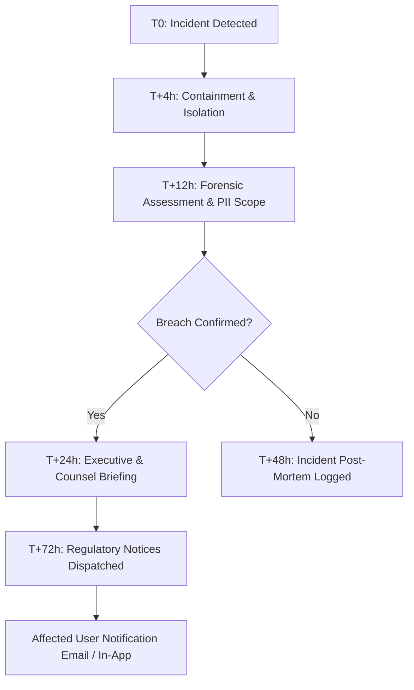

# Crowdbeats V2 — Security Incident & 50-State Breach Notification Response Plan

**Document Status:** Permanent Incident Response Plan  
**Statutory Basis:** Cal. Civ. Code § 1798.82; NY SHIELD Act § 899-aa; GDPR Art. 33–34  

---

## 1. Incident Response Timeline (72-Hour Target)

---

## 2. Notification Thresholds & Jurisdictional Triggers

| Jurisdiction | Notification Trigger | Regulatory Body | Consumer Notice Deadline |
| :--- | :--- | :--- | :--- |
| **California** | Unencrypted personal info acquired | California Attorney General (> 500 residents) | Most expedient time possible |
| **New York** | Unauthorized access to private info | NY Attorney General, Dept of State, State Police | Expedient time without unreasonable delay |
| **Texas** | Unauthorized access to sensitive data | Texas Attorney General (> 250 residents) | Within 30 days |
| **European Union (GDPR)**| Risk to rights and freedoms | Lead Supervisory Authority (DPA) | **Within 72 hours** |
