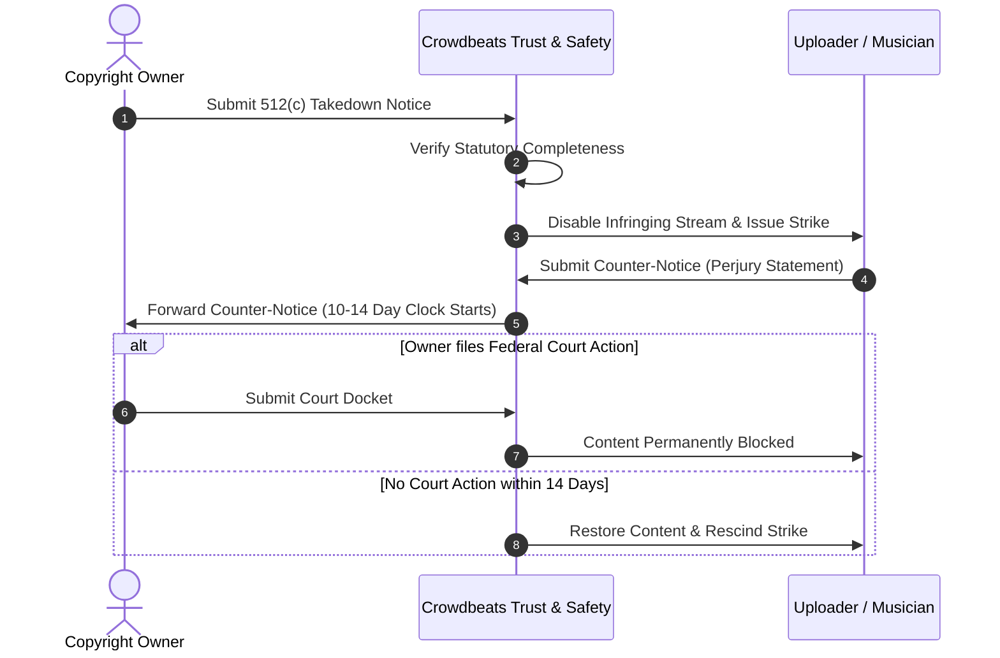

# Crowdbeats V2 — DMCA Notice, Takedown & Copyright Operations Plan

**Document Status:** Permanent Operations Specification  
**Statutory Basis:** 17 U.S.C. § 512(c) (Digital Millennium Copyright Act)  

---

## 1. Designated Copyright Agent Information

- **Registered Organization:** Crowdbeats LLC
- **Designated Agent:** Copyright & Compliance Counsel
- **Email:** `dmca@crowdbeats.com`
- **Notice Intake URL:** `https://crowdbeats.com/legal/dmca`
- **Physical Address:** Crowdbeats LLC, Registered Office, USA

---

## 2. Notice & Takedown Workflow (4-Step Timeline)

---

## 3. Repeat Infringer Policy

Pursuant to 17 U.S.C. § 512(i)(1)(A), Crowdbeats enforces a strict **3-strike policy**:
- **Strike 1:** Content disabled, creator receives formal warning and education modal.
- **Strike 2:** 30-day monetization and live stage broadcast suspension.
- **Strike 3:** Permanent account termination and revocation of Stripe Connect association.
