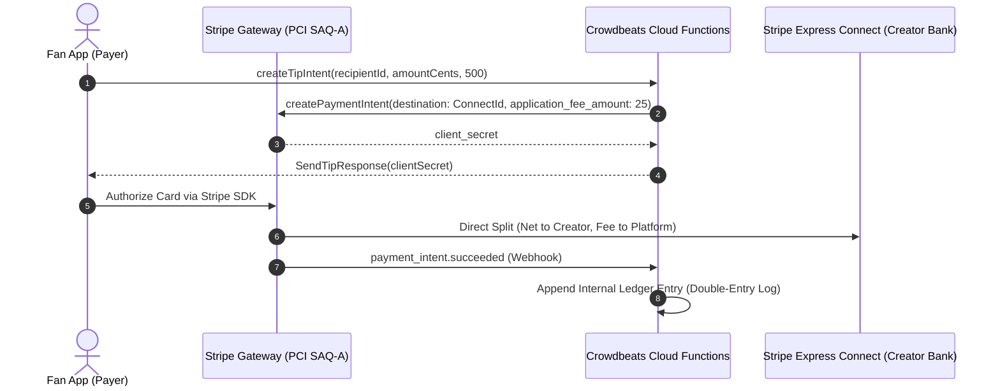

# Crowdbeats V2 — Payments, Marketplace Architecture & Money Transmission Review

**Document Status:** Permanent Architecture Specification  
**Regulatory Review:** FinCEN MSB Regulations & State Money Transmitter Licensing (MTL)  

---

## 1. Non-Stored Value Wallet Architecture (Anti-Custody Invariant)

> [!IMPORTANT]
> **Core Financial Invariant:** Crowdbeats **is NOT a stored-value digital wallet**. Crowdbeats **never custodies, holds in escrow, or freely transmits user funds**. 

---

## 2. Agent-of-the-Payee Statutory Exemption

Crowdbeats operates strictly under the **Agent-of-the-Payee exemption** recognized under FinCEN guidance (FIN-2014-R009) and state Money Transmission Licensing laws:
1. **Contractual Appointment:** In the Creator Monetization Agreement, the performing musician expressly appoints Crowdbeats and Stripe as their authorized collection agent.
2. **Satisfaction of Debt:** When a fan pays the agent (Stripe), the fan's obligation to the creator is legally satisfied immediately, regardless of when funds settle to the creator's bank account.
3. **No Direct Intermediary Balance:** Fan funds do not sit in a commingled Crowdbeats operating account. Settlement routes directly from the fan's card to the creator's Stripe Express account.
