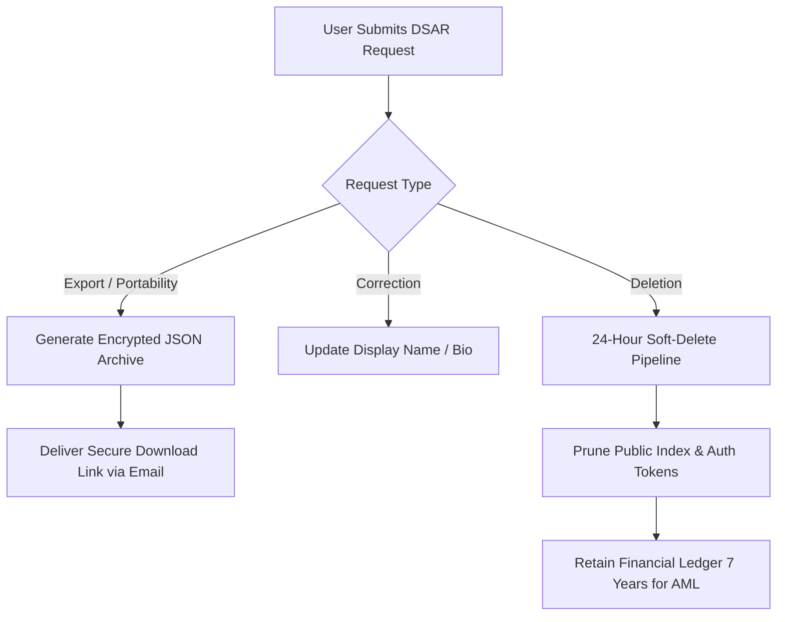

# Crowdbeats V2 — Privacy, Data Rights & DSAR Operations Plan

**Document Status:** Permanent Privacy Operations Plan  
**Target Regulations:** CCPA/CPRA, GDPR, VCDPA, CPA, CTDPA, TDPSA  

---

## 1. Data Subject Access Request (DSAR) Framework

---

## 2. Statutory Timelines & SLAs

| Request Type | Statutory Deadline | Crowdbeats SLA | Verification Method |
| :--- | :--- | :--- | :--- |
| **Data Export / Access** | 45 Days (CCPA) / 30 Days (GDPR) | **48 Hours** | Authenticated session + Email OTP |
| **Account Deletion** | 45 Days (CCPA) / 30 Days (GDPR) | **24 Hours** (Soft-delete) | Authenticated session + Re-auth |
| **Opt-Out / GPC Signal** | 15 Days (CCPA) | **Instant** (< 1 sec) | Automated HTTP Header Detection |
| **Correction** | 45 Days (CCPA) | **Instant** (Self-service) | In-app settings update |
