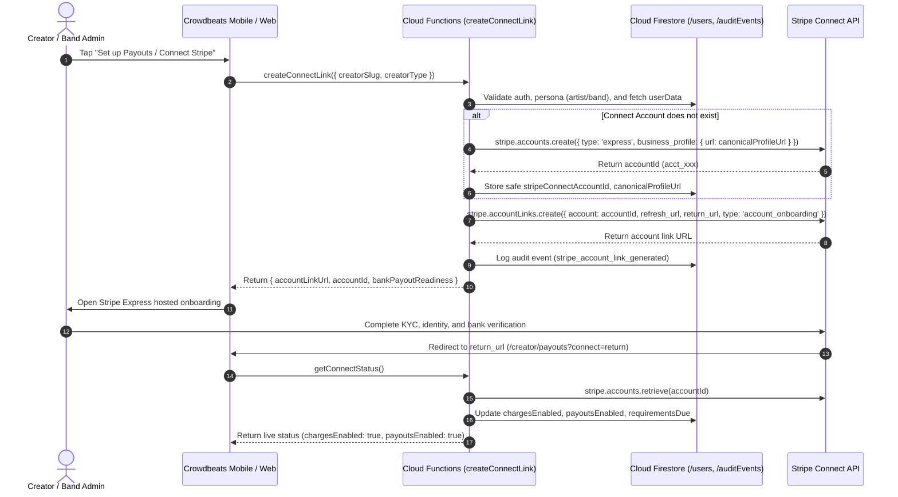

# CROWDBEATS V2 — STRIPE CONNECT ARCHITECTURE SPECIFICATION

**Document Type:** Technical & Compliance Architecture (Phase 1)  
**System Role:** Stripe Connect Multi-Party Payment & Creator Payout Framework  
**Classification:** Internal Compliance & Due Diligence Record  
**Last Updated:** 2026-08-30  

---

## 1. System Role & Financial Invariants

1. **Fans as Customers:**
   - Fans are consumers who voluntarily tip, contribute to artist campaigns, or purchase tickets/merchandise.
   - Fans create tokenized Stripe Customer identities (`stripeCustomerId`) via server-authoritative SetupIntents and PaymentIntents.
2. **Solo Musicians & Bands as Connected Accounts:**
   - Solo Musicians and eligible Bands operate as Stripe Connect Express connected accounts (`stripeConnectAccountId`).
   - All creator payouts occur directly via Stripe Connect mechanisms (Destination Charges or Separate Charges and Transfers) into verified bank accounts or debit cards managed on Stripe Express.
3. **Crowdbeats as the Platform:**
   - Crowdbeats facilitates discovery, live stage sessions, engagement, and content moderation.
   - Crowdbeats collects a server-governed platform fee deduction (in integer basis points).
   - Crowdbeats is **not** a custodial money transmitter, bank, or stored-value wallet.
4. **Stripe as the Sole Financial System of Record:**
   - All spendable balances, pending balances, hold reserves, and actual payout disbursements reside entirely on Stripe.
   - Crowdbeats database records (`/paymentLedger`, `/tips`, `/payouts`) reflect transaction status and audit events, never spendable stored balances.

---

## 2. Stripe Connect Onboarding & Account-Link Lifecycle

---

## 3. Data Storage & Safe Identifier Boundary

### Safe Identifiers Stored in Firestore
| Field Name | Collection | Description | Security Classification |
| :--- | :--- | :--- | :--- |
| `stripeCustomerId` | `/users/{uid}` | Customer reference for fans | Safe Public/Internal ID |
| `stripeConnectAccountId` | `/users/{uid}`, `/artistProfiles/{uid}`, `/bands/{bandId}` | Connected account reference | Safe Internal Reference |
| `chargesEnabled` | `/users/{uid}` | Whether account can receive funds | Boolean Capability Status |
| `payoutsEnabled` | `/users/{uid}` | Whether account can withdraw funds | Boolean Capability Status |
| `disabledReason` | `/users/{uid}` | Reason if disabled by Stripe | Safe Enumerated Status |
| `requirementsDue` | `/users/{uid}` | Array of pending verification fields | Safe Requirement List |
| `bankPayoutReadiness` | `/users/{uid}` | Ready / Not Ready status | Operational State |
| `creatorVerificationState` | `/users/{uid}` | `unverified`, `pending`, `verified`, `restricted` | Operational State |
| `canonicalProfileUrl` | `/users/{uid}` | `https://crowdbeats.ai/artist/{slug}` | Public Canonical URL |

### Strictly Prohibited Data (Zero Storage Invariant)
- **NO** full Primary Account Numbers (PAN / 16-digit card numbers).
- **NO** Card Verification Values (CVV / CVC).
- **NO** raw bank routing or account numbers.
- **NO** Stripe Secret API Keys (`sk_live_...`, `sk_test_...`) in Firestore or client code.
- **NO** unrestricted payment tokens.

---

## 4. Webhook Synchronization & Requirement Handling

Stripe Connect webhooks are ingested through the server-authoritative webhook handler:
- `account.updated`: Updates `chargesEnabled`, `payoutsEnabled`, `requirementsDue`, `disabledReason`, and `creatorVerificationState`.
- `account.application.deauthorized`: Immediately transitions `monetizationStatus` to `DEMONETIZED` and revokes payout capabilities.
- `capability.updated`: Synchronizes card payments and transfers capabilities.
- `payout.paid` / `payout.failed`: Updates payout records in `/payouts` with exact Stripe transaction references.

---

## 5. Security & Secret Management

1. **Secret Management:**
   - Stripe API secrets (`STRIPE_SECRET_KEY`, `STRIPE_WEBHOOK_SECRET`) are loaded strictly from **Google Cloud Secret Manager** or injected into server environment variables.
   - Never accessible in client bundles, public repositories, or client-side storage.
2. **Server-Side Authorization:**
   - All financial operations (`createConnectLink`, `getConnectStatus`, `createTipIntent`, `requestPayout`) run inside Firebase Cloud Functions Gen 2 (`us-central1`).
   - Client applications never make direct API calls with Stripe secret privileges.
