# Crowdbeats V2 — Account Settings Information Architecture

**Authoritative Source:** Google Stitch Project `5326179813018056505` (Vivid Resonance)  
**Design Reference:** Consumer Organization Simplicity  
**Target Form Factors:** Flutter Mobile (iOS / Android) & Next.js Responsive Web  

---

## 1. Hierarchy Overview

```mermaid
graph TD
    A[Account Hub Screen] --> B[A. Profile Header]
    A --> C[B. Your Crowdbeats]
    A --> D[C. Money & Payments]
    A --> E[D. Artist & Band Tools - Role Aware]
    A --> F[E. Sponsor Tools - Role Aware]
    A --> G[F. Account & Security]
    A --> H[G. Preferences]
    A --> I[H. Trust, Safety & Support]
    A --> J[I. Legal & Data]
    A --> K[J. Session & Danger Zone]

    B --> B1[Avatar & Name]
    B --> B2[Verified Badge]
    B --> B3[Active Persona Chip]
    B --> B4[Switch Persona Sheet]
    B --> B5[Edit Profile]

    C --> C1[Personas & Profiles]
    C --> C2[Saved Artists & Bands]
    C --> C3[Tip & Contribution History]
    C --> C4[Campaign Activity]

    D --> D1[Payment Methods - Stripe PMs]
    D --> D2[Tips, Receipts & Invoices]
    D --> D3[Tipping Preferences]
    D --> D4[Stripe Connect Payouts]
    D --> D5[Band Payment Splits]

    E --> E1[Stage Session Settings]
    E --> E2[QR Tip Code Settings]
    E --> E3[Live Location Check-In]
    E --> E4[Band Roster & Roles]

    F --> F1[Organization Profile]
    F --> F2[Escrow Balance & Match Pools]
    F --> F3[Contracts & Invoices]

    G --> G1[Personal Information]
    G --> G2[Sign-In & Password]
    G --> G3[Connected Accounts]
    G --> G4[Devices & Active Sessions]
    G --> G5[Biometric App Lock]

    H --> H1[Notification Categories]
    H --> H2[Privacy & Location Precision]
    H --> H3[App Permissions & Discovery]
    H --> H4[Appearance & Accessibility]

    I --> I1[Safety Hub & Guidelines]
    I --> I2[Blocked Accounts]
    I --> I3[Incident Reports & Support]

    J --> J1[Terms & Privacy Policies]
    J --> J2[Monetization & DMCA Disclosures]
    J --> J3[Download My Data Export]

    K --> K1[Sign Out with Cache Clear]
    K --> K2[Account Status & Deletion]
```

---

## 2. Detailed Section Specifications

### A. Profile Header
- **Elements:**
  - Avatar / Profile Photo (with fallback persona avatar and live gradient rim).
  - Display Name (Large, Montserrat Bold 22px).
  - Verified Checkmark Badge (Shown only when `isVerified == true` in verified creator records).
  - Active Persona Pill (e.g. `Fan`, `Solo Musician`, `Band Manager`, `Sponsor Rep`).
  - Tenure Subtitle: `Member since [Month Year]`.
  - Actions: **View Public Profile** (opens `/artist/:slug` or fan profile modal) & **Switch Persona** (triggers `PersonaSwitcherSheet`).

### B. Your Crowdbeats
1. **Personas & Profiles:** Overview of all personas bound to the current UID, with option to onboard additional personas.
2. **Saved Artists & Bands:** Bookmarked creators and favorited live stages.
3. **Tip and Contribution History:** Chronological ledger of all tips given or campaign rewards backed, with downloadable receipts.
4. **Campaign Activity:** Backed crowdfunding campaigns, updates, and reward tier fulfilment status.
5. **Invitations & Referrals:** *(Feature flagged)* Displayed only when referral campaign is active.

### C. Money & Payments
- **Universal (All Personas):**
  1. **Payment Methods:** Saved credit/debit cards via Stripe Elements / PaymentSheet. Shows safe brand, last4, and expiry.
  2. **Receipts & History:** Filterable payment transaction receipts with Stripe PaymentIntent references.
  3. **Tipping Preferences:** Default tip preset amounts ($2, $5, $10, $20), tipping currency, anonymous tipping toggle.
  4. **Refund & Payment Support:** Guided flow to request 24h refund on eligible tips or submit dispute inquiry.
- **Creator Personas (Solo Musicians, Bands):**
  5. **Stripe Connect Account:** Express onboarding status (`Active`, `Restricted`, `Action Required`) with link to Stripe Express Dashboard.
  6. **Payout Methods & History:** Bank account / debit card destinations, pending balances, recent payouts.
  7. **Band Payment Splits:** Automatic revenue-split rules across band members.
  8. **Payout Holds & Verification:** Notices on tax documentation (W-9 / 1099-K) or compliance holds.
- **Sponsors:**
  9. **Sponsorship Escrow & Billing:** Corporate payment methods, match pool allocations, tax invoices.

### D. Artist & Band Tools *(Shown for `artist` and `band_member`)*
1. **Live Performance Settings:** Default stage configuration, auto-check-in geofence radius, stage broadcast visibility.
2. **QR Tip Code Settings:** Custom branded QR code generator, printable tip stand PDF exporter, NFC tag linking.
3. **Location & Check-In Preferences:** Live GPS radar broadcast toggle, venue beacon detection.
4. **Band Management & Roster:** *(Band Founder / Admin only)* Member invitations, role assignments (`BAND_FOUNDER`, `BAND_ADMIN`, `BAND_MEMBER`), revenue splits.
5. **EPK & Social Media Links:** Spotify artist URL, Instagram handle, Apple Music link, SoundCloud, YouTube.

### E. Sponsor Tools *(Shown for `sponsor_rep`)*
1. **Organization Profile:** Company branding, website, tax ID, representative contact.
2. **Team Members & Permissions:** Authorized team managers and campaign contributors.
3. **Match Pools & Campaigns:** Active sponsorship pools matching fan tips at live concerts.
4. **Contracts & Invoices:** PDF sponsorship agreements and monthly corporate billing statements.

### F. Account & Security
1. **Personal Information:** Real name, contact email, mobile phone number (E.164 format).
2. **Sign-In & Security:**
   - Password change (requires recent authentication).
   - Connected OAuth accounts: Google Sign-In (`Connected`), Apple Sign-In (`Connected`).
3. **Devices & Active Sessions:**
   - Current device indicator (OS, platform, last active timestamp).
   - "Sign out of all devices" server-authoritative revocation.
4. **Biometric App Lock:** Face ID / Touch ID / Fingerprint prompt requirement on app resume (when supported).

### G. Preferences
1. **Notifications:** Granular category toggles:
   - *Financial & Tips:* Tip received notifications, refund updates, payout transfers (locked ON for security/transactional).
   - *Live Music:* Followed artist goes live nearby, geofence stage alerts.
   - *Campaigns:* Project milestones, creator updates.
   - *Social:* New followers, mentions, fan messages.
   - *Marketing & News:* Crowdbeats product updates, newsletter.
   - *Channels:* Push Notifications, Email Digests, SMS (explicit opt-in only).
2. **Privacy & Location:**
   - Location precision: Precise (GPS Live radar) vs Approximate (City-level discovery).
   - Profile Discoverability: Public in nearby feed vs Stealth mode.
   - Anonymous Tipping Default: Hide real name from public tip tickers.
   - Privacy Analytics Consent: Telemetry opt-out.
3. **Appearance & Accessibility:**
   - Dark Theme (Vivid Resonance) / System Default.
   - High Contrast Mode (WCAG AAA enforcement).
   - Reduced Motion (disables radar pulse and glowing particle animations).
   - Text Size Scaling (respects system dynamic type).
4. **Language & Region:** Preferred currency (`USD`, `EUR`, `GBP`, `CAD`, `AUD`), Timezone.

### H. Trust, Safety & Support
1. **Safety Hub:** Crowdbeats safety principles, live event safety tips, fraud protection.
2. **Blocked Accounts:** List of blocked users with 1-tap unblock option.
3. **Reports & Cases:** History of filed content/conduct reports with status tracking.
4. **Help Center & FAQ:** Knowledge base on tipping, live sessions, Bluetooth check-in, and payouts.
5. **Contact Support:** In-app support ticketing / direct support email (`support@crowdbeats.com`).
6. **Report a Concern:** Protected reporting modal (harassment, copyright, venue issue, payment fraud).

### I. Legal & Data
1. **Terms of Service:** Direct link to `/legal/terms`.
2. **Privacy Policy:** Direct link to `/legal/privacy`.
3. **Creator Monetization Agreement:** Direct link to `/legal/creator-monetization`.
4. **Acceptable Use & Prohibited Content:** Direct link to `/legal/aup`.
5. **DMCA & Copyright Policy:** Direct link to `/legal/dmca`.
6. **Download My Data:** GDPR/CCPA data export request (triggers `requestPrivacyExport` Cloud Function).
7. **Open Source Licenses:** Acknowledgements of Flutter, React, Firebase, Stripe open source packages.

### J. Session & Danger Zone
1. **Sign Out:** Positioned near bottom; safely clears local tokens, Riverpod state, and cache before redirecting to `/auth`.
2. **Account Status & Danger Zone:** Isolated sub-route `/account/delete` with multi-step protection:
   - Verifies user is not the sole founder of an active band (requires transferring ownership first).
   - Verifies no active escrow balance or unfulfilled campaigns.
   - Requires recent re-authentication and typing exact confirmation phrase.
   - Triggers `requestAccountDeletion` Cloud Function for compliant GDPR soft-delete with 7-year financial record retention.
