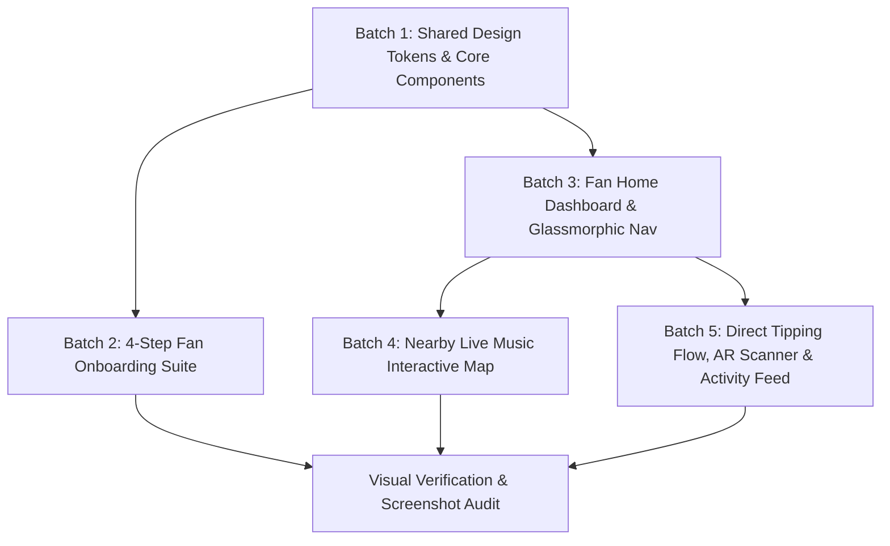

# Stitch Redesign Implementation Plan — Crowdbeats V2

**Design Authority:** Google Stitch Project `5326179813018056505`  
**Target Codebases:** `apps/mobile/` (Flutter) & `apps/web/` (Next.js 16)  
**Execution Strategy:** Multi-Batch Phased Implementation with Visual Verification

---

## 1. Implementation Batches

---

### Batch 1 — Shared Design Tokens & Core Reusable Components
**Goal:** Establish the foundational visual system across both Flutter and Next.js before building screen layouts.
- **Flutter Deliverables (`apps/mobile/lib/ui/components/`):**
  - `cb_theme.dart` (Colors, Typography, Radii, Shadows, Glows)
  - `cb_pill_button.dart` (Primary full-width gradient button)
  - `cb_outline_button.dart` (Ghost/outline button)
  - `cb_tip_preset_card.dart` (Amount selector tile)
  - `cb_live_badge.dart` (Glowing green LIVE pill)
  - `cb_form_field.dart` (Dark rounded input with validation)
  - `cb_linear_step_indicator.dart` (4-step progress header)
- **Next.js Deliverables (`apps/web/components/ui/` & `globals.css`):**
  - Updated `globals.css` with Stitch CSS variables & utility classes
  - `CbPillButton.tsx`, `CbOutlineButton.tsx`, `CbTipPresetCard.tsx`, `CbLiveBadge.tsx`, `CbFormField.tsx`, `CbLinearStepIndicator.tsx`

---

### Batch 2 — 4-Step Fan Onboarding Experience (Screens 2, 7, 4, 6, 5)
**Goal:** Implement the complete end-to-end fan registration and personalization wizard.
- **Screens Covered:**
  - Step 1: Basic Profile Info (Avatar upload, Username availability, Email, Socials)
  - Step 2: Music Preferences & Genres (12-genre grid, Artist tags, Notification switches)
  - Step 3: Profile Details & Experience (Bio, City, Occupation, Interests, Show frequency)
  - Step 4: Profile Review & Submission (Interactive review cards with inline edit triggers)
  - Step 4 Complete: Welcome & Next Steps (Confetti celebration, Discovery pathways, Referral card)
- **Files Affected:**
  - Flutter: `apps/mobile/lib/ui/fan/onboarding/`
  - Next.js: `apps/web/app/onboarding/fan/`

---

### Batch 3 — Fan Home Dashboard & Glassmorphic Navigation (Screen 10)
**Goal:** Implement the primary fan landing hub and persistent bottom navigation bar.
- **Features:**
  - Personalized header greeting ("Good evening, Jordan 👋") with unread notification badge
  - 3-column quick action cards (Nearby Live, Tip a Musician, Following)
  - Horizontal scrolling carousel of live performers near you with `LIVE` tags
  - Upcoming show banners with `Remind Me` actions
  - Recent tip transactions
  - Glassmorphic floating bottom navigation bar with elevated centered floating "Tip" action button
- **Files Affected:**
  - Flutter: `apps/mobile/lib/ui/fan/tabs/home_tab.dart`, `apps/mobile/lib/ui/fan/fan_shell.dart`
  - Next.js: `apps/web/app/(fan)/home/page.tsx`, `apps/web/app/(fan)/layout.tsx`

---

### Batch 4 — Interactive Nearby Live Music Map (Screens 8 & 11)
**Goal:** Implement the geolocation-driven discovery map and lineup drawer.
- **Features:**
  - Dark satellite/vector map with user GPS position beacon
  - Custom circular performer avatar markers with colored category status rings
  - Radar beacon pulses on live performing stages
  - Segmented view switcher (Map, List, Venues)
  - Expandable bottom drawer with live performer cards and direct "Tip" action buttons
- **Files Affected:**
  - Flutter: `apps/mobile/lib/ui/fan/tabs/nearby_tab.dart`, `apps/mobile/lib/ui/fan/nearby/`
  - Next.js: `apps/web/app/(fan)/nearby/page.tsx`, `apps/web/components/map/`

---

### Batch 5 — Direct Tipping Flow, AR Camera Scanner & Activity Feed (Screens 1, 3, 9, 12)
**Goal:** Implement the core monetization and engagement interactions.
- **Features:**
  - Direct Tipping Flow Modal (Spotlight concert hero, amount presets, impact banner, Apple Pay/Google Pay radio options, message input, Tip CTA)
  - AR Camera Performer Detection Viewfinder with dynamic neon green reticle and instant bottom tipping sheet
  - Fan Activity & Notifications Feed with category chips (All, Tips, Follows, Campaigns, System), chronological groupings, and "Follow Back" actions
- **Files Affected:**
  - Flutter: `apps/mobile/lib/ui/fan/tip/`, `apps/mobile/lib/ui/fan/tabs/activity_tab.dart`
  - Next.js: `apps/web/app/(fan)/tip/[creatorSlug]/`, `apps/web/app/(fan)/activity/page.tsx`

---

## 2. Visual Verification Protocol

For each implemented batch:
1. **Compilation & Typecheck:** `npm run typecheck` and `flutter analyze` must pass with 0 errors.
2. **Automated Unit & Widget Tests:** Execute component and screen rendering tests.
3. **Viewport Screenshot Capture:**
   - iPhone / iOS: 393 × 852 (or 853 × 1844)
   - Android: 412 × 915
   - Web Desktop / Tablet: 1280 × 800 and 768 × 1024
4. **Visual Comparison:** Validate pixel precision against the authoritative Stitch project screenshots in `docs/design/stitch_assets/`.
5. **Accessibility Audit:** Verify WCAG 2.2 AA color contrast and screen reader labels.
