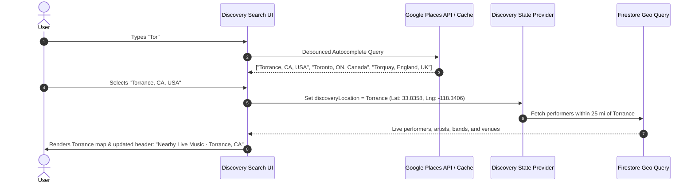

# CROWDBEATS V2 — GEOGRAPHIC SEARCH & LOCATION ARCHITECTURE

**Document:** `docs/discovery/GEO_SEARCH_ARCHITECTURE.md`  
**Classification:** Spatial Discovery, Google Places Autocomplete & Geolocation Architecture  
**Status:** **AUTHORITATIVE DESIGN & IMPLEMENTATION SPECIFICATION**  
**Target Environment:** Cross-Platform Mobile (Flutter) & Web (Next.js)  

---

## 1. Location Source Hierarchy

To guarantee a frictionless experience without violating user privacy, Crowdbeats determines discovery locations using the following strict priority hierarchy:

```
┌─────────────────────────────────────────────────────────────┐
│ 1. User-Selected Searched Location (Explicit user intent)  │
└──────────────────────────────┬──────────────────────────────┘
                               │ (if not specified)
┌──────────────────────────────▼──────────────────────────────┐
│ 2. Current Device GPS Location (Only if permission granted) │
└──────────────────────────────┬──────────────────────────────┘
                               │ (if denied / unavailable)
┌──────────────────────────────▼──────────────────────────────┐
│ 3. Previous Cached Discovery Location (Non-sensitive local)  │
└──────────────────────────────┬──────────────────────────────┘
                               │ (if first-time launch)
┌──────────────────────────────▼──────────────────────────────┐
│ 4. Sensible Default Discovery Experience (e.g. San Diego)   │
└─────────────────────────────────────────────────────────────┘
```

### Key Principles:
- **Never Require Mandatory Location Permission**: The application remains 100% functional even if location permission is completely blocked or permanently denied.
- **Educational Permission Request**: Permission is requested only when the user opens Nearby, accompanied by an educational dialog explaining the value ("Find live music near you") with clear options: `Use location` or `Search another area`.
- **Zero Nagging**: If a user declines permission, the decision is respected without repetitive prompts.

---

## 2. Location Search & Autocomplete Architecture

Crowdbeats incorporates a dedicated, debounced **Location Search Bar** at the top of discovery surfaces:

- **Placeholder**: `Search city, town, state or country`
- **Supported Query Examples**:
  - *Torrance, California*
  - *Palm Springs, California*
  - *Los Angeles, California*
  - *Austin, Texas*
  - *Nashville, Tennessee*
  - *London, United Kingdom*
  - *Auckland, New Zealand*

### Autocomplete Rules:
1. **Debouncing**: Input is debounced by 300ms to eliminate unnecessary API requests.
2. **Geographic Filtering**: Autocomplete restricts results to geographic entity types (`(cities)`, `locality`, `administrative_area_level_1`, `country`).
3. **Strict Separation of Search Types**:
   - **Location Search**: Restricted strictly to geographical regions. Never auto-populates artist or band names.
   - **Artist Discovery Search**: Dedicated search for artist names, band names, genres, and venues.



---

## 3. Search Area Mode & Distance Calculation

When a user searches for another city (e.g. searching "Torrance, CA" while physically in "San Diego, CA"):

1. **State Independence**:
   - `deviceLocation`: Preserves the physical GPS coordinates (if granted).
   - `discoveryLocation`: Represents the searched area center.
2. **Contextual Wording**:
   - The UI header updates to: `Nearby Live Music · Torrance, CA`.
   - Distances on cards are computed relative to the **searched location center** (e.g. "within 0.8 mi of Torrance") to avoid misleading the user.
3. **"Use My Location" Quick Action**:
   - When browsing in Search Area Mode, a prominent floating pill or action button (`Use My Location`) is displayed to instantly return to local GPS discovery.

---

## 4. Scalable Firestore Geo-Discovery Model

Crowdbeats avoids downloading entire collections to client memory. Queries utilize bounded geospatial indexing:

### Spatial Schema:
```typescript
interface PublicGeoDocument {
  readonly creatorId: string;
  readonly publicLocationType: 'VENUE' | 'SCHEDULED_PERFORMANCE' | 'CITY_CENTROID';
  readonly venueId?: string;
  readonly performanceId?: string;
  readonly latitude: number;
  readonly longitude: number;
  readonly geohash: string;
  readonly isLive: boolean;
  readonly visibility: 'PUBLIC';
  readonly discoveryEligible: boolean;
  readonly updatedAt: IsoTimestamp;
}
```

- **Query Strategy**: Cloud Functions compute the 9-cell geohash neighborhood or bounding box coordinates (`minLat`, `maxLat`, `minLng`, `maxLng`) and query Firestore with compound index constraints.
- **Server Filtering**: Only documents with `discoveryEligible == true` and `visibility == 'PUBLIC'` are returned to the client.
