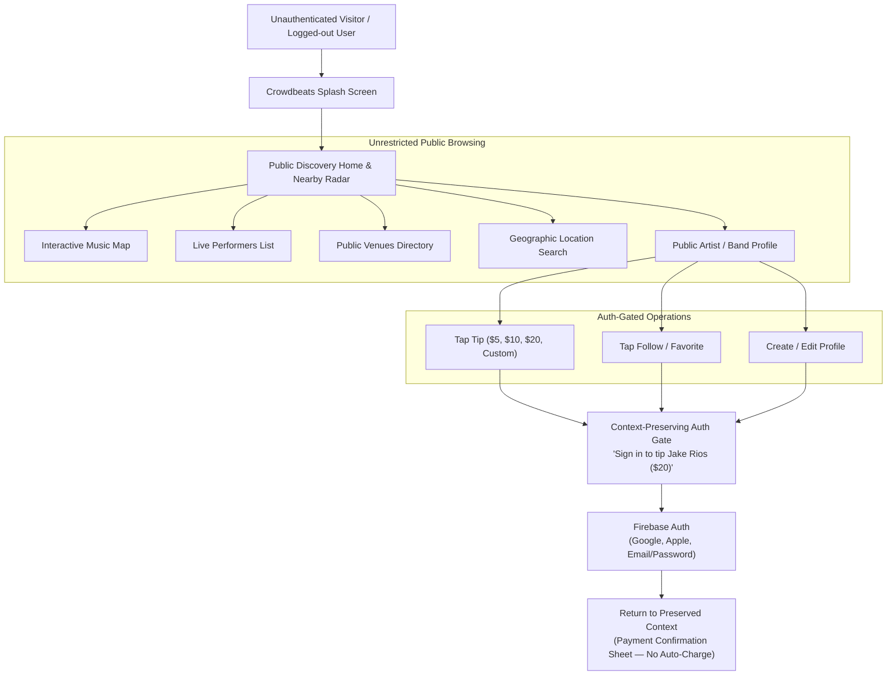

# CROWDBEATS V2 — PUBLIC DISCOVERY ARCHITECTURE

**Document:** `docs/discovery/PUBLIC_DISCOVERY_ARCHITECTURE.md`  
**Status:** **AUTHORITATIVE ARCHITECTURAL SPECIFICATION**  
**Classification:** Public Discovery & Progressive Authentication Architecture  
**Target Environment:** Crowdbeats V2 Cross-Platform Application (Flutter Mobile, Next.js Web, Cloud Functions Gen 2)  

---

## 1. Executive Summary & Vision

Crowdbeats V2 adopts **Progressive Authentication with Frictionless Public Discovery**. Music discovery is treated as a zero-barrier public utility:
- Any visitor (unauthenticated guest, logged-out fan, logged-out solo musician, logged-out band member) can immediately explore Home, Nearby Live Radar, Interactive Maps, Artist Profiles, Band Profiles, and Venue Pages.
- **Authentication is strictly deferred** until the user initiates a protected action (tipping, following, favoriting, commenting, messaging, saving payment methods, or managing profiles).
- The user experience is designed to feel as effortless as **Uber, Lyft, Google Maps, and Spotify discovery** while preserving Crowdbeats' distinct dark obsidian aesthetic and strict financial ledger compliance.

---

## 2. Core Architectural Invariants

1. **Zero Mandatory Authentication at Startup**:
   - The application startup flow never presents an authentication wall immediately following the splash screen.
   - GoRouter and Next.js middleware default to public discovery surfaces.
2. **Read-Only Public Surface**:
   - Public discovery queries are strictly read-only. Unauthenticated clients have zero write access to Firestore, Cloud Storage, or financial ledgers.
3. **Context Preservation Across Auth Boundaries**:
   - When an unauthenticated visitor selects an artist and tip amount (e.g. $20) and triggers the Auth Gate, all transaction context (`creatorId`, `creatorSlug`, `selectedTipAmountCents`, `currency`, `performanceId`, `venueId`) is preserved in memory and restored upon login.
   - **Payment is NEVER automatically executed upon login**; the authenticated user is returned to the review sheet to explicitly confirm the Stripe PaymentIntent.
4. **Strict Separation of Device Location & Searched Discovery Location**:
   - `deviceLocation` (GPS coordinates from the physical device) is maintained strictly separate in state from `discoveryLocation` (the user's manually searched area, e.g. Torrance, CA).
   - Manually searching a remote city never overwrites the device GPS coordinates, and distance calculations clearly reflect the searched center.
5. **Zero Private PII / GPS Trail Leakage**:
   - Public queries never expose private residential addresses, private coordinates, billing data, Stripe account IDs, identity verification documents, or continuous GPS trails.

---

## 3. Surface Navigation & Progressive Auth Matrix

| Surface / Route | Access Mode | Unauthenticated Experience | Auth Gate Trigger | Context Restored on Auth |
|---|---|---|---|---|
| **Home (`/`, `/fan`)** | Public | Live performers carousel, popular artists, trending genres, guest greeting | N/A | N/A |
| **Nearby (`/nearby`)** | Public | Interactive map, synchronized list, venue directory, location search bar | N/A | N/A |
| **Artist Profile (`/artist/{slug}`)** | Public | Public bio, verified badge, photo/cover, public media, upcoming gigs, Tip CTA | Tapping Tip or Follow | Return to artist with selected tip amount / follow confirmed |
| **Band Profile (`/band/{slug}`)** | Public | Band bio, member count, genres, live status, Tip CTA | Tapping Tip or Follow | Return to band with selected tip amount / follow confirmed |
| **Venue Page (`/venues`)** | Public | Venue name, verified address, capacity, active musicians, stage schedule | Tapping favorite / follow | Return to venue page |
| **Tip Flow (`/tip`)** | Progressive | Select artist, select preset amount ($5, $10, $20, custom) | Tapping "Tip $X" | Restore `$X` on PaymentSheet confirmation |
| **Activity Tab (`/activity`)** | Protected | Displays Auth Gate with sign-in / register actions | Tapping Activity Tab | Navigates to personal activity stream |
| **Profile Tab (`/profile`)** | Protected | Displays Guest Card with "Sign in / Create Account" | Tapping Profile Tab | Navigates to active persona workspace |

---

## 4. Multi-Platform Delivery Architecture

### 4.1 Mobile Client (Flutter)
- **Framework**: Flutter 3.x with Riverpod state management.
- **Routing**: `GoRouter` with unauthenticated initial route pointing to `FanShell`.
- **Maps**: `google_maps_flutter` with custom obsidian styling, interactive marker tapping, bottom preview sheets, and debounced Places Autocomplete.

### 4.2 Web Client (Next.js 14 App Router)
- **Framework**: Next.js 14 (App Router, Server Actions).
- **Public Routes**: Root `/`, `/nearby`, `/artist/[slug]`, `/band/[slug]`, `/venues`.
- **Styling**: Google Stitch design tokens, dark obsidian theme (`#0B0C10`), glassmorphic panels (`#151722`), purple accents (`#8B5CF6`).

### 4.3 Backend & Cloud Functions (Gen 2)
- **Functions**: `getPublicDiscoveryFeed`, `createTipIntent`, `assertCreatorPubliclyDiscoverable`.
- **Rules**: Firestore security rules allowing unauthenticated reads for active artists, bands, venues, and stage sessions.
