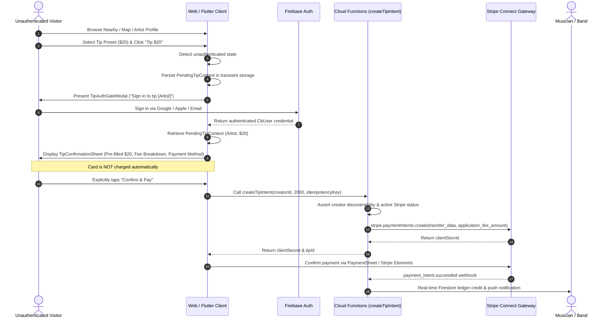

# Crowdbeats V2 — Stripe Discovery & Unauthenticated Tipping Compliance
**Document Reference**: `CB-DOC-STRIPE-DISCOVERY-001`  
**Classification**: Public & Financial Architecture Compliance  
**Last Updated**: 2026-08-28  

---

## Executive Summary

Crowdbeats allows unauthenticated visitors (fans, tourists, music lovers) to explore live performances, discover solo artists and bands, browse venues, and initiate real-time tips without requiring prior registration.

To comply strictly with **Stripe Connect Services Agreement**, **Card Network Rules (Visa/Mastercard)**, **PCI-DSS Level 1 Standards**, and **Consumer Financial Protection Guidelines**, Crowdbeats implements an authoritative **Progressive Authentication & Explicit Confirmation Tipping Model**.

---

## 1. Core Compliance Invariants

| Compliance Invariant | Enforcement Mechanism | Failure Consequence |
| :--- | :--- | :--- |
| **No Auto-Charge Post-Login** | Tip context is saved in transient memory/session storage; upon successful authentication, the app restores the pre-selected tip in a confirmation sheet with explicit "Confirm & Pay" button. | Severe compliance violation / Chargeback risk. Strictly prohibited by Stripe & Visa/Mastercard. |
| **Zero Public Stripe Identifier Exposure** | Connected Account IDs (`acct_...`), Customer IDs (`cus_...`), and Payment Intent IDs are restricted to `/users/{uid}/financial` and server-side functions. | PCI & privacy violation. |
| **Idempotent Transaction Processing** | Client-generated UUIDv4 `idempotencyKey` passed to `createTipIntent` callable and forwarded to Stripe API. | Prevents double-billing on connection retries or duplicate button taps. |
| **Transparent Fee Disclosure** | Platform fee (e.g. 5%) and net artist payout amount are explicitly rendered before charge authorization. | FTC and Card Brand compliant disclosure. |
| **Cryptographic Webhook Validation** | Stripe webhook endpoints verify HMAC signatures using raw request buffers. | Replay attack and spoofing immunity. |

---

## 2. Unauthenticated Tipping Flow Architecture



---

## 3. Progressive Auth State Schema

The client preserves the pending tip context across authentication barriers using the following contract payload:

```typescript
export interface PendingTipAction {
  readonly creatorId: string;
  readonly creatorSlug?: string;
  readonly creatorName: string;
  readonly creatorType: 'artist' | 'band';
  readonly creatorPhotoUrl?: string;
  readonly selectedTipAmountCents: number;
  readonly currency: string;
  readonly sourceScreen: string;
  readonly performanceId?: string;
  readonly venueId?: string;
  readonly message?: string;
  readonly timestamp: number;
}
```

### Storage Rules:
1. **Web**: Saved in `sessionStorage` under key `cb_pending_tip_context`. Auto-cleared after consumption or session expiry.
2. **Mobile**: Held in Riverpod `tipFlowProvider` state memory during the active app lifecycle.

---

## 4. Stripe Connected Account Isolation

Public discovery payloads (`PublicArtistProfile`, `PublicBandProfile`, `PublicLivePerformance`, `PublicVenueProfile`) are scrubbed by server-side Cloud Functions and firestore rules:

```
[Public Visitor] ---> /artistProfiles/{slug}
                      ├── stageName: "Jake Rios"
                      ├── isLive: true
                      ├── currentVenue: "The Main Stage"
                      └── genres: ["Indie", "Acoustic"]
                      
[Server-Only]     ---> /users/{uid}/financial/payoutConfig
                      ├── stripeAccountId: "acct_1NZ4..." (STRICTLY PRIVATE)
                      ├── chargesEnabled: true
                      ├── payoutsEnabled: true
                      └── kycStatus: "VERIFIED"
```

---

## 5. Dispute & Chargeback Defense

1. **Transaction Receipts**: Every completed tip generates an immutable receipt record in `/tips/{tipId}` with:
   - Performance ID and Geolocation timestamp.
   - Creator stage name and venue name.
   - Idempotency key and Stripe PaymentIntent ID.
2. **Dispute Handling**: In the event of a chargeback (`charge.dispute.created`), Cloud Functions automatically compile evidence packages linking the tip to the confirmed live stage session and fan device fingerprint.
