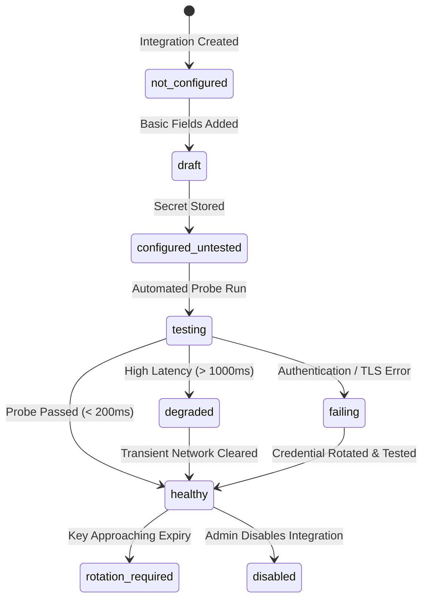

# Crowdbeats V2 — Integration Health & State Machine Model

**Document Status:** Permanent Architecture Specification  

---

## 1. 11 Canonical Integration Health States

```mermaid
stateDiagram-v2
    [*] --> not_configured: Integration Created
    not_configured --> draft: Basic Fields Added
    draft --> configured_untested: Secret Stored
    configured_untested --> testing: Automated Probe Run
    testing --> healthy: Probe Passed (< 200ms)
    testing --> degraded: High Latency (> 1000ms)
    testing --> failing: Authentication / TLS Error
    healthy --> rotation_required: Key Approaching Expiry
    healthy --> disabled: Admin Disables Integration
    degraded --> healthy: Transient Network Cleared
    failing --> healthy: Credential Rotated & Tested
```
