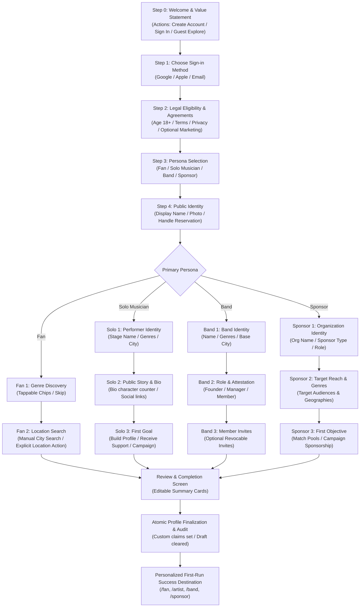

# Crowdbeats V2 — Complete Universal Onboarding Flow Map

**Authoritative Design Authority:** Google Stitch 5326179813018056505  

---

## 1. Flow Diagram

---

## 2. Resumable State Lifecycle

The state machine persists progress to `/onboardingDrafts/{uid}` on every forward transition:
$$\text{notStarted} \longrightarrow \text{accountCreated} \longrightarrow \text{legalAccepted} \longrightarrow \text{personaSelected} \longrightarrow \text{profileInProgress} \longrightarrow \text{review} \longrightarrow \text{completed}$$
