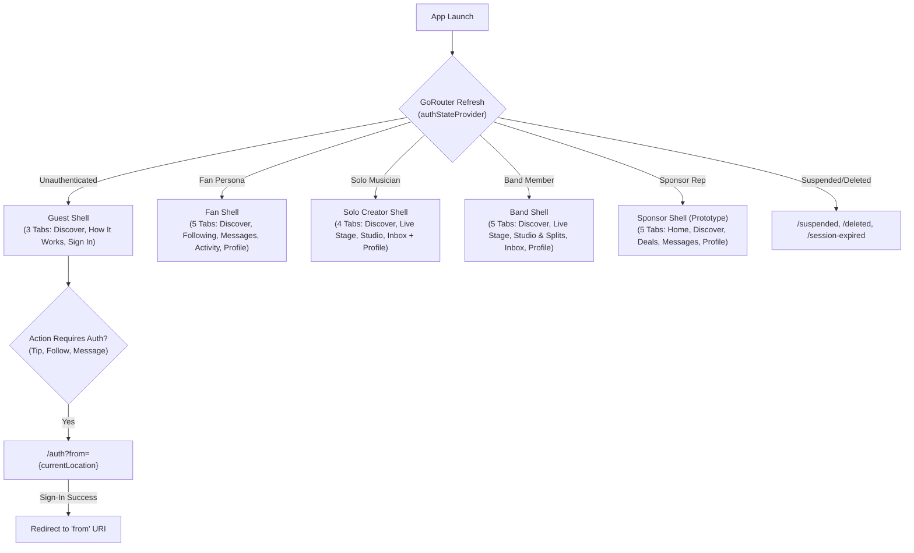

# Crowdbeats V2 Mobile Redesign — Audited Route Matrix & Flow Analysis

**Document Version:** 3.0.0 (Phase 3 Simplified Persona Navigation & Old-to-New Route Map)  
**Date:** 2026-10-09  
**Status:** RATIFIED & BINDING (Phase 3 Navigation Architecture Complete)  
**Assigned Specialists:**  
- Auth, Routing & Deep-Link Specialist (`auth_routing_deeplink_specialist`)  
- Product/UX Researcher & IA (`ux_researcher_ia`)  
- Senior Flutter Architect (`flutter_architecture_engineer`)  
- Responsive Web Engineer (`responsive_web_engineer`)  

---

## 1. Declarative Routing Engine & Persona Shell Architecture

Crowdbeats V2 mobile routing is implemented using **GoRouter** with Riverpod-driven auth state integration. To support simple 3-to-5 destination navigation per persona while preserving back-stack history, the architecture utilizes **`StatefulShellRoute.indexedStack`**:



### 1.1 Persona Shell Tab Allocation (Strict 3–5 Destinations)
| Persona | Tab Count | Tab 0 | Tab 1 | Tab 2 | Tab 3 | Tab 4 |
|---|---|---|---|---|---|---|
| **Guest** | **3 Tabs** | Discover (`/`) | How It Works (`/explore`) | Sign In (`/guest/sign-in`) | — | — |
| **Fan** | **5 Tabs** | Discover (`/fan`) | Following (`/fan/following`)| Messages (`/fan/messages`) | Activity (`/fan/activity`) | Profile (`/fan/profile`) |
| **Solo Musician** | **4 Tabs** | Discover (`/creator/discover`)| Live Stage (`/creator/live`) | Studio (`/creator/studio`) | Inbox (`/creator/inbox`) | Profile via Avatar / Studio |
| **Band Member** | **5 Tabs** | Discover (`/band/discover`) | Live Stage (`/band/live`) | Studio & Splits (`/band/studio`)| Inbox (`/band/inbox`) | Profile & EPK (`/band/profile`) |
| **Sponsor Rep** | **5 Tabs** | Home (`/sponsor`) | Discover (`/sponsor/discover`)| Deals (`/sponsor/deals`) | Messages (`/sponsor/messages`) | Profile (`/sponsor/profile`) |

---

## 2. Old-to-New Route Mapping & Backwards Compatibility

Every existing route, deep link, universal link, and QR destination is preserved with an explicit old-to-new mapping:

| Old Route Path | New Standard Route | Access Permission Tier | Query Parameters Supported | Deep-Link Universal URL | Status & Compatibility |
|---|---|---|---|---|---|
| `/` (Mobile App) | `/` (Guest Discover) | Public / Guest | `?genre=...&search=...` | `https://crowdbeats.com/` | Preserved |
| `/fan` (Unauth) | `/` (Guest Discover) | Public / Guest | None | None | Aliased to `/` |
| `/guest/explore` | `/explore` | Public / Guest | None | None | New How It Works tab |
| `/guest/account` | `/guest/sign-in` | Public / Guest | `?from=...` | None | Clean Sign-In tab |
| `/fan` (Auth) | `/fan` | Authenticated Fan | None | `crowdbeats://fan` | Root Fan Shell |
| `/fan/nearby` | `/fan?view=map` | Authenticated Fan | `?lat=...&lng=...` | None | Map sub-view of Discover |
| `/fan/following`| `/fan/following` | Authenticated Fan | None | `crowdbeats://fan/following` | New dedicated Following tab |
| `/fan/messages` | `/fan/messages` | Authenticated Fan | `?threadId=...` | `crowdbeats://fan/messages` | Promoted from buried push |
| `/fan/activity` | `/fan/activity` | Authenticated Fan | `?tab=tips|campaigns` | `crowdbeats://fan/activity` | Preserved Activity tab |
| `/fan/profile` | `/fan/profile` | Authenticated Fan | None | `crowdbeats://fan/profile` | Clean Fan Profile tab |
| `/tip/:performerId` | `/tip/:performerId` | Public View, Auth to Pay | `?amount=1000&session=...` | `https://crowdbeats.com/tip/{id}` | **PRESERVED CORE DEEP LINK** |
| `/artist/:slug` | `/artist/:slug` | Public / Guest | None | `https://crowdbeats.com/artist/{slug}` | **PRESERVED UNIVERSAL URL** |
| `/band/:slug` | `/band/:slug` | Public / Guest | None | `https://crowdbeats.com/band/{slug}` | **PRESERVED UNIVERSAL URL** |
| `/creator`, `/artist` | `/creator/studio` | Authenticated Solo | None | `crowdbeats://creator` | Redirect to Studio root |
| `/creator/home` | `/creator/studio` | Authenticated Solo | None | None | Merged into Studio Dashboard |
| `/creator/discover`| `/creator/discover`| Authenticated Solo | None | None | New Ecosystem Discover tab |
| `/creator/live` | `/creator/live` | Verified Solo Musician | None | `crowdbeats://creator/live` | **PRESERVED LIVE STAGE HUD** |
| `/creator/studio` | `/creator/studio` | Authenticated Solo | `?section=tools` | `crowdbeats://creator/studio`| Command Center Studio tab |
| `/creator/inbox` | `/creator/inbox` | Authenticated Solo | `?filter=tips|cheers` | `crowdbeats://creator/inbox` | Dedicated Creator Inbox tab |
| `/creator/profile`| `/creator/profile` | Authenticated Solo | None | `crowdbeats://creator/profile`| Profile & EPK preview |
| `/creator/balances`| `/creator/studio/balances`| Verified Solo Musician| None | `crowdbeats://creator/balances`| Sub-route under Studio |
| `/creator/analytics`| `/creator/studio/analytics`| Authenticated Solo| `?range=30d` | None | Sub-route under Studio |
| `/creator/campaigns`| `/creator/studio/campaigns`| Authenticated Solo| None | None | Sub-route under Studio |
| `/creator/media` | `/creator/profile/media` | Authenticated Solo | None | None | Sub-route under Profile |
| `/creator/social-links`| `/creator/profile/social`| Authenticated Solo| None | None | Sub-route under Profile |
| `/creator/kyc` | `/creator/studio/kyc` | Authenticated Solo | None | None | Stripe Connect KYC webview |
| `/band`, `/band_member`| `/band/studio` | Authenticated Band | None | `crowdbeats://band` | Band Studio & Splits root |
| `/band/discover` | `/band/discover` | Authenticated Band | None | None | Band Discover tab |
| `/band/live` | `/band/live` | Band Leader / Member | None | `crowdbeats://band/live` | Band Live Stage tab |
| `/band/studio` | `/band/studio` | Authenticated Band | None | `crowdbeats://band/studio` | Governance & Roster root |
| `/band/inbox` | `/band/inbox` | Authenticated Band | None | None | Band Fan Inbox tab |
| `/band/profile` | `/band/profile` | Authenticated Band | None | None | Band Profile & EPK tab |
| `/band/splits` | `/band/studio/splits` | Band Leader | None | None | Band Split Contract Editor |
| `/band/treasury` | `/band/studio/treasury`| Band Leader | None | None | Band Treasury & Distribution |
| `/sponsor` | `/sponsor` | Sponsor Representative | None | `crowdbeats://sponsor` | Preserved Prototype Shell |
| `/account` | `/account` | Authenticated Human | None | `crowdbeats://account` | Preserved Settings Hub |
| `/account/personal-info`| `/account/personal-info`| Authenticated Human| None | None | Preserved |
| `/account/payment-methods`| `/account/payment-methods`| Authenticated Fan| None | None | Preserved |
| `/account/tipping-preferences`| `/account/tipping-preferences`| Authenticated Fan| None | None | Preserved |
| `/account/notifications`| `/account/notifications`| Authenticated Human| None | None | Preserved |
| `/account/privacy` | `/account/privacy` | Authenticated Human | None | None | Preserved |
| `/account/security`| `/account/security` | Authenticated Human | None | None | Preserved |
| `/account/blocked` | `/account/blocked` | Authenticated Human | None | None | Preserved |
| `/account/support` | `/account/support` | Public / Any | None | None | Preserved |
| `/account/delete` | `/account/delete` | Authenticated Human | None | None | Preserved |
| `/legal`, `/terms`, `/privacy`| `/legal` | Public / Any | `?doc=terms|privacy` | `https://crowdbeats.com/legal`| Preserved |
| `/auth` | `/auth` | Public / Unauthenticated | `?from=...` | `crowdbeats://auth` | Preserved Auth Gate |
| `/auth/verify-email`| `/auth/verify-email` | Unverified Account | None | None | Preserved |
| `/auth/forgot-password`| `/auth/forgot-password`| Public | `?email=...` | None | Preserved |
| `/suspended` | `/suspended` | Suspended UID | None | None | Preserved |
| `/deleted` | `/deleted` | Deleted UID | None | None | Preserved |
| `/session-revoked`| `/session-revoked` | Revoked Session | None | None | Preserved |
| `/session-expired`| `/session-expired` | Expired Session | None | None | Preserved |

---

## 3. Resolution of Phase 1 Routing Defects

### Resolution of Defect R-01 (Imperative Navigator Pushes):
All 6 previously imperative pushed screens are now given first-class declarative route definitions:
1. `SocialMessagingScreen` → `/fan/messages/:threadId` or `/creator/inbox/:threadId`
2. `CameraCaptureScreen` → `/scan` (QR & AR camera scanner)
3. `NearbySecondaryView` → `/discover/nearby` (accessible via deep link)
4. `LiveNowSecondaryView` → `/discover/live` (accessible via deep link)
5. `PopularSecondaryView` → `/discover/popular` (accessible via deep link)
6. `TipFlowScreen` → strictly invokes `context.go('/tip/$performerId')`

### Resolution of Defect R-02 (Missing `?from=` Return Paths):
All social action buttons, profile follow actions, and guest tip gates now encode the active URI:
```dart
// Standard Auth Gate invocation across all components:
void requireAuth(BuildContext context, {required String returnLocation}) {
  context.push('/auth?from=${Uri.encodeComponent(returnLocation)}');
}
```

---

## 4. Back-Stack & Web History Invariants

1. **StatefulShellRoute Tab Preservation:**
   - Tabs preserve scroll offsets, search input state, and active filters when switching back and forth.
2. **Android Hardware & Gesture Back Navigation:**
   - **Step 1:** If the current tab has nested sub-routes pushed (e.g. Performer Profile pushed on Discover), pressing Back pops the sub-route.
   - **Step 2:** If the current tab is at its root and is not the home tab (Tab 0), pressing Back returns to Tab 0.
   - **Step 3:** If already at Tab 0 root, pressing Back triggers system app minimization.
3. **Web Browser History (Forward/Back) Invariant:**
   - When compiled for web exploration (or preview), GoRouter pushes browser history states (`history.pushState`), allowing standard browser back/forward buttons to navigate between tabs and sub-screens seamlessly.
