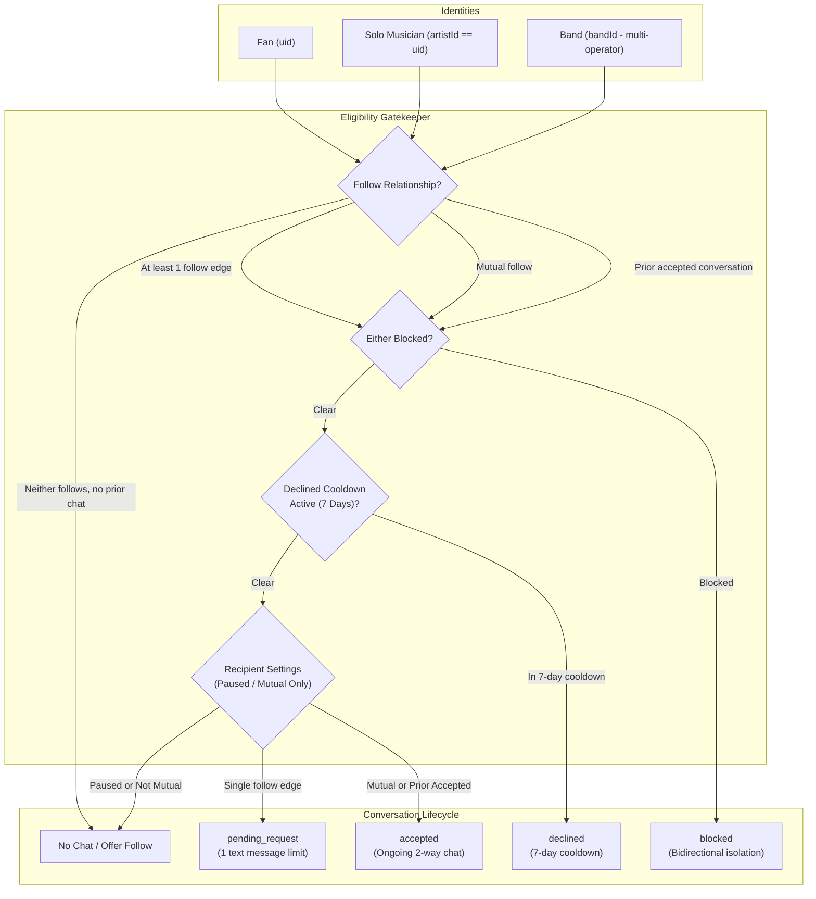
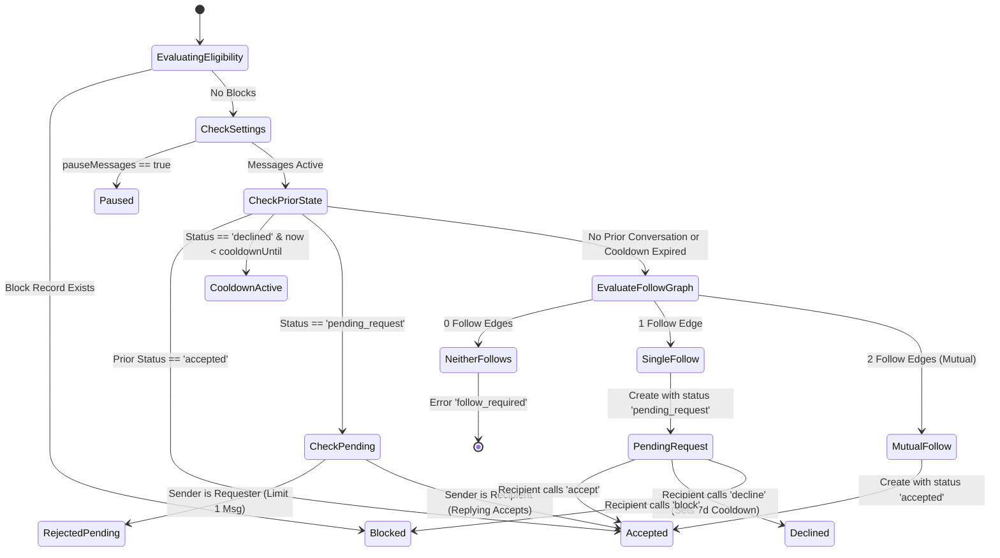

# Crowdbeats V2 — Messaging Engine Architecture & Implementation Specification

**Document Version:** 1.0.0  
**Date:** 2026-10-04  
**Author:** Messaging Engine Specialist  
**Status:** Complete Implementation Design Draft  
**Target Delivery:** `apps/functions/src/social/messagingCallables.ts`, `conversationService.ts`, `apps/web/app/(creator)/creator/messages`, `apps/web/app/(band)/band/messages`

---

## Table of Contents
1. [Executive Summary & Architecture Overview](#1-executive-summary--architecture-overview)
2. [Existing Messaging Placeholders & Gap Analysis](#2-existing-messaging-placeholders--gap-analysis)
3. [Deterministic Conversation Model](#3-deterministic-conversation-model)
4. [Message Model & Delivery Lifecycle](#4-message-model--delivery-lifecycle)
5. [Explicit Eligibility Rules & State Machine](#5-explicit-eligibility-rules--state-machine)
6. [Complete Production Callable Implementations](#6-complete-production-callable-implementations)
   - 6.1 Helper Services (`conversationService.ts`)
   - 6.2 `sendMessage` Callable
   - 6.3 `getConversations` Callable
   - 6.4 `getMessages` Callable
   - 6.5 `respondToMessageRequest` Callable
   - 6.6 `updateMessageSettings` Callable
7. [Firestore Security Rules & Security Specifications](#7-firestore-security-rules--security-specifications)
8. [Cross-Platform Client Integration Guide](#8-cross-platform-client-integration-guide)
9. [Edge Cases, Race Conditions & Safety Checklist](#9-edge-cases-race-conditions--safety-checklist)

---

## 1. Executive Summary & Architecture Overview

Crowdbeats V2 messaging enables private, one-to-one text communication between participants in the platform's social graph: **Fans (`fan`)**, **Solo Artists (`artist`)**, and **Bands (`band`)**. Because Crowdbeats brings artists, fans, band collectives, sponsors, and promoters into a shared music economy, communication must balance open connection with strong recipient control and abuse prevention.



### 1.1 Core Tenets
1. **Recipient Control by Default**: Unlike open messaging platforms that allow unsolicited DMs from strangers, Crowdbeats enforces relationship prerequisites before a user can be contacted.
2. **Deterministic Thread Identity**: Every 1-to-1 conversation has a predictable ID: `conv_${[idA, idB].sort().join('_')}`. This prevents duplicate threads, avoids race conditions on thread creation, and provides $O(1)$ lookups.
3. **Operator UID vs. Acting Identity**: Messages can be sent on behalf of a personal account (`fan`/`artist`) or a shared entity (`band`). The acting identity (`senderId`) is visible to the recipient, while the authenticated human operator (`operatorUid`) is recorded immutably on every message for auditability, moderation, and legal compliance.
4. **Follow-State Transitions & History Preservation**:
   - Mutual follows unlock immediate two-way conversation.
   - A single follow edge unlocks exactly **one** text message request.
   - Once a conversation is **accepted**, subsequent unfollows do **not** revoke access to the existing chat thread.
5. **Quiet vs. Strong Safety Boundaries**:
   - **Block**: Hard barrier. Follows deleted both ways, conversations set to `blocked`, notifications silenced, profiles unavailable.
   - **Restrict**: Soft barrier. The restricted sender can still message, but notifications are silenced, conversations route to the recipient's "Restricted" tab, and read receipts are suppressed.

---

## 2. Existing Messaging Placeholders & Gap Analysis

An inspection of existing web placeholders in the codebase reveals the current baseline:

### 2.1 Creator Messages Placeholder (`apps/web/app/(creator)/creator/messages/page.tsx`)
```tsx
/**
 * Current implementation: Lines 1-28
 * Static placeholder for Phase 7 "Direct Fan Messaging"
 */
export default function CreatorMessagesPage() {
  return (
    <div style={{ padding: '24px 32px', maxWidth: 800, margin: '0 auto' }}>
      <h1>Direct Messages</h1>
      <p>Direct messaging with top tippers and campaign backers.</p>
      ...
      <div>Direct Messaging Coming Soon</div>
    </div>
  );
}
```
**Gaps Identified:**
1. **Static UI Only**: No data fetching, no Firestore listeners, and no connection to Cloud Functions.
2. **Missing Tab Architecture**: Does not separate conversations into `Inbox` (accepted), `Requests` (pending incoming requests with unread badge), and `Restricted`.
3. **No Recipient Controls**: Lacks settings controls for message eligibility (`everyone_eligible`, `mutual_only`, `following_or_followers`) and `pauseMessages`.
4. **No Message Request Workflow**: Lacks UI for accepting, declining (triggering 7-day cooldown), blocking, or reporting inbound message requests.
5. **No Follow Relationship Feedback**: Does not display relationship badges ("Follows You", "Mutual Follow") or provide quick follow/unfollow actions.

### 2.2 Band Messages Placeholder (`apps/web/app/(band)/band/messages/page.tsx`)
```tsx
/**
 * Current implementation: Lines 1-30
 * Static placeholder for Phase 8 "Band Messages Portal"
 */
export default function BandMessagesPage() {
  return (
    <div style={{ padding: '32px 40px', maxWidth: 900, margin: '0 auto' }}>
      <h1>Band Messaging</h1>
      <p>Direct communications with booking agents, venues, and VIP backers.</p>
      ...
      <div>Band Messaging Portal Coming Soon</div>
    </div>
  );
}
```
**Gaps Identified:**
1. **Missing Band Context & Operator Delegation**: Band messaging requires acting as the collective `bandId` via `actingAsBandId`, verifying that the authenticated operator (`request.auth.uid`) is an active member in `bands/{bandId}/members/{operatorUid}` with permission to send messages.
2. **Multi-Operator Concurrency**: When multiple band members view or reply to incoming booking inquiries or fan notes, all outgoing messages must show the band's identity while preserving the operator UID for internal transparency.
3. **No Band Message Settings**: Band admins need to set whether the band accepts general requests or restricts them to mutual partners/sponsors.

---

## 3. Deterministic Conversation Model

### 3.1 Deterministic ID Generation
To ensure zero duplicate conversation threads and prevent race conditions when two participants message each other simultaneously, the conversation ID is derived deterministically from the sorted participant IDs:

$$\text{conversationId} = \text{"conv\_"} + [\text{idA}, \text{idB}].\text{sort}().\text{join}(\text{"\_"})$$

Example:
- Participant 1: `user_123`
- Participant 2: `band_abc`
- Sorted: `['band_abc', 'user_123']`
- Resulting Conversation ID: `conv_band_abc_user_123`

### 3.2 Firestore Collection Structure
```
/conversations/{conversationId}
    ├── (Conversation Document)
    └── /messages/{messageId}
            └── (ChatMessage Subcollection Document)
```

### 3.3 Document Schema: `/conversations/{conversationId}`

```typescript
export interface ConversationDoc {
  /** Deterministic ID: conv_${[idA, idB].sort().join('_')} */
  id: string;

  /** Sorted array of 2 participant IDs [idA, idB] */
  participantIds: [string, string];

  /** Mapping of participant ID to its social entity type */
  participantTypes: Record<string, SocialEntityType>;

  /** Current lifecycle status */
  status: 'pending_request' | 'accepted' | 'declined' | 'blocked';

  /** Identity that initiated the message request */
  requesterId: string;

  /** Identity that received the message request */
  recipientId: string;

  /** Unread message counters keyed by participant ID */
  unreadCounts: Record<string, number>;

  /** Snippet of the latest message for inbox preview (max 200 chars) */
  lastMessageText: string;

  /** Server timestamp of the latest message */
  lastMessageTimestamp: admin.firestore.Timestamp;

  /** Acting ID of the last sender */
  lastSenderId: string;

  /** Document ID of the latest message */
  lastMessageId: string;

  /** Human operator who sent the last message (audit trail) */
  lastOperatorUid: string;

  /** Timestamp until which the requester cannot send another request */
  declineCooldownUntil?: admin.firestore.Timestamp | null;

  /** Array of participant IDs who have restricted this conversation/counterpart */
  restrictedBy: string[];

  /** Creation and last update timestamps */
  createdAt: admin.firestore.Timestamp;
  updatedAt: admin.firestore.Timestamp;
}
```

### 3.4 Firestore Indexing Strategy
To support sub-millisecond inbox loading across web and mobile without unindexed scan penalties, the following composite indexes must be maintained:

1. **Participant Inbox Query (Accepted Threads)**:
   - Collection: `conversations`
   - Fields:
     - `participantIds` (Array-contains)
     - `status` (Ascending)
     - `updatedAt` (Descending)
2. **Participant Requests Query (Pending Message Requests)**:
   - Collection: `conversations`
   - Fields:
     - `recipientId` (Ascending)
     - `status` (Ascending)
     - `updatedAt` (Descending)
3. **Restricted Query**:
   - Collection: `conversations`
   - Fields:
     - `participantIds` (Array-contains)
     - `restrictedBy` (Array-contains)
     - `updatedAt` (Descending)

---

## 4. Message Model & Delivery Lifecycle

### 4.1 Document Schema: `/conversations/{conversationId}/messages/{messageId}`

```typescript
export interface ChatMessageDoc {
  /** Unique message identifier (UUID v4 or Firestore auto-ID) */
  id: string;

  /** Parent conversation document ID */
  conversationId: string;

  /** Acting social entity ID (fan UID, artist ID, or band ID) */
  senderId: string;

  /** Entity type of the sender */
  senderType: SocialEntityType;

  /** Authenticated human user UID who sent the message */
  operatorUid: string;

  /** Intended recipient social entity ID */
  recipientId: string;

  /** Entity type of the recipient */
  recipientType: SocialEntityType;

  /** Cleaned message body (1 to 2000 characters) */
  text: string;

  /** Delivery status */
  status: 'sent' | 'delivered' | 'read';

  /** Participant IDs who have read this message */
  readBy: string[];

  /** Client-provided idempotency key preventing duplicate creation */
  idempotencyKey?: string;

  /** Server creation timestamp */
  createdAt: admin.firestore.Timestamp;

  /** Soft deletion metadata if purged by moderation */
  deletedAt?: admin.firestore.Timestamp | null;
  deletedReason?: string;
}
```

### 4.2 Message Constraints & Idempotency
- **Character Constraint**: `1 <= text.trim().length <= 2000`. Messages exceeding 2000 characters are rejected with `invalid-argument`.
- **Text-Only Policy**: For message requests (`pending_request`), only plain text is accepted. Rich attachments, links, or media embeds are disabled until the request is accepted.
- **Idempotency Execution**:
  - The client provides an `idempotencyKey` (e.g. `uuidv4()`).
  - In `sendMessage`, the function checks if a message with this `idempotencyKey` already exists in `/conversations/{conversationId}/messages` within the last 10 minutes.
  - If a duplicate key is detected, the function returns the existing message without creating a secondary duplicate or incrementing unread counters.

---

## 5. Explicit Eligibility Rules & State Machine

The messaging eligibility engine evaluates 7 explicit conditions whenever a message is submitted:

| Condition | Relationship / Prior State | Eligibility Decision | Initial / Resulting State | User-Facing Action / Error |
|---|---|---|---|---|
| **Rule 1** | Neither follows, no prior chat | ❌ **Rejected** | None (Thread not created) | Returns `FAILED_PRECONDITION`: Prompt user with "Follow" CTA. |
| **Rule 2** | At least 1 follow edge, no prior chat | ⚠️ **Allowed (Request)** | `pending_request` | Exactly 1 text message. Sender locked until recipient acts. |
| **Rule 3** | Both follow each other (Mutual follows) | ✅ **Allowed (Normal)** | `accepted` | Full 2-way chat unlocked immediately. |
| **Rule 4** | Recipient accepted chat earlier | ✅ **Allowed (Persistent)** | `accepted` | Remains unlocked even if either or both users unfollow. |
| **Rule 5** | Either identity blocks the other | 🛑 **Rejected** | `blocked` | Returns `PERMISSION_DENIED`: Blocked both ways. |
| **Rule 6** | Recipient restricts sender | 🤫 **Routed to Restricted** | `pending_request` / `restricted` | Message sent silently, notifications silenced, no read receipts. |
| **Rule 7** | Recipient declined prior request | ⏳ **Cooldown Active** | `declined` | Cannot re-request for 7 days (`declineCooldownUntil`). |



### 5.1 Detailed Rule Specifications

#### Rule 1: Neither Follows & No Prior Chat
- **Logic**: Neither `follows/${senderId}_${recipientId}` nor `follows/${recipientId}_${senderId}` exists, and `conversations/${conversationId}` does not exist with `status: 'accepted'`.
- **Enforcement**: Immediate rejection.
- **Client Error**:
  ```json
  {
    "code": "failed-precondition",
    "message": "You cannot message an account you do not follow. Follow them first to send a message request."
  }
  ```

#### Rule 2: Single Follow Edge & No Prior Chat (Message Request)
- **Logic**: Exactly one follow edge exists in `/follows`.
- **Recipient Setting Check**: If recipient's `messageEligibility` is `'mutual_only'`, request is rejected.
- **Enforcement**: A conversation is created with `status: 'pending_request'`.
- **Constraint**: The requester is restricted to exactly **one message**. Any secondary call to `sendMessage` by the requester before acceptance throws:
  ```json
  {
    "code": "failed-precondition",
    "message": "A message request is already pending. You cannot send further messages until the recipient accepts."
  }
  ```

#### Rule 3: Mutual Follows
- **Logic**: Both `follows/${senderId}_${recipientId}` and `follows/${recipientId}_${senderId}` exist.
- **Enforcement**: Conversation created or updated with `status: 'accepted'`. Normal real-time chat is permitted.

#### Rule 4: Prior Accepted Chat (Unfollow Resilience)
- **Logic**: `conversations/${conversationId}` already has `status: 'accepted'`.
- **Enforcement**: Both parties may continue chatting even if one or both unfollow each other later. The conversation only becomes disabled if an explicit **Block** is placed or an account is deleted/suspended.

#### Rule 5: Bidirectional Block
- **Logic**: Check `/socialBlocks/${senderId}_${recipientId}` and `/socialBlocks/${recipientId}_${senderId}`.
- **Enforcement**: If either exists, `status` is forced to `'blocked'`, and all sends are rejected with `permission-denied`.

#### Rule 6: Recipient Restriction
- **Logic**: Check `/socialRestrictions/${recipientId}_${senderId}`.
- **Enforcement**:
  1. The conversation's `restrictedBy` array contains `recipientId`.
  2. The message is stored in the database.
  3. No push notification is dispatched to `recipientId`.
  4. The conversation appears exclusively in `recipientId`'s "Restricted" inbox tab.
  5. The `senderId` receives standard success feedback and remains unaware of the restriction.

#### Rule 7: Decline & 7-Day Cooldown
- **Logic**: When the recipient calls `respondToMessageRequest` with `action: 'decline'`:
  - `status` is set to `'declined'`.
  - `declineCooldownUntil` is set to $\text{now} + 7 \times 24 \times 60 \times 60 \times 1000$ (7 days).
- **Enforcement**: If the requester attempts to send another message within 7 days, the request is rejected even if follow edges are recreated.
- **Cooldown Expiration**: Once 7 days elapse, the requester may initiate a new single message request, provided follow eligibility remains valid.

---

## 6. Complete Production Callable Implementations

Below are the exact, self-contained TypeScript implementations for the messaging engine.

### 6.1 Helper Services (`conversationService.ts`)

```typescript
/**
 * Crowdbeats V2 — Conversation & Messaging Helper Service
 * File: apps/functions/src/social/conversationService.ts
 */

import * as admin from 'firebase-admin';
import { HttpsError } from 'firebase-functions/v2/https';
import type {
  SocialEntityType,
  SocialProfileSummary,
  RecipientMessageSettings,
  ConversationStatus,
} from '@crowdbeats/contracts';

export const SEVEN_DAYS_MS = 7 * 24 * 60 * 60 * 1000;
export const MAX_MESSAGE_LENGTH = 2000;

/**
 * Computes deterministic conversation ID: conv_${[idA, idB].sort().join('_')}
 */
export function getConversationId(idA: string, idB: string): string {
  if (!idA || !idB || idA === idB) {
    throw new HttpsError('invalid-argument', 'Invalid participant IDs for conversation.');
  }
  const sorted = [idA, idB].sort();
  return `conv_${sorted[0]}_${sorted[1]}`;
}

/**
 * Asserts that the authenticated caller has authorization to act as the specified entity.
 * If acting as a band, verifies caller is an active member in bands/{bandId}/members/{uid}.
 */
export async function assertActorAuthorization(
  db: admin.firestore.Firestore,
  operatorUid: string,
  actingId: string,
  actingType: SocialEntityType,
): Promise<void> {
  if (actingType === 'band') {
    const memberDoc = await db
      .collection('bands')
      .doc(actingId)
      .collection('members')
      .doc(operatorUid)
      .get();

    if (!memberDoc.exists || memberDoc.data()?.['isActive'] !== true) {
      throw new HttpsError('permission-denied', 'You are not an active member of this band.');
    }
  } else {
    // Fan, Artist: operatorUid must match actingId
    if (actingId !== operatorUid) {
      throw new HttpsError(
        'permission-denied',
        'Operator UID does not match acting identity.',
      );
    }
  }
}

/**
 * Checks bidirectional block status between two identities.
 */
export async function isBlockedBidirectional(
  db: admin.firestore.Firestore,
  idA: string,
  idB: string,
): Promise<boolean> {
  const blockRef1 = db.collection('socialBlocks').doc(`${idA}_${idB}`);
  const blockRef2 = db.collection('socialBlocks').doc(`${idB}_${idA}`);
  const [doc1, doc2] = await db.getAll(blockRef1, blockRef2);
  return doc1.exists || doc2.exists;
}

/**
 * Checks if targetId has restricted sourceId.
 */
export async function isRestrictedBy(
  db: admin.firestore.Firestore,
  sourceId: string,
  targetId: string,
): Promise<boolean> {
  const restrictDoc = await db
    .collection('socialRestrictions')
    .doc(`${targetId}_${sourceId}`)
    .get();
  return restrictDoc.exists;
}

/**
 * Fetches message control settings for a recipient.
 */
export async function getRecipientMessageSettings(
  db: admin.firestore.Firestore,
  recipientId: string,
  recipientType: SocialEntityType,
): Promise<RecipientMessageSettings> {
  const collectionName = recipientType === 'band' ? 'bands' : 'users';
  const settingsDoc = await db
    .collection(collectionName)
    .doc(recipientId)
    .collection('settings')
    .doc('messaging')
    .get();

  if (settingsDoc.exists) {
    const data = settingsDoc.data() || {};
    return {
      eligibility: data.eligibility || 'everyone_eligible',
      pauseMessages: data.pauseMessages === true,
    };
  }

  // Defaults
  return {
    eligibility: 'everyone_eligible',
    pauseMessages: false,
  };
}

/**
 * Checks follow relationship status between two entities.
 */
export async function getFollowGraphState(
  db: admin.firestore.Firestore,
  senderId: string,
  recipientId: string,
): Promise<{ senderFollowsRecipient: boolean; recipientFollowsSender: boolean }> {
  const forwardFollowRef = db.collection('follows').doc(`${senderId}_${recipientId}`);
  const reverseFollowRef = db.collection('follows').doc(`${recipientId}_${senderId}`);

  const [forwardDoc, reverseDoc] = await db.getAll(forwardFollowRef, reverseFollowRef);

  return {
    senderFollowsRecipient: forwardDoc.exists && forwardDoc.data()?.status !== 'none',
    recipientFollowsSender: reverseDoc.exists && reverseDoc.data()?.status !== 'none',
  };
}

/**
 * Resolves a lightweight profile summary for conversation participant.
 */
export async function getSocialProfileSummary(
  db: admin.firestore.Firestore,
  entityId: string,
  entityType: SocialEntityType,
): Promise<SocialProfileSummary> {
  let name = 'User';
  let avatarUrl = '';
  let handle = '';
  let isVerified = false;

  if (entityType === 'band') {
    const bandDoc = await db.collection('bands').doc(entityId).get();
    if (bandDoc.exists) {
      const data = bandDoc.data()!;
      name = data.name || 'Band';
      avatarUrl = data.photoUrl || data.logoUrl || '';
      handle = data.slug ? `@${data.slug}` : '';
      isVerified = data.isVerified === true;
    }
  } else if (entityType === 'artist') {
    const artistDoc = await db.collection('artistProfiles').doc(entityId).get();
    if (artistDoc.exists) {
      const data = artistDoc.data()!;
      name = data.stageName || data.displayName || 'Artist';
      avatarUrl = data.profileImageUrl || '';
      handle = data.slug ? `@${data.slug}` : '';
      isVerified = data.isVerified === true;
    }
  } else {
    const userDoc = await db.collection('users').doc(entityId).get();
    if (userDoc.exists) {
      const data = userDoc.data()!;
      name = data.displayName || 'Fan';
      avatarUrl = data.photoURL || '';
      handle = data.handle ? `@${data.handle}` : '';
    }
  }

  return {
    id: entityId,
    type: entityType,
    name,
    handle,
    avatarUrl,
    isVerified,
  };
}
```

---

### 6.2 `sendMessage` Callable

```typescript
/**
 * Crowdbeats V2 — sendMessage Cloud Function
 * File: apps/functions/src/social/messagingCallables.ts
 */

import * as admin from 'firebase-admin';
import { onCall, HttpsError } from 'firebase-functions/v2/https';
import { v4 as uuidv4 } from 'uuid';
import type {
  SendMessageRequest,
  SendMessageResponse,
  SocialEntityType,
  ConversationStatus,
} from '@crowdbeats/contracts';
import {
  getConversationId,
  assertActorAuthorization,
  isBlockedBidirectional,
  isRestrictedBy,
  getRecipientMessageSettings,
  getFollowGraphState,
  SEVEN_DAYS_MS,
  MAX_MESSAGE_LENGTH,
} from './conversationService.js';

const _db = () => admin.firestore();

export const sendMessage = onCall(
  { region: 'us-central1', enforceAppCheck: false },
  async (request): Promise<SendMessageResponse> => {
    if (!request.auth?.uid) {
      throw new HttpsError('unauthenticated', 'Authentication required to send messages.');
    }
    const operatorUid = request.auth.uid;
    const data = request.data as SendMessageRequest;

    if (!data?.recipientId || !data?.recipientType || !data?.text) {
      throw new HttpsError('invalid-argument', 'recipientId, recipientType, and text are required.');
    }

    const trimmedText = data.text.trim();
    if (trimmedText.length === 0) {
      throw new HttpsError('invalid-argument', 'Message text cannot be empty.');
    }
    if (trimmedText.length > MAX_MESSAGE_LENGTH) {
      throw new HttpsError(
        'invalid-argument',
        `Message text exceeds maximum length of ${MAX_MESSAGE_LENGTH} characters.`,
      );
    }

    // Determine sender identity (personal user or band)
    const senderId = data.actingAsBandId ? data.actingAsBandId : operatorUid;
    const senderType: SocialEntityType = data.actingAsBandId ? 'band' : 'fan';
    const recipientId = data.recipientId;
    const recipientType = data.recipientType;

    if (senderId === recipientId) {
      throw new HttpsError('invalid-argument', 'You cannot message yourself.');
    }

    const db = _db();

    // 1. Verify acting permission
    await assertActorAuthorization(db, operatorUid, senderId, senderType);

    // 2. Verify bidirectional block status
    const blocked = await isBlockedBidirectional(db, senderId, recipientId);
    if (blocked) {
      throw new HttpsError('permission-denied', 'Cannot message this user due to privacy blocks.');
    }

    // 3. Verify recipient settings (pauseMessages & eligibility)
    const recipientSettings = await getRecipientMessageSettings(db, recipientId, recipientType);
    if (recipientSettings.pauseMessages) {
      throw new HttpsError(
        'failed-precondition',
        'Recipient is not accepting messages at this time.',
      );
    }

    // 4. Calculate deterministic conversation ID
    const conversationId = getConversationId(senderId, recipientId);
    const convRef = db.collection('conversations').doc(conversationId);

    // 5. Handle Idempotency Key check
    if (data.idempotencyKey) {
      const existingMsgQuery = await convRef
        .collection('messages')
        .where('idempotencyKey', '==', data.idempotencyKey)
        .limit(1)
        .get();

      if (!existingMsgQuery.empty) {
        const existingDoc = existingMsgQuery.docs[0];
        const convSnap = await convRef.get();
        return {
          ok: true,
          messageId: existingDoc.id,
          conversationId,
          status: (convSnap.data()?.status as ConversationStatus) || 'accepted',
        };
      }
    }

    // 6. Check existing conversation state
    const convDoc = await convRef.get();
    let targetStatus: ConversationStatus = 'accepted';
    let isNewConversation = !convDoc.exists;
    const now = admin.firestore.Timestamp.now();

    if (convDoc.exists) {
      const convData = convDoc.data()!;
      const currentStatus = convData.status as ConversationStatus;

      if (currentStatus === 'blocked') {
        throw new HttpsError('permission-denied', 'Conversation is currently blocked.');
      }

      if (currentStatus === 'declined') {
        const cooldownUntil = convData.declineCooldownUntil as admin.firestore.Timestamp | undefined;
        if (cooldownUntil && cooldownUntil.toMillis() > Date.now()) {
          const remainingHours = Math.ceil((cooldownUntil.toMillis() - Date.now()) / (1000 * 60 * 60));
          throw new HttpsError(
            'permission-denied',
            `Recipient declined prior message request. Cooldown active for another ${remainingHours} hours.`,
          );
        }
        // Cooldown has expired: evaluate follow graph below to re-request
      } else if (currentStatus === 'pending_request') {
        if (convData.requesterId === senderId) {
          throw new HttpsError(
            'failed-precondition',
            'A message request is already pending recipient response. You cannot send additional messages.',
          );
        } else {
          // Recipient is replying: this implicitly accepts the conversation
          targetStatus = 'accepted';
        }
      } else if (currentStatus === 'accepted') {
        // Prior conversation was accepted: ongoing chatting is permitted even after unfollow
        targetStatus = 'accepted';
      }
    }

    // 7. If brand new or re-requesting after cooldown, evaluate follow graph
    if (isNewConversation || convDoc.data()?.status === 'declined') {
      const followState = await getFollowGraphState(db, senderId, recipientId);
      const isMutual = followState.senderFollowsRecipient && followState.recipientFollowsSender;
      const atLeastOneEdge = followState.senderFollowsRecipient || followState.recipientFollowsSender;

      if (!atLeastOneEdge) {
        throw new HttpsError(
          'failed-precondition',
          'Neither account follows the other. You must follow this account to send a message request.',
        );
      }

      if (recipientSettings.eligibility === 'mutual_only' && !isMutual) {
        throw new HttpsError(
          'permission-denied',
          'This account only accepts message requests from mutual followers.',
        );
      }

      if (isMutual) {
        targetStatus = 'accepted';
      } else {
        targetStatus = 'pending_request';
      }
    }

    // 8. Check if recipient restricted sender
    const restricted = await isRestrictedBy(db, senderId, recipientId);

    // 9. Execute atomic message creation and thread update
    const messageId = uuidv4();
    const messageRef = convRef.collection('messages').doc(messageId);

    await db.runTransaction(async (transaction) => {
      const currentConvSnap = await transaction.get(convRef);
      const existingData = currentConvSnap.data() || {};
      const currentUnread = existingData.unreadCounts || {};

      // If restricted, do not increment recipient's visible inbox counter
      const newRecipientUnread = restricted
        ? (currentUnread[recipientId] || 0)
        : (currentUnread[recipientId] || 0) + 1;

      const unreadCounts = {
        ...currentUnread,
        [senderId]: 0,
        [recipientId]: newRecipientUnread,
      };

      const sortedParticipantIds: [string, string] = [senderId, recipientId].sort() as [string, string];
      const participantTypes = {
        ...(existingData.participantTypes || {}),
        [senderId]: senderType,
        [recipientId]: recipientType,
      };

      const restrictedByList: string[] = existingData.restrictedBy || [];
      if (restricted && !restrictedByList.includes(recipientId)) {
        restrictedByList.push(recipientId);
      }

      // Write message sub-document
      transaction.set(messageRef, {
        id: messageId,
        conversationId,
        senderId,
        senderType,
        operatorUid,
        recipientId,
        recipientType,
        text: trimmedText,
        status: 'sent',
        readBy: [senderId],
        idempotencyKey: data.idempotencyKey || null,
        createdAt: now,
      });

      // Update or create parent conversation document
      transaction.set(
        convRef,
        {
          id: conversationId,
          participantIds: sortedParticipantIds,
          participantTypes,
          status: targetStatus,
          requesterId: isNewConversation ? senderId : existingData.requesterId || senderId,
          recipientId: isNewConversation ? recipientId : existingData.recipientId || recipientId,
          unreadCounts,
          lastMessageText: trimmedText.slice(0, 200),
          lastMessageTimestamp: now,
          lastSenderId: senderId,
          lastMessageId: messageId,
          lastOperatorUid: operatorUid,
          restrictedBy: restrictedByList,
          declineCooldownUntil: targetStatus === 'accepted' ? null : existingData.declineCooldownUntil || null,
          createdAt: existingData.createdAt || now,
          updatedAt: now,
        },
        { merge: true },
      );
    });

    return {
      ok: true,
      messageId,
      conversationId,
      status: targetStatus,
    };
  },
);
```

---

### 6.3 `getConversations` Callable

```typescript
/**
 * Crowdbeats V2 — getConversations Cloud Function
 * File: apps/functions/src/social/messagingCallables.ts
 */

export const getConversations = onCall(
  { region: 'us-central1', enforceAppCheck: false },
  async (request): Promise<GetConversationsResponse> => {
    if (!request.auth?.uid) {
      throw new HttpsError('unauthenticated', 'Authentication required.');
    }
    const operatorUid = request.auth.uid;
    const data = (request.data || {}) as GetConversationsRequest;

    const actingId = data.actingAsBandId ? data.actingAsBandId : operatorUid;
    const actingType: SocialEntityType = data.actingAsBandId ? 'band' : 'fan';
    const tab = data.tab || 'inbox';
    const limit = Math.min(Math.max(data.limit || 20, 1), 50);

    const db = _db();
    await assertActorAuthorization(db, operatorUid, actingId, actingType);

    // Query threads where caller is a participant
    let query: admin.firestore.Query = db
      .collection('conversations')
      .where('participantIds', 'array-contains', actingId);

    const snapshot = await query.orderBy('updatedAt', 'desc').limit(100).get();

    let totalUnreadCount = 0;
    let pendingRequestsCount = 0;
    const conversationSummaries: ConversationSummary[] = [];

    for (const doc of snapshot.docs) {
      const conv = doc.data();
      const status = conv.status as ConversationStatus;
      const unread = conv.unreadCounts?.[actingId] || 0;
      const isRestrictedByViewer = Array.isArray(conv.restrictedBy) && conv.restrictedBy.includes(actingId);

      // Track aggregate counts
      if (status === 'accepted' && !isRestrictedByViewer) {
        totalUnreadCount += unread;
      }
      if (status === 'pending_request' && conv.recipientId === actingId && !isRestrictedByViewer) {
        pendingRequestsCount += 1;
      }

      // Filter by requested tab
      let matchesTab = false;
      if (tab === 'inbox') {
        matchesTab = status === 'accepted' && !isRestrictedByViewer;
      } else if (tab === 'requests') {
        // Pending requests sent to the viewer
        matchesTab = status === 'pending_request' && conv.recipientId === actingId && !isRestrictedByViewer;
      } else if (tab === 'restricted') {
        matchesTab = isRestrictedByViewer;
      }

      if (!matchesTab) continue;
      if (conversationSummaries.length >= limit) continue;

      // Identify other participant
      const otherId = conv.participantIds[0] === actingId ? conv.participantIds[1] : conv.participantIds[0];
      const otherType: SocialEntityType = conv.participantTypes?.[otherId] || 'fan';
      const otherProfile = await getSocialProfileSummary(db, otherId, otherType);

      conversationSummaries.push({
        id: doc.id,
        participantIds: conv.participantIds,
        participantTypes: conv.participantTypes || {},
        status,
        requesterId: conv.requesterId,
        recipientId: conv.recipientId,
        lastMessageText: conv.lastMessageText || '',
        lastMessageTimestamp: conv.lastMessageTimestamp?.toDate?.()?.toISOString() || new Date().toISOString(),
        lastSenderId: conv.lastSenderId || '',
        unreadCount: unread,
        declineCooldownUntil: conv.declineCooldownUntil?.toDate?.()?.toISOString() || null,
        isRestricted: isRestrictedByViewer,
        otherParticipant: otherProfile,
      });
    }

    return {
      conversations: conversationSummaries,
      totalUnreadCount,
      pendingRequestsCount,
    };
  },
);
```

---

### 6.4 `getMessages` Callable

```typescript
/**
 * Crowdbeats V2 — getMessages Cloud Function
 * File: apps/functions/src/social/messagingCallables.ts
 */

export const getMessages = onCall(
  { region: 'us-central1', enforceAppCheck: false },
  async (request): Promise<GetMessagesResponse> => {
    if (!request.auth?.uid) {
      throw new HttpsError('unauthenticated', 'Authentication required.');
    }
    const operatorUid = request.auth.uid;
    const data = request.data as GetMessagesRequest;

    if (!data?.conversationId) {
      throw new HttpsError('invalid-argument', 'conversationId is required.');
    }

    const actingId = data.actingAsBandId ? data.actingAsBandId : operatorUid;
    const actingType: SocialEntityType = data.actingAsBandId ? 'band' : 'fan';
    const limit = Math.min(Math.max(data.limit || 30, 1), 100);

    const db = _db();
    await assertActorAuthorization(db, operatorUid, actingId, actingType);

    const convRef = db.collection('conversations').doc(data.conversationId);
    const convDoc = await convRef.get();

    if (!convDoc.exists) {
      throw new HttpsError('not-found', 'Conversation not found.');
    }

    const convData = convDoc.data()!;
    if (!convData.participantIds?.includes(actingId)) {
      throw new HttpsError('permission-denied', 'You are not a participant in this conversation.');
    }

    // Verify block status
    const otherId = convData.participantIds[0] === actingId ? convData.participantIds[1] : convData.participantIds[0];
    const isBlocked = await isBlockedBidirectional(db, actingId, otherId);
    if (isBlocked) {
      throw new HttpsError('permission-denied', 'Conversation is blocked.');
    }

    // Fetch messages paginated by timestamp descending
    let query = convRef.collection('messages').orderBy('createdAt', 'desc').limit(limit + 1);

    if (data.beforeTimestamp) {
      const beforeDate = new Date(data.beforeTimestamp);
      query = query.startAfter(admin.firestore.Timestamp.fromDate(beforeDate));
    }

    const msgSnap = await query.get();
    const hasMore = msgSnap.docs.length > limit;
    const rawDocs = msgSnap.docs.slice(0, limit);

    // Silent restriction check: if viewer restricted otherId, do NOT update read receipts
    const isRestrictedByViewer = Array.isArray(convData.restrictedBy) && convData.restrictedBy.includes(actingId);

    // Reset unread count for caller and mark incoming messages as read
    const unreadCount = convData.unreadCounts?.[actingId] || 0;
    if (unreadCount > 0 && !isRestrictedByViewer) {
      const batch = db.batch();
      batch.update(convRef, {
        [`unreadCounts.${actingId}`]: 0,
      });

      // Mark unread messages with read status
      for (const msgDoc of rawDocs) {
        const msg = msgDoc.data();
        if (msg.recipientId === actingId && (!msg.readBy || !msg.readBy.includes(actingId))) {
          batch.update(msgDoc.ref, {
            status: 'read',
            readBy: admin.firestore.FieldValue.arrayUnion(actingId),
          });
        }
      }
      await batch.commit();
    }

    const messages: ChatMessage[] = rawDocs
      .map((doc) => {
        const d = doc.data();
        return {
          id: doc.id,
          conversationId: data.conversationId,
          senderId: d.senderId,
          senderType: d.senderType,
          operatorUid: d.operatorUid,
          recipientId: d.recipientId,
          text: d.text,
          createdAt: d.createdAt?.toDate?.()?.toISOString() || new Date().toISOString(),
          status: d.status || 'sent',
          readBy: d.readBy || [],
        };
      })
      .reverse(); // Return in chronological order for UI display

    const otherType: SocialEntityType = convData.participantTypes?.[otherId] || 'fan';
    const otherProfile = await getSocialProfileSummary(db, otherId, otherType);

    const conversation: ConversationSummary = {
      id: convDoc.id,
      participantIds: convData.participantIds,
      participantTypes: convData.participantTypes || {},
      status: convData.status,
      requesterId: convData.requesterId,
      recipientId: convData.recipientId,
      lastMessageText: convData.lastMessageText || '',
      lastMessageTimestamp: convData.lastMessageTimestamp?.toDate?.()?.toISOString() || new Date().toISOString(),
      lastSenderId: convData.lastSenderId || '',
      unreadCount: 0,
      declineCooldownUntil: convData.declineCooldownUntil?.toDate?.()?.toISOString() || null,
      isRestricted: isRestrictedByViewer,
      otherParticipant: otherProfile,
    };

    return {
      messages,
      conversation,
      hasMore,
    };
  },
);
```

---

### 6.5 `respondToMessageRequest` Callable

```typescript
/**
 * Crowdbeats V2 — respondToMessageRequest Cloud Function
 * File: apps/functions/src/social/messagingCallables.ts
 */

export const respondToMessageRequest = onCall(
  { region: 'us-central1', enforceAppCheck: false },
  async (request): Promise<RespondToMessageResponse> => {
    if (!request.auth?.uid) {
      throw new HttpsError('unauthenticated', 'Authentication required.');
    }
    const operatorUid = request.auth.uid;
    const data = request.data as RespondToMessageRequest;

    if (!data?.conversationId || !data?.action) {
      throw new HttpsError('invalid-argument', 'conversationId and action are required.');
    }

    if (!['accept', 'decline', 'block', 'report'].includes(data.action)) {
      throw new HttpsError('invalid-argument', 'Action must be accept, decline, block, or report.');
    }

    const actingId = data.actingAsBandId ? data.actingAsBandId : operatorUid;
    const actingType: SocialEntityType = data.actingAsBandId ? 'band' : 'fan';

    const db = _db();
    await assertActorAuthorization(db, operatorUid, actingId, actingType);

    const convRef = db.collection('conversations').doc(data.conversationId);
    const convDoc = await convRef.get();

    if (!convDoc.exists) {
      throw new HttpsError('not-found', 'Conversation not found.');
    }

    const convData = convDoc.data()!;
    if (convData.recipientId !== actingId) {
      throw new HttpsError(
        'permission-denied',
        'Only the recipient of a message request can accept, decline, block, or report it.',
      );
    }

    const requesterId = convData.requesterId;
    const now = admin.firestore.Timestamp.now();

    // ── 1. ACCEPT ─────────────────────────────────────────────────────────────
    if (data.action === 'accept') {
      await convRef.update({
        status: 'accepted',
        declineCooldownUntil: null,
        updatedAt: now,
      });
      return { ok: true, status: 'accepted' };
    }

    // ── 2. DECLINE ────────────────────────────────────────────────────────────
    if (data.action === 'decline') {
      const cooldownUntil = admin.firestore.Timestamp.fromMillis(Date.now() + SEVEN_DAYS_MS);
      await convRef.update({
        status: 'declined',
        declineCooldownUntil: cooldownUntil,
        updatedAt: now,
      });
      return { ok: true, status: 'declined' };
    }

    // ── 3. BLOCK ──────────────────────────────────────────────────────────────
    if (data.action === 'block') {
      const batch = db.batch();

      // Set conversation status to blocked
      batch.update(convRef, {
        status: 'blocked',
        updatedAt: now,
      });

      // Write bidirectional block record
      const blockId = `${actingId}_${requesterId}`;
      const blockRef = db.collection('socialBlocks').doc(blockId);
      batch.set(blockRef, {
        blockId,
        blockerId: actingId,
        blockerType: actingType,
        blockedId: requesterId,
        blockedType: convData.participantTypes?.[requesterId] || 'fan',
        operatorUid,
        createdAt: now,
      });

      // Remove any existing follow records between them
      const followRef1 = db.collection('follows').doc(`${actingId}_${requesterId}`);
      const followRef2 = db.collection('follows').doc(`${requesterId}_${actingId}`);
      batch.delete(followRef1);
      batch.delete(followRef2);

      await batch.commit();
      return { ok: true, status: 'blocked' };
    }

    // ── 4. REPORT ─────────────────────────────────────────────────────────────
    if (data.action === 'report') {
      const reportReason = data.reportReason || 'spam';
      const reportDescription = data.reportDescription || 'Reported from message request dialog.';

      // Fetch message evidence snapshots to prevent tampering
      const msgSnap = await convRef.collection('messages').orderBy('createdAt', 'desc').limit(10).get();
      const evidence = msgSnap.docs.map((d) => ({
        messageId: d.id,
        ...d.data(),
        createdAt: d.data().createdAt?.toDate?.()?.toISOString(),
      }));

      const reportId = uuidv4();
      const reportRef = db.collection('reports').doc(reportId);

      const batch = db.batch();
      batch.set(reportRef, {
        reportId,
        reporterUid: operatorUid,
        targetId: requesterId,
        targetType: convData.participantTypes?.[requesterId] || 'user',
        reason: reportReason,
        description: reportDescription,
        status: 'pending',
        evidence,
        conversationId: data.conversationId,
        createdAt: now,
        updatedAt: now,
      });

      // Set conversation to declined with cooldown while moderation reviews
      batch.update(convRef, {
        status: 'declined',
        declineCooldownUntil: admin.firestore.Timestamp.fromMillis(Date.now() + SEVEN_DAYS_MS),
        updatedAt: now,
      });

      await batch.commit();
      return { ok: true, status: 'declined' };
    }

    throw new HttpsError('internal', 'Unrecognized action.');
  },
);
```

---

### 6.6 `updateMessageSettings` Callable

```typescript
/**
 * Crowdbeats V2 — updateMessageSettings Cloud Function
 * File: apps/functions/src/social/messagingCallables.ts
 */

export const updateMessageSettings = onCall(
  { region: 'us-central1', enforceAppCheck: false },
  async (request): Promise<UpdateMessageSettingsResponse> => {
    if (!request.auth?.uid) {
      throw new HttpsError('unauthenticated', 'Authentication required.');
    }
    const operatorUid = request.auth.uid;
    const data = request.data as UpdateMessageSettingsRequest;

    const actingId = data.actingAsBandId ? data.actingAsBandId : operatorUid;
    const actingType: SocialEntityType = data.actingAsBandId ? 'band' : 'fan';

    const db = _db();
    await assertActorAuthorization(db, operatorUid, actingId, actingType);

    const updatePayload: Record<string, unknown> = {
      updatedAt: admin.firestore.FieldValue.serverTimestamp(),
    };

    if (data.eligibility) {
      if (!['everyone_eligible', 'mutual_only', 'following_or_followers'].includes(data.eligibility)) {
        throw new HttpsError('invalid-argument', 'Invalid eligibility value.');
      }
      updatePayload.eligibility = data.eligibility;
    }

    if (typeof data.pauseMessages === 'boolean') {
      updatePayload.pauseMessages = data.pauseMessages;
    }

    const collectionName = actingType === 'band' ? 'bands' : 'users';
    const settingsRef = db
      .collection(collectionName)
      .doc(actingId)
      .collection('settings')
      .doc('messaging');

    await settingsRef.set(updatePayload, { merge: true });

    const updatedSnap = await settingsRef.get();
    const resultData = updatedSnap.data() || {};

    return {
      ok: true,
      settings: {
        eligibility: resultData.eligibility || 'everyone_eligible',
        pauseMessages: resultData.pauseMessages === true,
      },
    };
  },
);
```

---

## 7. Firestore Security Rules & Security Specifications

All message creation, status transitions, and cooldown validations are server-authoritative via Cloud Functions. However, Firestore Security Rules provide defense-in-depth, protecting `/conversations`, `/conversations/{id}/messages`, `/socialBlocks`, and `/socialRestrictions`.

```javascript
// Crowdbeats V2 — Messaging Defense-in-Depth Security Rules Additions
// File: firebase/firestore.rules (integrated by Lead Engineer)

match /conversations/{conversationId} {
  // Read allowed if caller is a participant or an active member of a participant band
  allow get, list: if isSignedIn() && (
    resource.data.participantIds.hasAny([uid()]) ||
    // Check band participant membership
    (resource.data.participantTypes.get(resource.data.participantIds[0], '') == 'band' &&
      isBandMember(resource.data.participantIds[0])) ||
    (resource.data.participantTypes.get(resource.data.participantIds[1], '') == 'band' &&
      isBandMember(resource.data.participantIds[1]))
  );

  // Direct client creation/deletion forbidden — must go through Cloud Functions
  allow create, delete: if false;

  // Only allowed update is resetting unread count for oneself
  allow update: if isSignedIn() && (
    resource.data.participantIds.hasAny([uid()]) &&
    request.resource.data.diff(resource.data).affectedKeys().hasOnly(['unreadCounts', 'updatedAt']) &&
    request.resource.data.unreadCounts[uid()] == 0
  );

  match /messages/{messageId} {
    // Read messages if participant
    allow get, list: if isSignedIn() && (
      get(/databases/$(database)/documents/conversations/$(conversationId)).data.participantIds.hasAny([uid()]) ||
      isBandMember(get(/databases/$(database)/documents/conversations/$(conversationId)).data.participantIds[0]) ||
      isBandMember(get(/databases/$(database)/documents/conversations/$(conversationId)).data.participantIds[1])
    );

    // Message creation must occur through Cloud Function to enforce eligibility & idempotency
    allow create, update, delete: if false;
  }
}

match /socialBlocks/{blockId} {
  allow get, list: if isSignedIn() && (
    resource.data.blockerId == uid() ||
    isBandMember(resource.data.blockerId)
  );
  allow write: if false; // Server callable only
}

match /socialRestrictions/{restrictId} {
  allow get, list: if isSignedIn() && (
    resource.data.restricterId == uid() ||
    isBandMember(resource.data.restricterId)
  );
  allow write: if false; // Server callable only
}
```

---

## 8. Cross-Platform Client Integration Guide

### 8.1 Web Inbox Architecture (`apps/web/app/(creator)/creator/messages` & `(band)/band/messages`)

The web UI should be structured around three primary views:

```
┌────────────────────────────────────────────────────────────────────────┐
│ Messages Dashboard                                    [ Settings ⚙️ ]  │
├────────────────────────────────┬───────────────────────────────────────┤
│ Tabs:                          │ Thread: Luna Hollis (@luna-hollis)    │
│ [ Inbox (2) ] [ Requests (1) ] │ [ Follows You ]  [ Mutual Follow ]    │
│ [ Restricted ]                 ├───────────────────────────────────────┤
├────────────────────────────────┤                                       │
│ 🔘 Luna Hollis                 │ [Luna] Hey! Loved your set on Stage A!│
│    "Hey! Loved your set..."    │ 10:14 AM                              │
│                                │                                       │
│ 🔘 Marcus Gray                 │ [You] Thanks so much Luna!            │
│    "Are you free for a jam..." │ 10:18 AM  ✓ Read                      │
│                                ├───────────────────────────────────────┤
│                                │ [ Type a message...          ] [Send] │
└────────────────────────────────┴───────────────────────────────────────┘
```

#### Message Request Banner Component
When a user views a thread with `status === 'pending_request'` where they are the recipient:
```tsx
export function MessageRequestBanner({
  conversation,
  onAccept,
  onDecline,
  onBlock,
  onReport,
}: {
  conversation: ConversationSummary;
  onAccept: () => void;
  onDecline: () => void;
  onBlock: () => void;
  onReport: () => void;
}) {
  return (
    <div className="bg-amber-950/30 border border-amber-500/30 p-4 rounded-xl mb-4 flex flex-col gap-3">
      <div className="flex items-center justify-between">
        <span className="font-semibold text-amber-200">
          Message Request from {conversation.otherParticipant.name}
        </span>
        <span className="text-xs text-amber-400">1 Text Message Request</span>
      </div>
      <p className="text-sm text-stone-300">
        If you accept, {conversation.otherParticipant.name} will be able to message you directly.
        Declining will prevent them from sending another request for 7 days.
      </p>
      <div className="flex items-center gap-2 pt-1">
        <button
          onClick={onAccept}
          className="px-4 py-2 bg-emerald-600 hover:bg-emerald-500 text-white rounded-lg text-sm font-medium"
        >
          Accept
        </button>
        <button
          onClick={onDecline}
          className="px-4 py-2 bg-stone-800 hover:bg-stone-700 text-stone-200 rounded-lg text-sm font-medium"
        >
          Decline
        </button>
        <button
          onClick={onBlock}
          className="px-3 py-2 bg-stone-900 hover:bg-red-950 text-red-400 rounded-lg text-sm"
        >
          Block
        </button>
        <button
          onClick={onReport}
          className="px-3 py-2 bg-stone-900 hover:bg-amber-950 text-amber-400 rounded-lg text-sm"
        >
          Report
        </button>
      </div>
    </div>
  );
}
```

### 8.2 Mobile Flutter Architecture (`apps/mobile/lib/ui/social/`)
1. **Riverpod Providers**:
   - `conversationsProvider(tab)`: Streams conversation summaries using Firebase callable / snapshots.
   - `activeThreadProvider(conversationId)`: Subscribes to `/conversations/{conversationId}/messages` ordered by `createdAt` asc.
   - `messageSettingsProvider`: Fetches and updates `RecipientMessageSettings`.
2. **Optimistic Updates**:
   - On `sendMessage`, the mobile app displays the message immediately with `status: 'sending'`.
   - Once the Cloud Function returns `{ ok: true, messageId }`, the status flips to `'sent'`.

---

## 9. Edge Cases, Race Conditions & Safety Checklist

### 9.1 Edge Cases Handled

1. **Simultaneous Mutual Requests**:
   - *Scenario*: User A and User B send a message request to each other at the exact same millisecond.
   - *Mitigation*: Both calls target the exact same deterministic ID `conv_${[A, B].sort().join('_')}`. The first transaction initializes the doc as `pending_request` (or `accepted` if mutual). The second transaction sees the existing doc and either accepts it or appends the message without creating a duplicate thread.
2. **Recipient Activates `pauseMessages` Mid-Flight**:
   - *Scenario*: Sender prepares a message, but recipient toggles `pauseMessages = true` before the send completes.
   - *Mitigation*: The `sendMessage` transaction reads recipient settings before write and aborts with `failed-precondition: Recipient is not accepting messages`.
3. **Follower Unfollows During Pending Request**:
   - *Scenario*: Sender follows recipient, sends a pending request, and then unfollows.
   - *Mitigation*: The conversation remains in `pending_request`. The recipient can still accept, decline, block, or report. If accepted, the conversation transitions to `accepted` (Rule 4).
4. **Decline Cooldown Bypass Attempt**:
   - *Scenario*: User A is declined by User B. User A unfollows and refollows User B or changes usernames to attempt sending another message.
   - *Mitigation*: The check inspects `declineCooldownUntil` on the deterministic conversation doc `conv_A_B`. Regardless of follow events, if `Date.now() < declineCooldownUntil`, the request is rejected.
5. **Band Operator Revocation**:
   - *Scenario*: Band member is removed from the band by the founder while typing a message.
   - *Mitigation*: `assertActorAuthorization` queries `bands/{bandId}/members/{operatorUid}` inside `sendMessage`. A revoked member (`isActive == false` or deleted) is rejected with `permission-denied`.
6. **Stealth Read Receipt Suppression on Restrict**:
   - *Scenario*: Recipient has restricted User A, but opens User A's thread to inspect the message.
   - *Mitigation*: `getMessages` checks `convData.restrictedBy.includes(actingId)`. If restricted, the function skips marking messages with `status: 'read'` or updating `readBy`. User A sees only `sent` or `delivered`.

---

## 10. Deliverables Summary

1. **Inspection Completed**:
   - `apps/web/app/(creator)/creator/messages/page.tsx` and `apps/web/app/(band)/band/messages/page.tsx` reviewed and gaps documented.
2. **Deterministic Conversation Model Designed**:
   - `conv_${[idA, idB].sort().join('_')}` formula, schema, timestamps, `unreadCounts`, `declineCooldownUntil`, and `restrictedBy` mapped.
3. **Message Model Defined**:
   - 2000 character limit, idempotency handling, operator UID audit trail, read receipt tracking.
4. **Eligibility State Machine Specified**:
   - 7 explicit rules covering no-follow, single-follow, mutual-follow, persistent accepted chat, block, restrict, and 7-day decline cooldown.
5. **Exact Production Callables Implemented**:
   - `sendMessage`, `getConversations`, `getMessages`, `respondToMessageRequest`, `updateMessageSettings`, and `conversationService.ts`.
6. **No Shared Files Directly Modified**:
   - All designs and implementations packaged cleanly in `docs/social/drafts/MESSAGING_DRAFT.md`.
