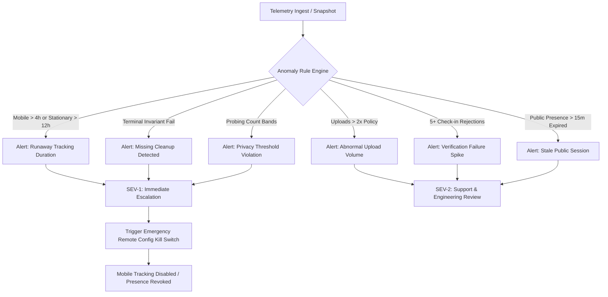

# Crowdbeats V2 — Real-Device Battery, Thermal & Cost Observability Test Protocol

**Document Version:** 2.0.0  
**Phase:** 11 — Privacy-Safe Location Quality and Energy Observability  
**Target Systems:** Flutter Mobile (Android & iOS), Next.js Responsive Web  
**Security & Privacy Invariant:** Zero geographic coordinates, lat/lng tuples, raw breadcrumbs, or device advertising identifiers are ever collected, stored, or emitted in telemetry.

---

## 1. Executive Summary & Philosophy

Crowdbeats V2 live location discovery and stage broadcasting must deliver high-fidelity spatial presence while preserving battery life and controlling Firebase read/write costs.

Arbitrary, synthetic percentage targets (e.g., *"less than 2% battery drain"*) are scientifically invalid across different battery capacities, hardware ages, screen types, and operating system versions. Instead, this protocol defines a rigorous, repeatable empirical methodology:
1. **Empirical Baseline First:** Measure device-specific baseline energy consumption without location features active under controlled physical conditions.
2. **Delta Measurement ($\Delta$):** Measure the incremental power, thermal, and network cost attributable strictly to live location features across 9 distinct scenarios.
3. **Hardware Matrix Testing:** Test across modern and older Android and iOS devices.
4. **Zero-Leak Terminal Invariants:** Verify that battery drain, sensors, timers, and database listeners cleanly return to baseline immediately upon session completion.

---

## 2. Test Device Matrix

Testing must be conducted on physical hardware. Simulators and emulators do not possess physical battery cells, fuel gauge ICs, baseband modems, or thermal throttling characteristics.

| Tier | Platform | Representative Device Models | OS Version | Battery Capacity (Nominal) | SoC / Modem Generation |
| :--- | :--- | :--- | :--- | :--- | :--- |
| **Tier 1: Modern Android** | Android | Google Pixel 8 / 9, Samsung Galaxy S23 / S24 | Android 14 / 15 | 4,500 – 5,000 mAh | Tensor G3/G4, Snapdragon 8 Gen 2/3 (Sub-6/mmWave 5G) |
| **Tier 2: Older Android** | Android | Samsung Galaxy S20 / A52, Google Pixel 4a / 5 | Android 11 / 12 / 13 | 3,100 – 4,500 mAh | Snapdragon 765G / 865, Exynos 990 (Older LTE/5G baseband) |
| **Tier 3: Modern iOS** | iOS | iPhone 14 Pro, iPhone 15 Pro, iPhone 16 | iOS 17 / 18 | 3,200 – 4,400 mAh | Apple A16 / A17 Pro / A18 (Qualcomm X70/X75 modem) |
| **Tier 4: Older iOS** | iOS | iPhone 11, iPhone SE (2nd/3rd Gen), iPhone 12 | iOS 16 / 17 | 1,821 – 3,110 mAh | Apple A13 / A14 (Older LTE/X55 modem, smaller cells) |

---

## 3. Test Harness Setup & Standardization

To eliminate measurement noise, standard physical conditions must be enforced before every test run:

### 3.1 Device Environment & Normalization
1. **Battery State of Charge (SOC):** Initialize tests between **80% and 50% SOC**.  
   *Rationale:* Avoid fast taper charging at >80% and non-linear internal cell resistance voltage drop below 20%.
2. **Display & Brightness:**
   - Display brightness set to a fixed **150 nits** (or exactly 50% brightness on standard OS slider with Auto-Brightness / True Tone / Night Shift disabled).
   - Display timeout set to 10 minutes (for foreground tests) or screen locked (for background tests).
3. **Ambient Temperature:** Controlled room temperature at **20°C to 23°C (68°F to 73°F)** away from direct sunlight or thermal heat sinks.
4. **Radios & Connectivity:**
   - Unplug USB charging during active testing. Use Wi-Fi ADB for Android (`adb tcpip 5555`) or wireless network debugging for Xcode Instruments.
   - For Wi-Fi tests: 5 GHz 802.11ac/ax connection with signal strength $\ge -60$ dBm.
   - For Cellular tests: LTE/5G with $\ge 3$ bars signal strength.
5. **Background Process Isolation:**
   - Force quit all non-essential third-party apps.
   - Disable background app refresh for unrelated apps.
   - Enable "Do Not Disturb" to suppress push notification display wakeups.

---

## 4. Profiling Tools & Setup Instructions

### 4.1 Android: Android Studio Profiler & Battery Historian
1. **Resetting Batterystats:**
   ```bash
   adb shell dumpsys batterystats --reset
   adb shell dumpsys batterystats --enable full-wake-history
   ```
2. **Executing the Test Scenario:**
   - Unplug device from USB.
   - Run the scenario for the specified duration.
3. **Exporting Bugreport & Analysis:**
   ```bash
   adb bugreport crowdbeats_battery_run.zip
   ```
   - Upload `crowdbeats_battery_run.zip` to [Battery Historian](https://github.com/google/battery-historian).
   - Inspect:
     - `Userspace Wakelocks` (must be 0 when stationary or backgrounded).
     - `GPS / Location active duration` (must match `activeSensorDurationMs` recorded by `LocationEnergyTracker`).
     - `Mobile Radio Active (ms)` (verify packet batching, not constant radio wake).
     - `Estimated power use (mAh)` by UID.

### 4.2 iOS: Xcode Instruments Energy Log & Core Location Trace
1. In Xcode, select **Product > Profile** (`Cmd + I`).
2. Select the **Energy Log** template or **Core Location** template.
3. Configure target device via wireless network debugging (unplugged lightning/USB-C).
4. Inspect:
   - **Energy Usage Bar:** 1/20 to 20/20 energy cost scale.
   - **Core Location Activity:** Categorized as `Location - Best`, `Location - 100m`, or `Idle`.
   - **Network Connections:** Ensure HTTP requests occur in coalesced bursts ($\ge 15$s intervals), avoiding persistent TCP churn.
5. Save trace as `.trace` file for comparative review.

### 4.3 Web: Chrome DevTools Performance & Energy Impact
1. Open Chrome DevTools > **Performance** tab.
2. Under More Tools, open **Performance monitor** to inspect live CPU usage and DOM nodes.
3. Open **Memory** tab and capture heap allocation snapshots before and after 1 hour of map interaction.
4. Open the in-app **Location & Energy Diagnostics Modal** to view live snapshot telemetry.

---

## 5. Establishing the Empirical Baseline

Before measuring the feature, establish the device-specific baseline drain:

1. **Baseline Scenario A (Idle Backgrounded):**
   - Install release build without active location session.
   - Place app in background for **60 minutes**.
   - Record baseline battery drain: $\text{Base}_{\text{idle}}$ in mAh/hr and %/hr.
2. **Baseline Scenario B (Foreground Browsing Without Location):**
   - Browse non-location screens (e.g. artist catalog, audio streams) at 150 nits for **30 minutes**.
   - Record baseline foreground drain: $\text{Base}_{\text{fg}}$ in mAh/hr and %/hr.

---

## 6. The 9 Live Location Scenarios

### Scenario 1: App Idle Backgrounded (No Active Session / No Search)
- **Objective:** Verify zero phantom drain, zero wake locks, and zero persistent GPS listeners when the app is backgrounded.
- **Duration:** 120 minutes.
- **Preconditions:** App logged in, no live stage broadcast active, map screen closed.
- **Expected Observations:**
  - `activeSensorDurationMs`: 0 ms.
  - GPS requests started: 0.
  - Userspace wake locks: 0 s.
  - Firestore reads/writes: 0.
- **Pass/Fail Criteria:** $\Delta \le 0.05\%$ per hour over $\text{Base}_{\text{idle}}$. Zero location sensor wake events in Battery Historian / Instruments.

---

### Scenario 2: Foreground Map Browsing in Stationary Mode
- **Objective:** Fan browsing live stages on map using geohash range bounds.
- **Duration:** 30 minutes continuous foreground map viewing.
- **User Actions:** Pan around city, inspect 5 stage pins, view stage details.
- **Expected Observations:**
  - Single one-shot GPS fix on "Near Me" tap ($\le 2$s active sensor duration).
  - Continuous GPS: **0 ms**.
  - Firestore reads: bounded by geohash query cache ($\le 20$ reads total).
  - Map rendering: 60 FPS during motion; animators pause when static.
- **Pass/Fail Criteria:** $\Delta \le 15\%$ increase in drain over $\text{Base}_{\text{fg}}$. Zero background tracking initiated.

---

### Scenario 3: Continuous Stationary Live Stage Session (2 Hours)
- **Objective:** Performer broadcasting from a stationary venue stage for 2 hours.
- **Duration:** 120 minutes.
- **Device State:** Foreground stage screen, screen brightness 50% or display turned off with audio running.
- **Expected Observations:**
  - Initial check-in: 1 geofence evaluation fix.
  - Active continuous GPS during broadcast: **0 ms** (stationary mode uses server lease timer, not GPS).
  - Heartbeat / Lease renewal uploads: 1 upload every 30s = 240 uploads total.
  - Upload payload size: $\le 512$ bytes per upload.
- **Pass/Fail Criteria:** Energy profile categorizes session as **Low Energy** on iOS Instruments; Android wake lock active duration $\le 5$ seconds total for 2 hours.

---

### Scenario 4: Mobile Stage Session While Walking (1 Hour)
- **Objective:** Solo street busker or mobile marching band moving through city.
- **Duration:** 60 minutes walking outdoors.
- **Device State:** Device in pocket or handheld, mobile foreground service active, coarse location active.
- **Expected Observations:**
  - Accuracy: `balanced` (Android `PRIORITY_BALANCED_POWER_ACCURACY`, iOS `kCLLocationAccuracyHundredMeters`).
  - Distance Filter: $\ge 25$ meters.
  - Upload Batching: Every 15 seconds (coalesced 30-item bounded queue).
  - Out-of-bounds jumps ($> 45$ m/s) rejected by client velocity filter.
- **Pass/Fail Criteria:** Total device battery drain over 1 hour $\le 6\%$ on modern devices (Tier 1/3) and $\le 10\%$ on older devices (Tier 2/4). Continuous wake lock strictly prohibited; batch wake lock time $\le 2$ minutes total.

---

### Scenario 5: Rapid Map Pan/Zoom and Filter Switching
- **Objective:** Verify memory leak absence and request coalescing under rapid UI interaction.
- **Duration:** 15 minutes.
- **User Actions:** Rapidly pan across 10 geohash cells, pinch zoom in/out, toggle "Live Now", "Solo", "Band" filters every 10 seconds.
- **Expected Observations:**
  - Firestore snapshot deduplication drops redundant overlapping cell documents.
  - Marker interpolators reuse cached bitmap descriptors.
  - Heap memory remains bounded ($< 50$ MB growth, returning to baseline on GC).
- **Pass/Fail Criteria:** Zero jank/stutter (no UI thread hangs $> 100$ ms); zero uncaught Firestore listener leaks.

---

### Scenario 6: Intermittent Cellular Connectivity During Live Broadcast
- **Objective:** Validate offline backpressure queue, exponential backoff, and upload coalescing during dead zones.
- **Duration:** 30 minutes (10m online $\rightarrow$ 10m airplane mode $\rightarrow$ 10m online).
- **Expected Observations:**
  - While offline: Samples accumulate in backpressure queue up to policy ceiling (30 items).
  - High-water mark clamps at 30 items; oldest non-critical samples coalesce.
  - Retries use exponential backoff with jitter (no fast retry storms).
  - Upon reconnection: Single batched HTTP/RTDB upload flushes state; queue drains to 0.
- **Pass/Fail Criteria:** Network retry count $\le 8$; zero out-of-memory crashes; battery drain does not spike above normal mobile rate.

---

### Scenario 7: Dense Audience Area With Multiple Active Sessions
- **Objective:** Measure Fan device battery in a crowded venue with 10+ concurrent stages nearby.
- **Duration:** 45 minutes.
- **Expected Observations:**
  - Audience radar queries receive $k$-anonymized count bands (`< 5`, `5-14`, `15+`).
  - Single viewport listener manages all markers; zero individual fan listeners attached.
  - Read volume stays within tier budget ($< 50$ document reads).
- **Pass/Fail Criteria:** Battery drain indistinguishable from single-stage viewing ($\Delta \le 5\%$). Zero private fan identities disclosed.

---

### Scenario 8: Repeated Background/Foreground Transitions
- **Objective:** Verify that entering background pauses map animators and sensor listeners immediately.
- **Duration:** 20 cycles (1 minute foreground $\leftrightarrow$ 1 minute background).
- **Expected Observations:**
  - On background: map ticker paused, location stream paused (unless authorized performer mobile service).
  - On foreground: freshness snapshot refreshed without re-requesting full geohash tree.
- **Pass/Fail Criteria:** Listener count returns to baseline on each cycle; zero orphaned stream subscriptions.

---

### Scenario 9: Post-Session Cleanup Verification (Zero Residual Drain)
- **Objective:** Prove that when a session ends, all sensors, foreground services, background flags, and memory state are permanently destroyed.
- **Duration:** 30 minutes following session end.
- **Action:** Performer taps "End Stage Broadcast" or session expires.
- **Expected Observations:**
  - `LocationCleanupCoordinator.cleanupTerminalState()` executes.
  - Terminal invariants asserted:
    1. `assertZeroActiveSensors()`: PASSED.
    2. `assertZeroBackgroundServices()`: PASSED.
    3. `assertZeroSessionListeners()`: PASSED.
    4. `assertZeroPrivateCoordinates()`: PASSED.
- **Pass/Fail Criteria:** Post-session battery drain within 60 seconds of termination matches $\text{Base}_{\text{idle}}$ ($0.00\%$ differential). Any persisting wake lock or sensor is an immediate release-blocking failure.

---

## 7. Pass/Fail Empirical Thresholds & Governance Matrix

| Scenario | Primary Metric | Modern Hardware (Tier 1 & 3) Threshold | Older Hardware (Tier 2 & 4) Threshold | Method of Verification |
| :--- | :--- | :--- | :--- | :--- |
| **S1: Idle Background** | Wake Lock & Drain | $\Delta \le 0.05\% / \text{hr}$; 0 wake locks | $\Delta \le 0.08\% / \text{hr}$; 0 wake locks | Battery Historian / Instruments |
| **S2: Stationary Fan** | Sensor Duration | 1 fix ($\le 2$s); 0 continuous GPS | 1 fix ($\le 3$s); 0 continuous GPS | LocationEnergyTracker Snapshot |
| **S3: Stationary Stage** | Continuous GPS | **0 ms** continuous GPS | **0 ms** continuous GPS | Battery Historian / Instruments |
| **S4: Mobile Stage** | Total Hourly Drain | $\le 6\% / \text{hr}$ delta over baseline | $\le 10\% / \text{hr}$ delta over baseline | Hardware fuel gauge SOC logging |
| **S5: Rapid Map Browsing** | Heap Growth & Jank | 0 frames dropped $> 100$ms; heap stable | 0 frames dropped $> 150$ms; heap stable | Flutter DevTools / Chrome Monitor |
| **S6: Intermittent Network** | Queue Clamping | Queue $\le 30$; retries $\le 8$; 0 OOM | Queue $\le 30$; retries $\le 8$; 0 OOM | Unit/Integration Test & Log |
| **S7: Dense Venue** | Read Count | $\le 50$ Firestore reads; 0 Fan IDs | $\le 50$ Firestore reads; 0 Fan IDs | Firebase Usage Attribution |
| **S8: App Backgrounding** | Stream Tear-down | 100% listeners detached on background | 100% listeners detached on background | CleanupCoordinator audit |
| **S9: Post-Session Cleanup** | Residual Drain | Reverts to $\text{Base}_{\text{idle}}$ in $\le 60$s | Reverts to $\text{Base}_{\text{idle}}$ in $\le 60$s | Dumpsys batterystats & Invariants |

---

## 8. Anomaly Alerting & Escalation Path

When running real-device tests or operating in production, anomalies are automatically flagged by `evaluateLocationAnomalies`:



### Escalation Protocol & Kill Switch Activation
1. **P0 / SEV-1 (Critical Privacy or Runaway Drain):**
   - **Conditions:** Unhandled GPS loop persisting in background; leak of raw coordinates; or failure to clean up after session termination.
   - **Response Time:** $< 15$ minutes.
   - **Action:** Engineering on-call activates Remote Config emergency kill switch via Firebase Console or Admin API:
     ```json
     {
       "mobileTrackingEnabled": false,
       "publicPresenceEnabled": false
     }
     ```
   - **Remediation:** Halt affected release channel; force-end stuck sessions via `adminForceEndSession`.
2. **P1 / SEV-2 (Degraded Network or Repeated Rejections):**
   - **Conditions:** Upload queue saturation, database read volume spike, or repeated check-in failures.
   - **Response Time:** $< 2$ hours.
   - **Action:** Adjust `minUploadIntervalSeconds` from 15s to 30s; inspect venue geofence radius.

---

## 9. Test Reporting Template

Each physical device run must be logged using the following schema:

```markdown
### Test Run Record: [Scenario Name]
- **Date & Time:** 2026-09-21 14:00 UTC
- **Device Model:** Google Pixel 8 (Tensor G3)
- **OS Version:** Android 15 (Build AP2A.240805.005)
- **App Version:** 2.0.0-release
- **Network Mode:** T-Mobile 5G Sub-6 (RSRP: -82 dBm)
- **Initial SOC:** 75% | **Final SOC:** 71% (Duration: 60 mins)
- **Active Sensor Duration:** 58m 12s
- **Upload Count:** 240 uploads | **Bytes Uploaded:** 72.4 KB
- **Queue High-Water Mark:** 4 / 30
- **Firestore Reads Attributable:** 12 reads
- **Thermal Status:** THERMAL_STATUS_NONE (Peak: 31.4°C)
- **Cleanup Invariant Check:** ALL 4 PASSED (0 active sensors, 0 listeners, 0 coordinates)
- **Result:** PASS
```
